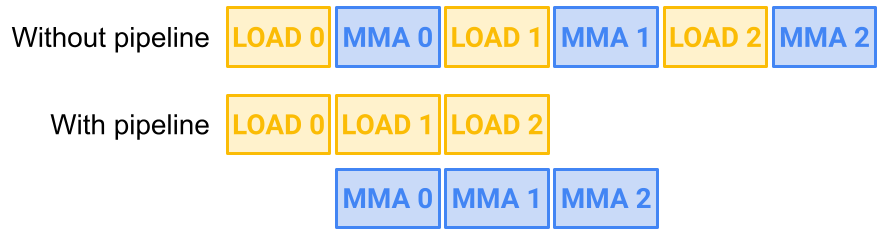
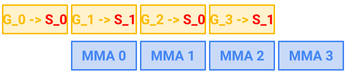

# CUTLASS 教程：使用流水线进行高效的 GEMM 内核设计

原文标题：CUTLASS Tutorial: Efficient GEMM kernel designs with Pipelining

英文对照：[articles-en/cutlass-tutorial-design-of-a-gemm-kernel.en.md](../articles-en/cutlass-tutorial-design-of-a-gemm-kernel.en.md)

欢迎来到 GEMM（通用矩阵乘法）教程系列的第 2 部分。在[第 1 部分](https://research.colfax-intl.com/cutlass-tutorial-wgmma-hopper/)中，我们从 WGMMA 出发讨论了 GEMM 的计算侧，WGMMA 是 NVIDIA® Hopper™ 架构 GPU 上用于小矩阵块乘加的底层原语。在这一部分，我们把重点转向 GEMM 的内存侧。具体来说，我们将说明如何高效地把小块操作数张量从 GPU 全局内存搬运到片上内存，再从那里送入 WGMMA（或其他 MMA 原语）。

本文要解释的核心概念，是如何组织*流水线化*的数据流，以便持续、高效地向 Tensor Core 供数。在 GEMM 内核设计语境里，*流水线*指的是通过维护多个数据缓冲区，让数据拷贝和 MMA 运算彼此重叠的设计思路。本文将介绍两种在 Hopper 架构上行之有效的流水线策略：

- **warp specialization。**把不同 warp 分别专用于生产者（负责数据传输）和消费者（负责计算），让两者并行运行。
- **多级。**利用异步拷贝机制，在计算当前数据块的同时加载下一组数据，例如 Hopper 上的 TMA，或 Ampere 上的 `cp.async`。在这种设计中，同一个 warp 同时承担生产者和消费者的职责。

为了保证内核的正确性，必须非常仔细地处理数据依赖关系，因为它决定了某个缓冲区何时可以被 MMA 指令读取，何时又可以被新的拷贝操作覆盖。我们将详细说明，如何借助 CUTLASS 中的工具，尤其是 CUTLASS `Pipeline` 类，为流水线 GEMM 内核写出必要的同步逻辑。

随后，我们会给出流水线设计的性能评估，并展示如何利用这类优化思路，让 Hopper GEMM 内核在半精度场景下达到约 65% 的利用率。最后，附录还会解释如何为基于 NVIDIA Ampere 架构的 GPU 编写流水线 GEMM 内核。

## 大局观：“喂饱猛兽”

GEMM 内核中有两个主要操作：一是把数据搬运到正确的内存位置，二是执行乘加计算。前者由数据拷贝指令负责，例如 [Hopper 上的 TMA](https://research.colfax-intl.com/tutorial-hopper-tma/)、[Ampere 上的 `cp.async`](https://docs.nvidia.com/cuda/parallel-thread-execution/index.html#data-movement-and-conversion-instructions-cp-async)，以及更早架构上的普通拷贝。后者则从 [Volta 架构](https://en.wikipedia.org/wiki/Volta_(microarchitecture)) 开始，主要交由 Tensor Core 负责。

经过几代架构演进，Tensor Core 已经变成了一个真正的“吞吐猛兽”。例如，H200 SXM GPU 的 Tensor Core 峰值吞吐可以达到 [3,958 TFLOPS](https://resources.nvidia.com/en-us-data-center-overview-mc/en-us-data-center-overview/hpc-datasheet-sc23-h200)。另一方面，同一块 H200 SXM GPU 的内存带宽只有 4.8 TB/s。相比之下，数据搬运速度远远跟不上 Tensor Core 的计算速度，而且想把带宽真正吃满也并不容易。因此，CUDA 编程，尤其是 GEMM 内核设计的一个核心问题，就是如何足够快地供数，让 Tensor Core 始终保持忙碌。我们把这个过程称为“喂饱猛兽”。

一般来说，“喂饱猛兽”可以从两条互补路线入手，而且它们作用在不同层级（网格级与线程块级）。第一条路线是优化*线程块调度*：通过在 CTA 之间合理分配计算任务，获得更好的负载均衡和更高的 L2 缓存命中率。这个问题我们会在后续文章里展开，这里先给出两个关键词：[threadblock rasterization](https://github.com/NVIDIA/cutlass/blob/main/media/docs/efficient_gemm.md#threadblock-rasterization) 与 persistent kernel。本文重点关注的第二条路线，是把*数据拷贝*与*数学计算*重叠起来。也就是说，当 Tensor Core 正在处理当前一批数据时，拷贝单元应当同时去搬运下一批数据。这样就能把一部分拷贝延迟“藏”在计算过程中，这正是流水线设计要解决的问题。

### 延迟、warp 与 warp specialization

在讨论流水线机制之前，我们先回顾一下引言中提到的两种重叠策略：multistage 和 warp specialization。

首先，将内存复制与数学运算重叠的想法既不新鲜，也不是 GPU 特有的。熟悉 CPU 的读者可能会发现它类似于[缓存预取](https://en.wikipedia.org/wiki/Cache_prefetching)技术，在需要数据之前发出异步获取请求。事实上，我们在这篇文章中讨论的管道技术是*从概念上来说*与CPU缓存预取相同！然而，由于 GPU 上的预取[就芯片上的硅面积而言昂贵](https://developer.nvidia.com/blog/boosting-application-performance-with-gpu-memory-prefetching/)，该技术的实现方式不同。

GPU 程序员实现重叠的最基本方式，是利用额外的 *warp*（warp 是由 32 个连续线程组成的执行单元）。NVIDIA GPU 允许每个 SM 同时驻留大量 warp，并且可以以极低开销在它们之间切换。特别是，当某个 warp 遇到较慢的内存访问时，warp 调度器可以切换到另一个 warp 继续执行。为了进一步给 warp 调度器创造隐藏延迟的机会，研究者在 2011 年左右提出了 *warp specialization* [[1, 2]](https://research.colfax-intl.com/cutlass-tutorial-design-of-a-gemm-kernel/#bibliography)。在 warp specialization 中，一部分 warp 专门负责内存获取（*生产者*），另一部分 warp 专门负责计算（*消费者*），它们之间通过命名屏障进行同步。这个思路的核心在于，让 warp 调度器更容易用计算去掩盖拷贝延迟，反之亦然。

从 Ampere 架构开始，NVIDIA 推出了 `cp.async`，它允许同一个 warp 在执行数学计算的同时异步发起内存拷贝。具体来说，warp 可以发出 `cp.async` 把下一批数据加载到缓冲区，同时继续在当前缓冲区上执行计算，而不必等异步加载完成后再继续。这样一来，就不再必须依赖 warp specialization 才能用计算去掩盖数据传输开销。*Multistage* 内核设计正是基于这一思路。最快的 Ampere GEMM 内核，以及著名的 FlashAttention-2，都采用了 multistage 设计。

最后，随着最新的 GPU 架构 Hopper 引入 TMA 异步复制、warpgroup 级寄存器重分配等新能力，warp specialization 在 Hopper 上变得尤其有效。事实上，CUTLASS 中性能最好的 Hopper GEMM 内核，就采用了这种设计。

### 管道图解

图 1 说明了理论流程`LOAD`和`MMA`。这里，`LOAD`指将操作数矩阵 tile从GMEM复制到SMEM的过程，并且`MMA`指将 SMEM 中存储的操作数块相乘的Tensor Core运算。如图所示，通过重叠两个`LOAD`有两个`MMA`s，我们节省了 2 个单位的时间。



思考图 1 时出现的一个问题是：在哪里`LOAD_1`和`LOAD_2`将数据复制到？显然，我们不希望后续加载在 MMA 可以计算该数据之前覆盖先前加载复制的数据。我们也不希望因等待 SMEM 变为可自由写入而导致不必要的停顿。否则，实际上将无法实现预期的 2 个单位时间的增益。

解决这个问题的一个简单方法是保留*TW*在 SMEM 中添加比 MMA 所需的内存更多的内存，并以交替方式使用它们。这个策略被称为*双缓冲*如图 2 所示。当然，我们可以概括为具有两个以上的交替缓冲区。这样做会创造更多重叠机会，从而更有效地使用可用硬件，但代价是使用更多 SMEM。



正确有效地实施管道并非易事。程序员必须处理多个缓冲区以及跨多个线程的异步加载调用。在下一节中，我们将展示如何通过 CUTLASS 抽象实现流水线：`Pipeline` 类。

### CUTLASS 管道抽象

CUTLASS 的异步 [`Pipeline` 类](https://github.com/NVIDIA/cutlass/blob/main/media/docs/pipeline.md)作为管理跨多个数据缓冲区和参与线程的复制和计算的有效抽象。它包括 `PipelineAsync`、`PipelineTmaAsync` 和 `PipelineTransactionAsync` 等类；下文中“`Pipeline`”将作为它们的统称。

我们先解释 CUTLASS 的 `Pipeline` 如何在高层协调数据流水线。设 `buffers` 是一个具有 `N` 个阶段的共享内存缓冲区。我们的目标是让*生产者*把数据写入缓冲区（例如通过 TMA），并让*消费者*在数据就绪后对其进行处理（例如执行 WGMMA）。

**屏障。**为了同步生产者和消费者之间的缓冲阶段，管道遵循标准*获取和释放模型*它使用锁来管理对缓冲区的访问。为此，让`full_barrier`和`empty_barrier`是两个*屏障数组*, 两者的大小`N`。这些障碍物具有*相位位*value 初始化为 0 并在 0 和 1 之间翻转。

具体来说，这些屏障对象就是 [mbarrier](https://docs.nvidia.com/cuda/parallel-thread-execution/index.html#parallel-synchronization-and-communication-instructions-mbarrier)对象驻留在 SMEM 中。 mbarrier 对象使用上述相位位以及*到达计数*。然后，它支持到达和等待操作，并根据到达计数阈值翻转其阶段。重要的是，这些屏障对象的值可以而且应该对所有线程可见。

**线程本地管道状态。**接下来，我们有`PipelineState`类作为线程本地状态对象，用于跟踪线程的当前*指数*和*阶段*，与数字`N`作为模板参数传入的阶段。索引采用整数值模`N`，相位为 0 或 1。此外，++ 运算符`PipelineState`类是[重载](https://github.com/NVIDIA/cutlass/blob/be60a0b27204078dc0f3f1d6ed4a95cdb2114111/include/cutlass/pipeline/sm90_pipeline.hpp#L140)这样索引就会以模数递增`N`，当索引增加到0时，相位翻转。

**同步**。我们现在解释如何使用屏障对象和线程本地管道状态来同步生产者和消费者。为了避免混淆，我们先区分一下生产者*行动*来自发出该操作的生产者线程，因为它们可能是解耦的（想想 TMA）。首先，生产者行动将翻转阶段`full_barrier[i]`表示它已经填满`i`缓冲区的第 阶段，以便消费者线程现在可以从中读取。类似地，消费者线程将翻转`empty_barrier[i]`表示他们已经吃完`i`缓冲区的第 阶段，以便生产者现在可以写入它。

请注意，我们不知道生产者操作或消费者线程到底如何翻转 SMEM 中的相位位，只要它是通过到达计数机制完成的。例如，所有消费者线程都可以*集体地*增加到达计数，或者可以选择每个warp一个消费者线程来执行相同的操作。

最后，每个线程，无论是消费者还是生产者，都会跟踪一个阶段以与屏障对象的阶段相匹配，事实上，同时承担消费者和生产者角色的线程都需要跟踪*两个都*阶段。线程的这些“内部”阶段需要翻转，并且内核继续执行其主循环的迭代。

**四种管道方法**。现在让`pipeline`是一个实例`Pipeline`使用指向的指针初始化的类`full_barrier`和`empty_barrier`，并让`pipe_state`是一个实例`PipelineState`班级。然后`pipeline`可以调用以下四个关键方法：

- `pipeline.producer_acquire(pipe_state)`. *阻塞*调用线程，直到阶段`empty_barrier[pipe_state.index()]`翻转反对`pipe_state.phase()`.
- `pipeline.producer_commit(pipe_state)`. *信号* `full_barrier[pipe_state.index()]`增加其到达计数。
- `pipeline.consumer_wait(pipe_state)`. *阻塞*调用线程，直到`full_barrier[pipe_state.index()]`翻转反对`pipe_state.phase()`.
- `pipeline.consumer_release(pipe_state)`. *信号* `empty_barrier[pipe_state.index()]`增加其到达计数。

在阻塞指令的描述中`producer_acquire`和`consumer_wait`，通过翻转*反对*的阶段`pipe_state`我们的意思是，例如，如果屏障的当前相位为 0，则该方法会阻塞，如果`pipe_state`为0则不阻塞，为1则不阻塞。

请注意，正如所写，这对方法（`producer_acquire`, `consumer_release`） 和 （`producer_commit`, `consumer_wait`）在功能上完全对称。然而，如果`Pipeline`有问题的班级是`PipelineTmaAsync`， 然后`full_barrier`被包装为一个实例`cutlass::arch::ClusterTransactionBarrier`类和信号机制`full_barrier`由 TMA 加载方法本身通过增加事务计数来处理。在这种情况下，`producer_commit`方法实际上是一个空操作；下面我们回到这一点。然而，在伪代码中我们仍然会插入`producer_commit`如果 TMA 副本没有像我们现在那样写出。

将它们放在一起，以下伪代码显示了四种正在运行的管道方法：

```

using PipelineState = typename cutlass::PipelineState<N>;
// We initialize smem_pipe_write to start with an opposite phase
// (即， 1 instead of 0), since the buffers start out as empty.
PipelineState smem_pipe_write = cutlass::make_producer_start_state<Pipeline>();
PipelineState smem_pipe_read;
for (int i = 0; i < total_steps; ++i) {
  pipeline.producer_acquire(smem_pipe_write);
  // Acquire data (e.g. TMA, cp.async, etc.)  
  pipeline.producer_commit(smem_pipe_write);
  ++smem_pipe_write;

  pipeline.consumer_wait(smem_pipe_read);
  // Compute workload (e.g. WGMMA)
  pipeline.consumer_release(smem_pipe_read);
  ++smem_pipe_read;
}
```

我们发现上面的代码片段有助于说明 producer/consumer 获取和释放模式。我们邀请读者完成循环的几个步骤，同时跟踪所有涉及的状态，并将此伪代码与前面给出的同步的详细描述联系起来。

但是，此代码片段具有序列化执行流，其中生产者和消费者操作永远不会同时运行，因此在实践中没有用处。在有效的流水线工作负载中，生产者和消费者必须重叠。我们接下来讨论的是*多级*内核设计提供了一种实现此目的的方法。

### 多级内核设计

让我们使用 Pipeline 类的 TMA 专用版本，`PipelineTmaAsync`，创建在 Hopper GEMM 内核中使用的 2 级管道，该内核与 TMA 与 WGMMA 重叠。这个内核是用**128个线程**（即，1 个warpgroup）。我们假设读者熟悉 CUTLASS 中 TMA 和 WGMMA 的语法，我们在两篇文章中详细讨论过[以前的](https://research.colfax-intl.com/tutorial-hopper-tma/) [博文](https://research.colfax-intl.com/cutlass-tutorial-wgmma-hopper/)。因此，我们省略了进入的张量的准备`cute::copy`和`cute::gemm`来电。

```

using MainloopPipeline = typename cutlass::PipelineTmaAsync<2>;
using PipelineState = typename cutlass::PipelineState<2>;

typename MainloopPipeline::Params params;
// number of bytes transferred by TMA load per stage (A and B)
params.transaction_bytes = TmaTransactionBytes;
params.role = MainloopPipeline::ThreadCategory::ProducerConsumer;
params.is_leader = threadIdx.x == 0;
params.num_consumers = 128;

// Disregard clusters for this example
auto cluster_shape = Shape<_1,_1,_1>{};

// pipeline_storage is instance of cutlass::PipelineTmaAsync<2>::SharedStorage
// Has full_barrier and empty_barrier as members
// Located in the SharedStorage struct that manages objects in smem
MainloopPipeline pipeline(shared_storage.pipeline_storage, params, cluster_shape);

__syncthreads();

PipelineState smem_pipe_write = 
    cutlass::make_producer_start_state<MainloopPipeline>();
PipelineState smem_pipe_read;

// Prepare tensors for GEMM
// ...

// Issue the first TMA load with leader thread
if(threadIdx.x == 0) {
  pipeline.producer_acquire(smem_pipe_write);
  BarrierType *tmaBar = pipeline.producer_get_barrier(smem_pipe_write);
  // smem_pipe_write.index() == 0  
  copy(tma_load_a.with(*tmaBar, 0), tAgA(_,0), tAsA(_,0));
  copy(tma_load_b.with(*tmaBar, 0), tBgB(_,0), tBsB(_,0));
  ++smem_pipe_write;
}

for (int i = 0; i < k_tile_count - 1; ++i) {
  // Only leader thread issues TMA load
  if(threadIdx.x == 0) {
    pipeline.producer_acquire(smem_pipe_write);
    BarrierType *tmaBar = pipeline.producer_get_barrier(smem_pipe_write);
    auto write_stage = smem_pipe_write.index();
    copy(tma_load_a.with(*tmaBar, 0), tAgA(_,i+1), tAsA(_,write_stage));
    copy(tma_load_b.with(*tmaBar, 0), tBgB(_,i+1), tBsB(_,write_stage));
    ++smem_pipe_write;
  }

  // Compute on the completed load from prior iteration
  pipeline.consumer_wait(smem_pipe_read);
  auto read_stage = smem_pipe_read.index();
  // WGMMA
  warpgroup_arrive();
  gemm(tiled_mma, tCrA(_,_,_,read_stage), tCrB(_,_,_,read_stage), tCrC);
  warpgroup_commit_batch();
  warpgroup_wait<0>();
  pipeline.consumer_release(smem_pipe_read);
  ++smem_pipe_read;
}

// Handle the last compute iteration
pipeline.consumer_wait(smem_pipe_read);
auto read_stage = smem_pipe_read.index();
warpgroup_arrive();
gemm(tiled_mma, tCrA(_,_,_,read_stage), tCrB(_,_,_,read_stage), tCrC);
warpgroup_commit_batch();
warpgroup_wait<0>();
pipeline.consumer_release(smem_pipe_read);

// Epilogue for writing out accumulator
axpby(alpha, tCrC, beta, tCgC);
```

这里，在主循环的每次迭代中，`(i+1)`TMA 负载是异步发出的，并且`i`执行第 WGMMA 计算，注意`smem_pipe_write`和`smem_pipe_read`彼此偏移一。

在此伪代码中，请注意`cute::set_barrier_transaction_bytes`我们在 TMA 博客文章中使用的方法（或其等效方法，`cutlass::arch::arrive_and_expect_tx`）没有出现。相反，它的功能由`producer_acquire`在`PipelineTmaAsync`班级。确实，这个方法[执行以下操作](https://github.com/NVIDIA/cutlass/blob/be60a0b27204078dc0f3f1d6ed4a95cdb2114111/include/cutlass/pipeline/sm90_pipeline.hpp#L401)内部，在哪里`stage`和`phase`是其索引和相位`PipelineState`争论：

```

if (barrier_token != BarrierStatus::WaitDone) {
   empty_barrier_ptr_[stage].wait(phase);
}

if (params_.is_leader) {
   full_barrier_ptr_[stage].arrive_and_expect_tx(params_.transaction_bytes);
}
```

此外，我们使用`producer_get_barrier`带参数的方法`smem_pipe_write`为了检索指向`full_barrier[smem_pipe_write.index()]`，根据 TMA 的需要`TiledCopy`物体`tma_load_a`和`tma_load_b`在`cute::copy`称呼。

随着`cute::copy`调用因此链接到 mbarrier 对象`full_barrier`然后，我们可以使用 TMA 基于事务计数的完成机制来向消费者发出缓冲区已准备好使用的信号，从而无需调用`producer_commit`来自管道对象本身。这就是为什么 CUTLASS 使得`producer_commit`禁止操作`PipelineTmaAsync`.

这种构建管道的方式允许重叠数据传输和计算，从而发挥异步操作隐藏延迟的潜力。尽管我们在本例中使用了 TMA，但 Ampere 架构中也可以使用类似的技术：`cp.async`。我们在[附录](https://research.colfax-intl.com/cutlass-tutorial-design-of-a-gemm-kernel/#appendix)。然而，在 Hopper 架构中，有时最好使用*warp专用*设计而不是多级，我们现在解释一下。

### warp specialization

在多级内核中，每个 warp 都承担生产者和消费者的角色。两个角色之间的切换是使用`PipelineState`抽象，并且 TMA 加载的异步性允许两种类型的操作重叠。另一种策略，*warp专业化*，为不同的warp分配不同的角色，这样我们就有*生产者warp*完全致力于内存复制和*消费者warp*完全致力于计算。如上所述，warp 调度程序可以通过在两种类型的 warp 之间切换来隐藏延迟。请注意，与多级内核不同，warp specialization本质上并不依赖于*异步*但在实践中仍然受益匪浅。

特别是对于我们的 GEMM，生产者warp使用 TMA 将数据从全局内存加载到共享内存，而消费者warp使用 WGMMA 计算分片 GEMM。值得注意的是，在我们的简化设置中，两种类型的 warp 中的执行流程都是内部串行的，即TMA 和 WGMMA 指令本身并不重叠*内部*-warpgroup。然而，还有更复杂的内核调度，它们利用 TMA 和 WGMMA 的异步性来实现与其他指令的warpgroup内重叠，例如[FlashAttention-3](https://research.colfax-intl.com/flashattention-3-fast-and-accurate-attention-with-asynchrony-and-low-precision/).

对于 Hopper 架构来说，warp specialization是一个特别有吸引力的主张，原因有以下三个：

- **TMA**与早期的复制操作相比，寄存器密集度较低。
- **WGMMA**可以从共享内存中获取其操作数，这意味着消费者warp不必执行自己的内存加载操作。
- Hopper允许手动**warpgroup 范围内的寄存器（取消）分配**通过`setmaxnreg`操作说明。因此，可以将更大部分的寄存器分配给通常需要更多寄存器的消费者warp。

为了扩展最后一个要点，每个 SM 都有一组有限的寄存器，并且在 Hopper 之前的架构中，每个 warp 在内核启动时都被分配了固定的、相同数量的寄存器。这对于多级管道来说很好，其中每个warp都做相同的工作，但对于warp specialization模式来说通常是浪费：生产者warp（仅加载数据）通常比消费者warp（执行数学）需要更少的寄存器，特别是在使用 TMA 时。对于寄存器密集型的工作负载，能够利用浪费的寄存器可能意味着允许每个 SM 有更多的warp或避免寄存器溢出。

现在让我们展示一段warp specialization代码。和以前一样，`Pipeline`类抽象了设置 warp 专用内核的复杂性。

```

// Create the pipeline and the iterator for the stage
using MainloopPipeline = typename cutlass::PipelineAsync<2>;
using PipelineState = typename cutlass::PipelineState<2>;

// Producer warps
if (isProducerWarp(threadIdx.x)) {
  // Only one thread should be calling TMA
  if(isTMAThread(threadIdx.x)) { 
    PipelineState smem_pipe_write = 
      cutlass::make_producer_start_state<MainloopPipeline>();
    for (...) {
      pipeline.producer_acquire(smem_pipe_write);
      copy(...); // TMA
      ++smem_pipe_write;
    }
  }
}
// Consumer warps
else {
  PipelineState smem_pipe_read;
  for (...) {
    pipeline.consumer_wait(smem_pipe_read);
    // WGMMA
    pipeline.consumer_release(smem_pipe_read);
    ++smem_pipe_read;
  }
  // Epilogue
}
```

该格式类似于我们之前讨论的基本管道，但这次有一个外部条件，将工作负载分为生产者warp和消费者warp。尾声属于消费者warp，因为它涉及写出消费者线程寄存器中保存的累加器。

要查看线程位于哪个warp和warpgroup中，我们可以执行以下操作。

```

int warp_group_idx = __shfl_sync(0xffffffff, threadIdx.x / 128, 0);
int warp_idx_in_warpgroup = __shfl_sync(0xffffffff, (threadIdx.x / 32) % 4, 0);
int warp_group_thread_idx = threadIdx.x % 128;
```

上面的代码片段还使用了`__shfl_sync`操作，这是一个值的warp范围广播（更多信息[这里](https://developer.nvidia.com/blog/using-cuda-warp-level-primitives/)）。这是为了确保经线中的所有线程都获得相同的值。

现在让我们重点关注这如何应用于 GEMM。在[第 1 部分](https://research.colfax-intl.com/cutlass-tutorial-wgmma-hopper/)在本系列中，我们讨论了在 warpgroup 级别组织的 WGMMA 指令。因此，我们还在 warpgroup 级别组织生产者和消费者。我们使用TMA管道，这样我们就可以在生产者端使用TMA。

对于 2 个阶段和 2 个 warpgroup，我们首先更改 WS 内核的管道初始化，如下所示：

```

using MainloopPipeline = typename cutlass::PipelineTmaAsync<2>;
using PipelineState = typename cutlass::PipelineState<2>;

typename MainloopPipeline::Params params;
params.transaction_bytes = TmaTransactionBytes; 
const int producerWarpGroupId = 0; 
if (warp_group_idx == producerWarpGroupId)
  params.role = MainloopPipeline::ThreadCategory::Producer;
else
  params.role = MainloopPipeline::ThreadCategory::Consumer;
params.is_leader = warp_group_thread_idx == 0;  
params.num_consumers = 128; 

auto cluster_shape = make_shape(Int<1>{},Int<1>{},Int<1>{});

// Create the pipeline
MainloopPipeline pipeline(shared_storage.pipeline_storage, params, cluster_shape);
```

我们突出显示第 12 行来强调这一点，尽管`params.num_consumers`仍然等于 128，现在仅计算消费者 warpgroup 的 128 个线程，而不是所有 256 个线程。

现在进入主循环。总体结构与初始代码示例相同，但生产者端有一些差异：

```

// Example values for Hopper GEMM with 1 consumer warpgroup
using LowerRegisterCount = Int<40>;
using HigherRegisterCount = Int<256>;

if (warp_group_idx == producerWarpGroupId) {
  cutlass::arch::warpgroup_reg_dealloc<LowerRegisterCount{}>();
  int lane_predicate = cute::elect_one_sync();
  if (warp_idx_in_warpgroup == 0 && lane_predicate) {
    PipelineState smem_pipe_write = 
      cutlass::make_producer_start_state<MainloopPipeline>();
    for (...) {
      pipeline.producer_acquire(smem_pipe_write);
      copy(...); // TMA
      ++smem_pipe_write;
    }
  }
} else { // consumer warpgroup
  cutlass::arch::warpgroup_reg_alloc<HigherRegisterCount{}>();
  PipelineState smem_pipe_read;
  for (...) {
    pipeline.consumer_wait(smem_pipe_read);
    gemm(...); // WGMMA
    pipeline.consumer_release(smem_pipe_read);
    ++smem_pipe_read;
  }
  // Epilogue to write out accumulator
  axpby(...);
}
```

在第 6 行和第 18 行中，我们使用[CUTLASS 呼叫](https://github.com/NVIDIA/cutlass/blob/3a8c01a18b24c35b216922481ac762496720a99d/include/cutlass/arch/reg_reconfig.h)，它又调用 PTX 原语[`setmaxnreg`](https://docs.nvidia.com/cuda/parallel-thread-execution/index.html#miscellaneous-instructions-setmaxnreg)调整分配给 warpgroup 中线程的寄存器。正如文档中所解释的，`warpgroup_reg_dealloc<M>()`释放额外的寄存器*减少*每线程最大寄存器计数`M`， 然而`warpgroup_reg_alloc<N>()`请求额外的寄存器以便*增加*每线程最大寄存器计数`N`.

用于这些寄存器计数的确切数字取决于算法和硬件施加的约束。在Hopper架构中，一个线程最多可以拥有255个寄存器，并且`setmaxnreg`可以设置为 24 到 256（含）之间且为 8 的倍数的值。一般来说，对于 Hopper GEMM WS 内核，建议安排一个 CTA 占据整个 SM。因此，我们应该尝试选择寄存器计数，以便（a）将最小数量的寄存器分配给发布 TMA 的生产者 warpgroup，以及（b）整个寄存器文件大小[每个 SM 64K](https://docs.nvidia.com/cuda/hopper-tuning-guide/index.html#occupancy)被使用。例如，24/240/240 分割通常适用于 1 个生产者warpgroup和 2 个消费者warpgroup（这总计为 504 < 512，并且 512*128 = 64*1024），同样，32/160/160/160 分割将用于 1 个生产者和 3 个消费者warpgroup。另请注意，如果尝试分配的寄存器总数超过寄存器文件大小，则程序将崩溃。

此外，我们必须确保只有*一*warpgroup 中的线程曾经调用 TMA。在我们的代码示例中，我们确保只有第一个warp涉及这个，以及使用选择的那个线程`elect_one_sync`，负责TMA的调用。此代码适用于 2 个warpgroup，但只需进行最小的更改即可将其用于更多数量的warpgroup和阶段。

应通过仔细分析内核来选择要使用的 warpgroup 和阶段的数量。作为两者的一般经验法则，更多的阶段和更多的warpgroup意味着更多的并行和重叠机会，但也使用更多的资源。特别是，使用更多的阶段需要更多的 SMEM 用于缓冲区，并且使用更多的warpgroup会增加寄存器压力。

## 表现

我们使用的是CUTLASS[Hopper GEMM 教程代码](https://github.com/NVIDIA/cutlass/blob/main/examples/cute/tutorial/wgmma_sm90.cu)作为具有半精度 (FP16) 数据类型的多级和warp专用 GEMM 内核的基础。我们还修改了代码以适应 FP32 累积并使用 TMA 存储写出输出。然后，我们将两个版本调整为 MxNxK = 8192x8192x8192，并为 FP16 累积和 FP32 累积选择不同的tile 大小。我们选择的tile 大小和阶段数如下（bMxbNxbK 除以 MxNxK）：

- FP16 累积：bM = 256，bN = 256，bK = 96，2 个阶段，4 个 MMA warpgroup。簇大小 (1, 2, 1)。
- FP32 累积：bM = 256，bN = 192，bK = 128，2 个阶段，2 个 MMA warpgroup。簇大小 (1, 2, 1)。

我们使用转换为 FP16 的随机浮点数初始化矩阵，并记录以下 TFLOP/s（10 次迭代，5 次测量的平均值）：

- FP16累加：多级531、WS 536。
- FP32累加：多级477、WS 485。

请注意，H100 PCIe GPU 上的密集半精度 MMA 的理论峰值性能为 750 TFLOP/s，因此我们在 FP32 累积的标准设置中实现了约 65% 的理论峰值。多级和 WS 内核均可在[科尔法克斯的 github](https://github.com/ColfaxResearch/cfx-article-src/tree/master/pipeline-gemm).

作为警告，另请注意，CUTLASS Hopper GEMM 教程代码使用随机选择 ±1 初始化的矩阵，因此它将报告不切实际的良好性能；看[本文](https://www.thonking.ai/p/strangely-matrix-multiplications)。例如，当矩阵初始化为 ±1 时，具有 FP16 累积的多级内核的性能从 ~530 TFLOP/s 膨胀到 ~630 TFLOP/s。

现在为了进行比较，我们使用 CUTLASS 分析器测量的最快的 CUTLASS FP16 Hopper GEMM 内核经过 10 次分析迭代产生 630 TFLOP/s（约 84% 利用率）。（注意：本文的早期版本报告的利用率较低，约为 74%，因为它使用了过多的分析迭代次数，导致 H100 PCIe GPU 的 350W TDP 出现热节流。）该数字是通过以下内核获得的：

```

cutlass3x_sm90_tensorop_s64x256x16gemm_f16_f16_f32_void_f16_128x256x64_2x1x1_0_tnn_align8_warpspecialized_cooperative_epi_tma
```

请注意，此 CUTLASS 内核采用“Warp 专用持久协作”设计，如上所述[这里](https://github.com/NVIDIA/cutlass/blob/main/media/docs/efficient_gemm.md#warp-specialization)。我们预计，当前的流水线 GEMM 内核与最快的 GEMM 内核之间的差距将通过实现threadblock rasterization和在 CTA 之间重叠序言和尾声的persistent kernel来很大程度上弥合。使用 Stream-K 进行负载平衡也将是具有更非典型问题几何形状的一个因素。在这个方形示例中，Stream-K CUTLASS 内核的性能几乎同样好 (625 TFLOP/s)。

我们现在评论 WS 内核的 warpgroup 范围寄存器重新分配的相关性。要查看寄存器的使用情况，我们可以使用以下标志编译内核`-Xptxas=--verbose`。 （注意：该标志不适用于`--generate-code`。使用`--gencode`）使用寄存器重新分配时，您将看到寄存器使用计数固定为所使用的warpgroup数量的函数。例如，总共有 3 个warpgroup：

```

    0 bytes stack frame, 0 bytes spill stores, 0 bytes spill loads
ptxas info    : Used 168 registers
```

或者总共 4 个warpgroup：

```

    0 bytes stack frame, 0 bytes spill stores, 0 bytes spill loads
ptxas info    : Used 128 registers
```

请注意，168*3 = 504 和 128*4 = 512，这些数字是生产者和消费者寄存器计数之和必须小于或等于的数字（相关：这就是 32/240/240 分割不适用于 3 个warpgroup的原因）。

另一方面，有可能寄存器使用率一开始就很低，寄存器重新分配不会产生任何实际影响。例如，通过 FP16 累加，当删除寄存器重新分配时，我们看到：

```

    0 bytes stack frame, 0 bytes spill stores, 0 bytes spill loads
ptxas info    : Used 90 registers
```

此外，重新测量时间显示变化没有影响。但随着FP32的积累，我们看到：

```

    2784 bytes stack frame, 4764 bytes spill stores, 4760 bytes spill loads
ptxas info    : Used 168 registers
```

当重新测量次数时，我们现在得到大约 21 TFLOP/s，这是灾难性的性能损失！然而，我们注意到，将调整参数调整为（bM = 128，bN = 256，bK = 128，2个阶段，2个MMAwarpgroup，簇（2,1,1））几乎可以产生同样好的性能（460 TFLOP/s），没有溢出，也没有寄存器重新分配。

最后，在*融合的*WS 内核设计（例如 FlashAttention-3）具有寄存器中保存的多个累加器，必须强制使用寄存器重新分配以避免过度溢出。

## 结论

在本文中，我们全面介绍了流水线技术。我们介绍了它通过重叠内存复制和数学运算来隐藏延迟的目标，以及为什么这对于良好的性能至关重要。然后我们提出了两种流水线设计：

- **多级：**使用异步复制屏蔽数据传输（Hopper 上的 TMA 或`cp.async`安培）加载下一组数据，同时对当前组进行计算。warp同时扮演生产者和消费者的角色。
- **warp specialization：**将warp specialization为生产者和消费者，并让它们同时运行。另外，生产者或消费者操作可以是异步的（Hopper 上的 例如，TMA 和 WGMMA）。

我们详细介绍了如何使用 CUTLASS Pipeline 类来管理在 Hopper GEMM 内核中实现两种流水线策略所需的同步逻辑。最后，我们以 GEMM 为例对两种类型的管道进行了比较。尽管两者在我们的简化设置中表现大致相同，但实际上，性能最佳的 Hopper GEMM 内核使用warp specialization（例如，如[CUTLASS Profiler](https://github.com/NVIDIA/cutlass/blob/main/media/docs/profiler.md)).

在本教程的第 3 部分中，我们将讨论调度整个内核的策略，包括threadblock rasterization、persistent kernel，以及最后一项称为[Stream-K GEMM](https://arxiv.org/abs/2301.03598).

## 附录：Ampere GEMM 的流水线

在本文的主要部分中，我们讨论了使用 TMA 进行内存传输和 WGMMA 进行计算的流水线。这两个功能都是通过 Hopper 架构引入的（`sm90`），因此它们不适用于较旧的架构。在旧架构中实现类似的范例需要一些额外的步骤。因此，为了完整起见，我们还讨论了如何在 Ampere 架构中实现 GEMM 的流水线（`sm80`）。具体来说，我们研究了[CUTLASS 示例](https://github.com/NVIDIA/cutlass/blob/main/examples/cute/tutorial/sgemm_sm80.cu)为了`sm80`。与代码相比`sm90`我们在为 Ampere 撰写的文章中介绍了两个复杂情况：

- Ampere具有从GMEM加载到SMEM的异步指令（`cp.async`），但没有对寄存器分配进行特定于 warp 的控制。这阻止了我们使用warp specialization，并鼓励我们编写一个多级管道，其中每个warp同时扮演生产者和消费者的角色。
- 与 WGMMA 不同，WGMMA 可以直接从 SMEM 获取其操作数，此处 MMA 操作数必须从寄存器 (RMEM) 加载。因此，在 MMA 运行之前，需要进一步的指令从 SMEM 加载到 RMEM。此外，我们还可以将 SMEM 传输到 RMEM 负载，以潜在地提高性能，这会给整体设计带来额外的复杂性。


图 3 来自 CUTLASS 文档，显示了内核的整体结构。 （这张图片早于安培，因此在一个小方面歪曲了安培：使用`cp.async`，“加载全局”和“存储共享”不是单独的阶段，而是单个机器指令。）主循环的每次迭代都会使用 Ampere 启动将后续tile从 GMEM 异步加载到 SMEM`cp_async`指令，这些指令与当前tile上的工作重叠。这个外部管道类似于我们为 Hopper 构建的多级管道。内部展开循环加载从 SMEM 到 RMEM 的连续片段，并对它们进行数学运算。尽管这些操作是同步的，但我们仍然可以通过 CPU 计算中的一种技术来减少它们的延迟（在这种情况下，令人困惑）[软件流水线](https://en.wikipedia.org/wiki/Software_pipelining).

让我们首先检查外部管道，它从主循环之前的预取阶段开始：

```

TiledCopy copyA = make_tiled_copy(Copy_Atom<SM80_CP_ASYNC_CACHEALWAYS<TA>, TA>{},
                                    Layout<Shape<_32,_8>,Stride<_8,_1>>{}, // Thr layout 32x8 k-major
                                    Layout<Shape< _1,_1>>{});              // Val layout  1x1
TiledCopy copyB = make_tiled_copy(Copy_Atom<SM80_CP_ASYNC_CACHEALWAYS<TB>, TB>{},
                                    Layout<Shape<_32,_8>,Stride<_8,_1>>{}, // Thr layout 32x8 k-major
                                    Layout<Shape< _1,_1>>{});              // Val layout  1x1

// Number of tiles left to copy
int k_tile_count = size<3>(tAgA);
// Current tile index in gmem to read from
int k_tile_next = 0;

// Initial load. Start async loads for all pipes but the last.
for (int k_pipe = 0; k_pipe < K_PIPE_MAX-1; ++k_pipe) {
  copy(copy_a, tAgA(_,_,_,k_tile_next), tAsA(_,_,_,k_pipe));
  copy(copy_b, tBgB(_,_,_,k_tile_next), tBsB(_,_,_,k_pipe));
  cp_async_fence();
  --k_tile_count;
  if (k_tile_count > 0) { ++k_tile_next; }
}

// wait for first tile to be available before proceeding
cp_async_wait<K_PIPE_MAX-2>();
__syncthreads();
```

副本是使用异步发行的[CUTLASS的`cp_async`API](https://github.com/NVIDIA/cutlass/blob/main/include/cutlass/arch/memory_sm80.h)，它包裹着[`cp.async`PTX指令](https://docs.nvidia.com/cuda/parallel-thread-execution/index.html#data-movement-and-conversion-instructions-cp-async)。解释一下这里使用的方法：

- 复印时使用`cp.async`使用分成“提交组”`cp_async_fence()`。在此示例中，每个提交组从 A 复制一个tile，从 B 复制一个tile。
- `cp_async_wait<N>()`指示 CTA 等待，直到最多 N 个最近启动的提交组仍在运行。在这个例子中，我们推出了`K_PIPE_MAX-1`提交组，所以`cp_async_wait<K_PIPE_MAX-2>()`相当于等待最旧的组完成，即，直到 A 和 B 的第 0 个tile被复制。其他提交组可以在最旧的提交组之前完成，但调用会等待最旧的提交组。

这是内核的主循环，省略了 SMEM->RMEM 负载和计算，重点关注 GMEM->SMEM 管道：

```

while (k_tile_count > -(K_PIPE_MAX-1)) {
  // handling a single block in a tiled gemm
  for (int k_block = 0; k_block < K_BLOCK_MAX; ++k_block) {
    // Start the async copies for the next tile. 
    if (k_block == 0) {
      copy(copy_a, tAgA(_,_,_,k_tile_next), tAsA(_,_,_,smem_pipe_write));
      copy(copy_b, tBgB(_,_,_,k_tile_next), tBsB(_,_,_,smem_pipe_write));
      cp_async_fence();

      --k_tile_count;
      if (k_tile_count > 0) { ++k_tile_next; }
  }

  // Load block from SMEM to RMEM (omitted)

  if (k_block == K_BLOCK_MAX-1) {
    // wait for the previous copies to complete
    cp_async_wait<K_PIPE_MAX-2>();
    __syncthreads();
  }

  // Compute on block (omitted)
}
```

概要与预取中的概要基本相同。在外循环的每个阶段开始时，都会启动另一个异步副本。在循环阶段结束时，CTA 等待下一个必要tile的副本。在计算的最后阶段，管道将耗尽要复制的 GMEM 切片。该代码表示​​这一点`k_tile_count <= 0`，并触发未使用的虚拟副本。

请注意，该示例未使用 CUTLASS`Pipeline`类，因为我们不需要使用 mbarrier 对象来管理同步。相反，该示例手动设置同步以在数据缓冲区之间切换。然后，内部循环超过缓冲区的大小，以跟踪要使用哪个缓冲区。尽管细节不同，但整体结构与本文中的简单管道示例相同。

我们最后转向包含 SMEM->RMEM 负载和 MMA 的内部循环。现在，SMEM->RMEM 传输明显快于 GMEM->SMEM，但访问延迟仍然足够高，因此将加载时间与数学重叠是有利的。这里的概念与 GMEM->SMEM 情况相同：我们有额外的缓冲区（寄存器），我们向其发出加载指令，而计算在其他寄存器上运行。然而，我们将依赖软件管道，而不是显式的异步调用。

软件流水线是一种优化技术，通过消除连续高延迟指令的依赖性来最大化硬件利用率。具体来说，对于我们来说，如果 SMEM->RMEM 负载和计算在硬件和数据方面都是独立的，那么它们可以同时运行。从SMEM到RMEM的加载由LSU（Load/Store单元）处理，而计算由计算单元（例如，Tensor Core）处理。虽然没有公开记录，但人们普遍认为[这些硬件组件可以同时运行](https://forums.developer.nvidia.com/t/how-does-the-lsu-load-store-unit-execute-load-store-instructions-in-the-ampere-architecture/273699)，因此硬件依赖性不是问题。 然而，数据依赖性可能是一个问题。

考虑以下几点：

```

for (i=0; i<N-1; i++) {
  load2rmem(i);
  compute(i);
}
```

这里的问题是`compute(i)`无法启动直到`load2rmem(i)`完成是因为它需要加载操作加载的数据。这种数据依赖性使得这两个操作是连续的。因此，就像我们对 GMEM->SMEM 管道所做的那样，我们加载下一个缓冲区。

```

load2rmem(0);
for (i=0;i<N-1; i++) {
  load2rmem(i+1);
  compute(i);
}
compute(N-1);
```

现在，负载和计算之间不存在数据或硬件依赖性，因此它们可以同时执行。在 sm80 CUTLASS 示例中，这是通过以下行处理的。

```

CUTE_UNROLL
for (int k_block = 0; k_block < K_BLOCK_MAX; ++k_block) {
  // Load A, B shmem->regs for k_block+1
  auto k_block_next = (k_block + Int<1>{}) % K_BLOCK_MAX;
  copy(tCsA_p(_,_,k_block_next), tCrA(_,_,k_block_next));
  copy(tCsB_p(_,_,k_block_next), tCrB(_,_,k_block_next));

  // Thread-level register gemm for k_block
  gemm(mma, tCrA(_,_,k_block), tCrB(_,_,k_block), tCrC);
}
```

在这里，两者`tCrA`和`tCrB`是由 CUTLASS 创建的 RMEM 引用`make_fragment`来电。复制命令能够与 GEMM 同时运行，因为它们访问不同的`k_block`价值观。

## 参考书目

[1] 迈克尔·鲍尔、亨利·库克和布鲁斯·凯兰尼。 2011.“CudaDMA：通过warp specialization优化 GPU 内存带宽。”在*2011 年高性能计算、网络、存储和分析国际会议论文集 (SC '11)*。计算机协会，纽约，NY，USA，第 12 条，1-11。[https://doi.org/10.1145/2063384.2063400](https://doi.org/10.1145/2063384.2063400)

[2] 迈克尔·鲍尔、肖恩·特雷克勒和亚历克斯·艾肯。 2014 年。“Singe：利用warp specialization在 GPU 上实现高性能”。在*第十九届 ACM SIGPLAN 并行编程原理与实践研讨会论文集 (PPoPP '14)*。计算机协会，纽约，NY，USA，119–130。[https://doi.org/10.1145/2555243.2555258](https://doi.org/10.1145/2555243.2555258)
