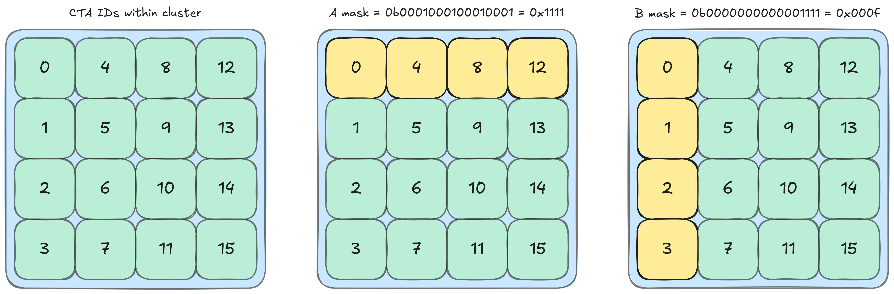

# CUTLASS 教程：NVIDIA® Blackwell GPU 上具有线程块集群的 GEMM

原文标题：CUTLASS Tutorial: GEMM with Thread Block Clusters on NVIDIA® Blackwell GPUs

英文对照：[articles-en/cutlass-tutorial-gemm-with-thread-block-clusters-on-nvidia-blackwell-gpus.en.md](../articles-en/cutlass-tutorial-gemm-with-thread-block-clusters-on-nvidia-blackwell-gpus.en.md)

欢迎来到我们研究 NVIDIA Blackwell 架构上的 GEMM 系列的第二部分。在第 1 部分中，我们介绍了 NVIDIA Blackwell GPU 上可用的一些关键新功能，包括张量内存，并介绍了如何编写使用新 UMMA 指令的简单 CUTLASS GEMM 内核（`tcgen05.mma`）以 Blackwell Tensor Core 为目标。在这篇文章中，我们将解释如何利用线程块集群和 2-SM UMMA 来实现 Blackwell GEMM。更具体地说，我们将按顺序涵盖以下几个方面：

1. 使用[Tensor Memory Accelerator](https://research.colfax-intl.com/tutorial-hopper-tma/)(TMA) 使用线程块集群和多播来分割参与的 CTA 之间的全局内存传输；
2. 将Blackwell 2-SM UMMA与CTA配对使用，增加MMA的算术强度；
3. 将 TMA 多播和 2-SM UMMA 放在 GEMM 主循环中，并正确地相互同步这些操作。

就像上一篇博客一样，我们将首先深入讨论相关概念，然后看看如何通过以下方式在 CUTLASS 中实现它们[CuTe Blackwell 示例](https://github.com/NVIDIA/cutlass/tree/main/examples/cute/tutorial/blackwell)，特别是示例 3 和 4。这两个示例跟踪我们介绍概念的顺序 — 第 3 个示例使用 TMA 多播和 Blackwell 1-SM UMMA 执行 GEMM，而第 4 个示例将其扩展为使用 CTA 对和新同步原语的 2-SM UMMA，包括不同的多播 TMA 原子。

**线程块簇**“SM”指的是一种构造，它允许开发人员将物理上彼此靠近（例如，片上）的 SM 分组。具体来说，集群中的线程块保证在位于同一 GPU 处理集群 (GPC) 上的 SM 上进行共同调度。


[此功能](https://docs.nvidia.com/cuda/hopper-tuning-guide/index.html#thread-block-clusters)，首先在 NVIDIA Hopper 架构中引入，使开发人员能够访问新的层次结构，以促进相邻线程块之间更高级的合作。值得注意的是，集群中的线程块可以访问彼此的共享内存，这种能力称为[分布式共享内存](https://docs.nvidia.com/cuda/cuda-c-programming-guide/index.html#distributed-shared-memory)。这也使得集群中的线程块可以协作加载数据（例如，通过 TMA 多播）并使用共同可见的 mbarriers 相互同步。我们稍后将在博客中看到这些功能的实际应用。

## 使用线程块集群

线程块簇是一个启动时间参数，就像网格大小或块大小一样。簇大小定义为`dim3`元组，`<cluster.x, cluster.y, cluster.z>`。 集群支持的最大可移植大小为 8，尽管某些 GPU（例如[Hopper H100](https://docs.nvidia.com/cuda/hopper-tuning-guide/index.html#thread-block-clusters)和[Blackwell B200](https://docs.nvidia.com/cuda/blackwell-tuning-guide/index.html#thread-block-clusters)，允许大小最多为 16 的集群，并带有选择加入选项。我们将参考最小形状，具有形状的簇`<1,1,1>`，作为**平凡簇**。最后，簇形状必须均匀划分网格大小。

在 CUTLASS 中，我们使用特殊的启动器实用程序启动集群：`launch_kernel_on_cluster`.

```

// define dimGrid, dimBlock, dimCluster as dim3 objects
// calculate smemBytes
// define kernel_ptr as pointer to kernel function

auto params = {dimGrid, dimBlock, dimCluster, smemBytes};
auto status = cutlass::launch_kernel_on_cluster(params, (void const*) kernel_ptr, 
                                                ... /* args to kernel */);
```

在 GEMM 内核中，很自然地将簇形状的三个维度映射到问题的 3 个维度（M、N、K）（簇形状的 K 维度等于 1，除非[Split-K内核设计](https://research.colfax-intl.com/cutlass-tutorial-persistent-kernels-and-stream-k/)被使用）。这意味着每个集群中的 CTA 都被分配了一个连续的输出块，这对于缓存性能以及我们稍后将看到的多播都有好处。

## TMA 组播

TMA 多播负载是一项旨在通过将相同张量切片同时加载到同一集群中的多个 CTA 来加速数据传输的功能。此功能是在 Hopper 中与线程块集群和 TMA 一起引入的，我们已在[上一篇博文](https://research.colfax-intl.com/tutorial-hopper-tma/).

简单回顾一下，TMA 组播将 TMA 加载的数据放置在同一集群中多个 CTA 的 SMEM 中。使用此功能，集群中的一组 CTA 可以协作并同时将一块数据加载到每个共享内存中，从而在多个 CTA 需要加载相同数据的情况下减少全局内存流量。每个 CTA 加载多播到其他参与 CTA 的 SMEM 中的一部分数据。例如，如果参与的CTA数量为4，则每个CTA加载四分之一的数据，从而使TMA加载的数据总量减少4倍。从技术上讲，这种协作部分加载是一种编程范例，并不是 TMA 多播功能所固有的，但在本文中我们将把它们视为同义词。

现在我们来看看[CuTe Blackwell 示例 3](https://github.com/NVIDIA/cutlass/blob/main/examples/cute/tutorial/blackwell/03_mma_tma_multicast_sm100.cu)并了解在 GEMM 的上下文中如何使用多播。多播自然地转化为 GEMM 的切片方案，因为操作数 A 和 B 中的每个切片都用于计算多个输出切片。为了简单起见，我们首先考虑形状簇`<2,2,1>`（注意实际示例使用形状`<4,4,1>`）。每个 CTA 处理大小为 (bM, bN) 的输出 tile，因此每个簇处理总大小为 4 个输出 tile的 2×2 块`(2*bM, 2*bN)`.

在每次主循环迭代中，每个 CTA 必须从 A 加载一个 (bM, bK) tile，从 B 加载一个 (bN, bK) tile，tile的 M 和 N 偏移量由网格中该 CTA 的行和列确定，K 偏移量由迭代确定。如果我们使用简单的 TMA，每个输出 tile将加载 2 个tile，从而导致集群加载 8 个tile。虽然像 CTA rasterization这样的一些优化可以确保大部分负载来自 L2，但很难达到 100%，甚至 L2 命中在 MMA 操作的时间尺度上也会有显着的延迟。 TMA 多播允许我们仅加载所需的最少 4 个tile，并将它们放置在需要它们的 CTA 的 SMEM 中。更准确地说，每个 CTA 需要与同一行中的所有其他 CTA 相同的 A 操作数块，以及与同一列中的所有其他 CTA 相同的 B 操作数块。因此，每个 CTA 参与两个 TMA 多播操作 - 一个用于操作数 A 与同一行中的所有其他 CTA，另一个用于操作数 B 与同一列中的所有其他 CTA。


从概念上讲，TMA 多播相当简单。然而，实际上，协调多个 CTA 之间的数据访问可能很棘手。因此，可以说 TMA 多播的关键是正确的同步。从 CTA 工作流程的角度来看，有两个同步点：一个同步点是所有参与的 TMA 都已完成并且数据已为 MMA 做好准备，另一个同步点是所有参与的 MMA 都已完成并且保存数据的缓冲区可以被下一次迭代的数据覆盖。我们将依次讨论这两个。

## 同步TMA参与者

第一个同步点是等待所有正在加载所需操作数的 TMA 多播完成。再次强调，对于 A 而言，所有 CTA 均位于同一行，对于 B 而言，所有 CTA 均位于同一列（请注意，这包括 CTA 本身）。因此，我们需要一个屏障来等待参与相关 TMA 多播操作的所有集群 CTA。

要了解这是如何完成的，我们来看看相关的 PTX。有关参与的信息被编码在 PTX 中，以便`cp.async.bulk.tensor`（TMA）：

```

// global -> shared::cluster
cp.async.bulk.tensor.dim.dst.src{.load_mode}.completion_mechanism{.multicast}
{.cta_group}{.level::cache_hint}
                                   [dstMem], [tensorMap, tensorCoords], 
                                   [mbar]{, im2colInfo}
                                   {, ctaMask} {, cache-policy}

.dst =                  { .shared::cluster }
.src =                  { .global }
.dim =                  { .1d, .2d, .3d, .4d, .5d }
.completion_mechanism = { .mbarrier::complete_tx::bytes }
.cta_group =            { .cta_group::1, .cta_group::2 }
.load_mode =            { .tile, .tile::gather4, .im2col, .im2col::w, .im2col::w::128 }
.level::cache_hint =    { .L2::cache_hint }
.multicast =            { .multicast::cluster  }
```

TMA 多播参与通过以下方式指定`ctaMask`，这是一个位掩码`i`-第bit判断CTA是否具有簇索引`i`参加。更准确地说，TMA操作将加载的数据放入位掩码指定的所有CTA的SMEM中，并且可选地到达CTA的mbarrier。 Blackwell GPU 的簇的最大大小是 16，因此我们有一个 16 位的位掩码。在我们特定的簇形状为 4x4x1 的情况下，我们可以通过使用十六进制来表示这个掩码来获得（相对）人类友好的表达式。例如，簇索引为0的CTA有`tma_bitmask_a`= 0x1111 和`tma_bitmask_b`= 0x000f。



这里每一位对应一个 CTA，多维簇形状通过列主布局映射到 CTA 的一维排序。 （集群中每个 CTA 的一维位置可通过[PTX 特殊寄存器 %cluster_ctarank](https://docs.nvidia.com/cuda/parallel-thread-execution/index.html#special-registers-cluster-ctarank)，或使用`cute::block_rank_in_cluster()`.）我们可以看到列和行参与是如何在掩码中编码的：例如，在 A 的位掩码中，CTA 0 与 CTA 4、8 和 12 共享行，因此掩码`0b0001000100010001`位 0、4、8 和 12 为 1。使用此掩码，CTA 0 发出的 TMA 多播操作会将加载的数据放置在 CTA 0、4、8 和 12 的 SMEM 中，并到达它们的每个屏障。同一行的 CTA 对 A 的 TMA 多播均使用相同的位掩码（`0x1111`对于顶行），并且同一列的 CTA 对 B 的 TMA 多播都使用相同的位掩码（`0x000f`对于最左边的列）。这允许 CTA 仅等待参与其操作数的多播加载的其他 6 个 CTA。

现在我们来看看例子中这个TMA的组播和同步是如何实现的。首先，复制原子。该示例使用 sm90 TMA 原子来表示单个 SM 的简单情况。参数与标准 TMA 相同，但附加了多播模式下的 CTA 数量。请注意，给出参与者数量的多播模式被选择为 A 的 N 模式（其中 A 为 MxK）。

```

Copy_Atom tma_atom_A = make_tma_atom(
    SM90_TMA_LOAD_MULTICAST{},       // TMA load operation with multicast
    mA,                              // Source GMEM tensor
    sA_layout,                       // Destination SMEM layout
    select<0,2>(mma_tiler),          // MK Tiler for TMA operation
    size<2>(cluster_layout_vmnk)     // The number of CTAs in the multicasting mode
);
```

接下来，要启动 TMA 多播，我们需要位掩码。该位掩码可以通过 CUTLASS 的实用函数构造：

```

int cta_in_cluster_coord_1d = cute::block_rank_in_cluster(); // e.g. 11
auto cta_in_cluster_coord_vmnk = cluster_layout_vmnk.get_flat_coord(
                                                             cta_in_cluster_coord_1d);
// e.g. (0,3,2,0)

uint16_t tma_mcast_mask_a = create_tma_multicast_mask<2>(cluster_layout_vmnk, 
                                                         cta_in_cluster_coord_vmnk);
uint16_t tma_mcast_mask_b = create_tma_multicast_mask<1>(cluster_layout_vmnk, 
                                                         cta_in_cluster_coord_vmnk);
// printf("%#x\n", tma_mcast_mask_a); => 0x8888
// printf("%#x\n", tma_mcast_mask_b); => 0x0f00
```

TMA 多播所需的最后一组信息是数据张量。我们可以使用 TMA 分区器来获取分区tile：

```

// Project the cluster_layout for tma_A along the N-modes
auto [tAgA, tAsA] = tma_partition(tma_atom_A,
                                  get<2>(cta_in_cluster_coord_vmnk), 
                                  make_layout(size<2>(cluster_layout_vmnk)), 
                                  group_modes<0,3>(tCsA), group_modes<0,3>(tCgA));

// Project the cluster_layout for tma_B along the M-modes
auto [tBgB, tBsB] = tma_partition(tma_atom_B,
                                  get<1>(cta_in_cluster_coord_vmnk),
                                  make_layout(size<1>(cluster_layout_vmnk)),
                                  group_modes<0,3>(tCsB), group_modes<0,3>(tCgB));

// tAgA:   ArithTuple(0,0) o (((_64,_128),_1),4):(((_1@0,_1@1),_0),_64@0)
// tAsA:   Sw<3,4,3>_smem_ptr[16b](0xfe2600000400) o ((_8192,_1)):((_1,_0))
// tBgB:   ArithTuple(0,0) o (((_64,_256),_1),4):(((_1@0,_1@1),_0),_64@0)
// tBsB:   Sw<3,4,3>_smem_ptr[16b](0xfe2600004400) o ((_16384,_1)):((_1,_0))
```

这里一个有趣的注意事项是，即使每个 CTA 负责从 GMEM 加载共享tile的切片，这里的分区张量也会显示整个tile。事实上，这些张量看起来与常规 TMA 的张量相同。这是因为TMA组播片的信息是通过内存地址偏移来传输的，该偏移量存储在`ArithTuple(0,0)`。但由于该打印输出是在 CTA 0 上生成的，因此偏移量为零。我们可以通过查看来看到这个偏移量`tAgA`对于 CTA 1：

```

// tAgA:   ArithTuple(0,128) o (((_64,_128),_1),4):(((_1@0,_1@1),_0),_64@0)
```

每个 CTA 接收整个tile的相同布局，但指示它们复制哪个数据片的不同内存偏移量。为了更深入的讨论，我们参考了我们的[上一篇关于 TMA 的博客文章](https://research.colfax-intl.com/tutorial-hopper-tma/).

我们现在拥有启动 TMA 多播和同步所需的所有信息。除了参数中的位掩码之外，TMA 启动本身与我们拥有的标准 TMA 启动相同[之前涵盖过](https://research.colfax-intl.com/tutorial-hopper-tma/):

```

if (elect_one_warp && elect_one_thr) { 
  cute::initialize_barrier(shared_storage.tma_barrier, 1);
}
int tma_barrier_phase_bit = 0;
cute::cluster_sync(); 

int tma_transaction_bytes = sizeof(make_tensor_like(tAsA))
                          + sizeof(make_tensor_like(tBsB));

// Main loop 
for (int k_tile = 0; k_tile < size<3>(tCgA); ++k_tile) {
  if (elect_one_warp && elect_one_thr) {
      cute::set_barrier_transaction_bytes(shared_storage.tma_barrier,
                                          tma_transaction_bytes);
      copy(tma_atom_A.with(shared_storage.tma_barrier,tma_mcast_mask_a),
           tAgA(_,k_tile), tAsA);
      copy(tma_atom_B.with(shared_storage.tma_barrier,tma_mcast_mask_b),
           tBgB(_,k_tile), tBsB);
  }

  // Wait for TMA loads to SMEM to complete
  cute::wait_barrier(shared_storage.tma_barrier, tma_barrier_phase_bit);
  tma_barrier_phase_bit ^= 1;

  // ... Execute UMMA operation ...
}
```

这里需要注意的一件重要事情是 TMA 屏障完成，以及`transaction_bytes`。 mbarrier 对象有两个内部计数器，用于跟踪当前阶段的完成情况：线程中的待到达计数和待处理事务计数（`tx-count`) 以字节为单位。当两个计数都达到 0 时，该阶段完成。这里主要感兴趣的是`tx-count`，设置为 TMA 负载的预期大小`cute::set_barrier_transaction_bytes`。 （顺便说一下，这个函数内部调用`mbarrier.arrive.expect_tx`这在初始化中消耗了 1 组的到达计数。）到达后，TMA 复制将 mbarrier 的 tx-count 减少复制的数据量（以字节为单位）。我们将其设置为操作数 tile的总大小，因为我们需要等到参与的 CTA 加载所有操作数数据后才能继续处理 UMMA。

## 同步后UMMA

本例中的 UMMA 与我们在上一篇文章中看到的相同，因此我们将重点关注屏障同步。 UMMA 是一个异步操作，因此我们必须显式等待它完成。在前面的示例中，我们只需要等待正在执行的 CTA 完成 MMA，然后再继续下一次迭代。然而，这里我们还需要确保其他 CTA 在通过多播覆盖 SMEM 中的操作数数据之前已完成消耗。换句话说，每个 CTA 需要等待其自身以及与其共享操作数数据的所有其他 CTA 完成其 MMA，然后才能发出下一个 TMA 加载。

一个简单的解决方案是简单地添加`cute::cluster_sync()`并确保集群中的所有 CTA 均已完成，然后再继续。但我们可以做得更好一点；`cluster_sync()`这是多余的，因为对于给定的tile，并非所有 CTA 都将其用于其 GEMM。相反，每个 CTA 应该只等待共享其tile A 的其他 3 个 CTA，以及共享其tile B 的其他 3 个 CTA。这种有针对性的同步将允许集群中的一些 CTA 提前运行并发出 TMA 负载，而其他 CTA 仍在完成其 MMA 操作。

这种子集群级别的同步与我们在 TMA 多播中看到的类似。但由于它现在与异步 Tensor Core 操作的完成相关联，因此它使用了一些 Blackwell 的新指令，特别是[tcgen05.commit指令](https://docs.nvidia.com/cuda/parallel-thread-execution/index.html#tcgen-async-sync-operations-commit)或其 CUTLASS 包装器[cutlass::arch::umma_arrive_multicast](https://github.com/NVIDIA/cutlass/blob/main/include/cutlass/arch/barrier.h#L791)。该指令将之前的异步指令组合在一起`tcgen05`像 UMMA 这样的操作，并将它们设置为在完成后到达 mbarrier*每个*其集群中某些 CTA 的共享内存空间的数量，由位掩码指定。

因此，我们将设置一个位掩码同步，类似于我们为 TMA 创建的同步。这次，我们需要一个掩码来编码哪些其他 CTA 正在使用 CTA 已加载的tile。为了构造这个掩码，我们可以使用之前创建的 TMA 位掩码。 A 的位掩码告诉我们哪些其他 CTA 正在使用 A 操作数，位掩码 B 也是如此。所以我们可以通过将两个掩码按位 OR 得到我们需要的位掩码。例如，对于集群中索引为 0 的 CTA，我们发现 TMA 位掩码为`tma_bitmask_a`= 0x1111 和`tma_bitmask_b`= 0x000f。所以 MMA 位掩码是`tma_bitmask_a|tma_bitmask_b`= 0x111f。


我们可以在图中看到，该位掩码标识了与 CTA 0 共享tile的 CTA，即同一列或行中的 CTA。

通过这个位掩码，我们可以设置 MMA 同步。第一步，mbarrier 创建，与 TMA 情况有一个关键区别 - 由于没有数据传输，我们依赖于到达计数而不是`tx-count`。具体来说，障碍计数需要设置为等于参与 MMA 的数量。在这个例子中，每个CTA的barrier需要等待7个线程；这会计算从掩码中出现的所有 CTA 发出 MMA 的所有线程（包括其自身）。更一般地说，可以从集群布局中检索该数字，确保避免重复计算本身。

```

if (elect_one_warp && elect_one_thr) {
  int num_mcast_participants = size<1>(cluster_layout_vmnk) 
                               + size<2>(cluster_layout_vmnk) - 1;
  cute::initialize_barrier(shared_storage.mma_barrier, num_mcast_participants);
}
```

最后，我们可以设置同步。我们将对问题的内循环进行分组`tcgen05.mma`和`umma_arrive_multicast`，并指示它在完成后到达由位掩码指定的 CTA 的屏障。

```

if (elect_one_warp) {
  for (int k_block = 0; k_block < size<2>(tCrA); ++k_block) {
    gemm(tiled_mma, tCrA(_,_,k_block), tCrB(_,_,k_block), tCtAcc);
    tiled_mma.accumulate_ = UMMA::ScaleOut::One;
  }
  cutlass::arch::umma_arrive_multicast(&shared_storage.mma_barrier, 
                                       mma_mcast_mask_c);
}
cute::wait_barrier(shared_storage.mma_barrier, mma_barrier_phase_bit);
mma_barrier_phase_bit ^= 1;
// continue to TMA in next iteration
```

注意`umma_arrive_multicast`内部选择一个线程到达屏障，因此我们不应该像使用 TMA 设置事务计数那样显式选择一个线程。有了这个有针对性的屏障，CTA 可以继续执行，而无需等待集群中的所有 CTA——只需等待具有数据依赖性的 CTA。即使集群中的其他一些 CTA 仍在计算 MMA，它也能够为下一个 k 迭代启动 TMA。

接下来，我们来检查一下[实施例4](https://github.com/NVIDIA/cutlass/blob/main/examples/cute/tutorial/blackwell/04_mma_tma_2sm_sm100.cu)，我们遇到 2 SM 的情况。回顾上一篇文章，Blackwell 添加了同一集群中两个相邻 CTA 共同处理 UMMA 的功能。据我们所知，这种口味的MMA还没有正式名称，所以我们将其称为**2-SM UMMA**或者**配对-UMMA**。同样，我们将使用术语**1-SM UMMA**或者**单UMMA**当需要澄清时。

Pair-UMMA 增加了索引的复杂性，因为现在我们需要区分***MMA坐标***和***CTA坐标***。以前，每个 CTA 在每次主循环迭代期间计算 (bM, bN, bK) MMA 操作。因此，CTA 自然地排列在 3 维网格中。随着 Pair-UMMA 的引入，现在最好将其视为 (bM, bN, bK) MMA 区块的网格，其中单个 MMA 区块可以由**CTA组**1 或 2 个 CTA。这意味着 CTA 最好被认为是基于*4维*网格，其中第 0 个“值”模式表示其组内 CTA 的索引。请注意，CUDA 语法实际上并不支持此概念步骤，该语法专门使用 3 维网格形状，因此必须手动完成一些 CTA 索引的算术。

在本节中，我们将首先深入研究考虑 CTA 对时的两种索引方案。然后我们将浏览该示例并讨论 UMMA 对如何更改索引和分区。最后，一旦我们知道每个 CTA 需要哪些数据，我们将研究 CTA 对如何改变我们应该如何使用 TMA。

## CTA 对的线程块簇

CTA 对必须位于单个集群中，并且使用集群中的 CTA ID 将集群内的 CTA 排序成对。具体来说，索引第 0 位不同的 CTA（e.g.0 和 1、2 和 3 等）被视为对。在这对中，索引为偶数的 CTA 称为**甚至CTA**，索引为奇数的 CTA 称为**奇数 CTA**.

现在考虑簇形状`<4,4,1>`，有 8 对。因为这是CuTe，所以这个形状在索引中是列主的；所以配对是在最左边的模式上进行的，大小至少为 2。对于`<4,4,1>`这意味着第 0 个模式决定配对。 注意，配对模式的选择可能会受到具体Tensor Core 操作的限制；例如，pair-UMMA 要求通过 M 模式进行配对。

让我们回顾一下`cluster_shape_vmnk`那[我们在上一篇文章中简要介绍了](https://research.colfax-intl.com/cutlass-tutorial-writing-gemm-kernels-using-tensor-memory-for-nvidia-blackwell-gpus/#handling-clusters).

```

Layout cluster_layout_vmnk = tiled_divide(make_layout(cluster_shape),
                                          make_tile(typename TiledMMA::AtomThrID{}));
```

我们看到，当使用单UMMA时，`AtomThrID{}`是 1 并且`cluster_layout_vmnk`简化为`<1,cluster.x,cluster.y,cluster.z>`。但现在我们有一对 UMMA 原子，所以`AtomThrID{}`是 2。所以`tiled_divide`在本例中，将沿着簇形状的第 0 个模式平铺，平铺为 (2)，为 CTA 簇创建 4 级布局。同样，第 0 个“值”模式将确定该对中的 ID，其他三种模式形成*集群中 CTA 对的布局*。例如，簇形状为`<4,4,1>`:

```

auto cluster_shape = make_shape(Int<4>{}, Int<4>{}, Int<1>{});
Layout cluster_layout_vmnk = tiled_divide(make_layout(cluster_shape),
                                          make_tile(typename TiledMMA::AtomThrID{}));
print(cluster_layout_vmnk); // ((_2),_2,_4,_1)
```

我们可以将其理解为排列成以下形状的 8 个 CTA 对`(2,4,1)`。然后使用该簇布局来计算`mma_coord_vmnk`.

```

Layout cluster_layout_vmnk = tiled_divide(make_layout(cluster_shape),
                                          make_tile(typename TiledMMA::AtomThrID{}));
auto mma_coord_vmnk = make_coord(blockIdx.x % size<0>(cluster_layout_vmnk),
                                 blockIdx.x / size<0>(cluster_layout_vmnk),
                                 blockIdx.y,
                                 _);
```

这`mma_coord_vmnk`有点像复合坐标系；第 0 个模式是单个 MMA 内的对等 CTA 坐标，而模式 1 到 3 是 MMA 的全局坐标。后三种模式包括***MMA坐标***，这些坐标用于索引 MMA 切片。 Blackwell 架构的 MMA 是配对本地的，而 Hopper 架构的 MMA 是 CTA 本地的。

## 一对-UMMA

在一对 UMMA 中，该对的 CTA 在同一 MMA tile上协作工作。该对中的每个 CTA 加载每个 MMA 操作数块的一半，并在其 TMEM 中保存累加器的一半。例如，如果MMA是256x256x16，则每个CTA从A和B加载128×16切片，并在TMEM中保存128×256累加器矩阵。


我们在这里看到没有重叠的数据加载。因此，就算术强度而言，这确实相当于一个256×256的MMA；与让两个 CTA 执行两个单独的 128×256 MMA 相比，256×256 MMA 执行相同数量的 FLOP，但传输一半的操作数数据。

Pair-UMMA 从 PTX 发出，带有`tcgen05.mma`带有限定符的指令`cta_group::2`。 M 支持的大小为 128 和 256，并且累加器始终在 M 方向上的两个 CTA 之间分割，这对于选择簇形状有一些影响。请参阅[PTX指南](https://docs.nvidia.com/cuda/parallel-thread-execution/#tcgen05-data-path-layout-organization)有关数据布局的更多信息。

在 CUTLASS 中，Pair-UMMA 的构造函数与单个 CTA MMA 的构造函数相同：

```

TiledMMA tiled_mma = make_tiled_mma(SM100_MMA_F16BF16_2x1SM_SS<TypeA, TypeB, TypeC,                 
                                                               256, 256,                            
                                                               UMMA::Major::K,   
                                                               UMMA::Major::K>{});
```

然而，在幕后，存在很多信息差异`TiledMMA`single-UMMA 和pair-UMMA 之间的对象。打印出以上内容`tiled_mma`给出：

```

TiledMMA
  ThrLayoutVMNK:  (_2,_1,_1,_1):(_1,_0,_0,_0)
  PermutationMNK: (_,_,_)
MMA_Atom
  ThrID:      _2:_1
  Shape_MNK:  (_256,_256,_16)
  LayoutA_TV: (_2,(_128,_16)):(_128,(_1,_256))
  LayoutB_TV: (_2,(_128,_16)):(_128,(_1,_256))
  LayoutC_TV: (_2,(_128,_256)):(_128,(_1,_256))
```

正如上一篇文章中所讨论的，线程索引已被重新用作 CTA 对的索引。由于这是一对 UMMA，因此`ThrID`是2，并且所有布局在第0模式下相应地具有大小2。

接下来我们来讨论分区。每个 CTA 组都与全局内存张量的 MMA tile相关联，我们可以像平常一样提取它`local_tile`:

```

auto mma_coord = select<1,2,3>(mma_coord_vmnk); // extract MMA coordinates
Tensor gA = local_tile(mA, mma_tiler, mma_coord, Step<_1, X,_1>{});
Tensor gB = local_tile(mB, mma_tiler, mma_coord, Step< X,_1,_1>{});
Tensor gC = local_tile(mC, mma_tiler, mma_coord, Step<_1,_1, X>{});
Tensor gD = local_tile(mD, mma_tiler, mma_coord, Step<_1,_1, X>{});
// gA: (MmaTile_M, MmaTile_K, Tiles_K), e.g. (_256, _64, 4)
// gB: (MmaTile_N, MmaTile_K, Tiles_K), e.g. (_256, _64, 4)
// gC, gD: (MmaTile_M, MmaTile_N) = (_256, _256)
```

然后，使用以下命令在组中的 CTA 之间对这些 MMA 切片进行分区，以获得 CTA 本地操作数和累加器切片`ThrMMA::partition_[A|B|C]`方法。

```

auto mma_v = get<0>(mma_coord_vmnk); // extract peer CTA coordinate
ThrMMA cta_mma = tiled_mma.get_slice(mma_v); 
Tensor tCgA = cta_mma.partition_A(gA);
Tensor tCgB = cta_mma.partition_B(gB);
Tensor tCgC = cta_mma.partition_C(gC);
Tensor tCgD = cta_mma.partition_C(gD);
// tCgA: (MmaA, NumMma_M, NumMma_K, Tiles_K), e.g. ((_128,_16),_1,_4,4)
// tCgB: (MmaB, NumMma_N, NumMma_K, Tiles_K), e.g. ((_128,_16),_1,_4,4)
// tCgC, tCgD: (MmaC, NumMma_M, NumMma_N), e.g. ((_128,_256),_1,_1)
```

思考这个问题的一个有用方法是早期观察到 CTA 坐标已取代线程坐标。当在 Hopper 及更早版本的 GEMM 内核中加载操作数矩阵时，线程 ID 对 CTA 本地tile进行切片以提取线程本地分区。在 Blackwell 上，每个 MMA 本地tile均按对等 CTA ID 进行切片，以获得 CTA 本地分区。此示例中的代码是通用编写的，并且也适用于单 UMMA，在这种情况下，V 维度的大小均为 1，并且每个 MMA tile包含单个 CTA 分区。

最后一点，配对 UMMA 必须从我们选为领导者 CTA 的 CTA 之一的一个线程启动；在CUTLASS中，我们总是会选择偶数CTA作为领导者。

```

int cta_rank = int(cute::block_rank_in_cluster());
auto cta_in_cluster_coord_vmnk = cluster_layout_vmnk.get_flat_coord(cta_rank);
auto elect_one_cta  = get<0>(cta_in_cluster_coord_vmnk) == Int<0>{};

if (elect_one_cta) {
  // Issue pair-UMMA from single thread
}
```

## TMA 组播和配对-UMMA 主循环

现在我们有了`tiled_mma`启用pair-UMMA的对象，让我们看看中介绍的实现[实施例4](https://github.com/NVIDIA/cutlass/blob/main/examples/cute/tutorial/blackwell/04_mma_tma_2sm_sm100.cu)。内核主要工作流程如下：

```

// Compute the bitmasks for TMA and pair-UMMA
uint16_t tma_mcast_mask_a = 
    create_tma_multicast_mask<2>(cluster_layout_vmnk,cta_in_cluster_coord_vmnk);
uint16_t tma_mcast_mask_b = 
    create_tma_multicast_mask<1>(cluster_layout_vmnk,cta_in_cluster_coord_vmnk);
uint16_t mma_mcast_mask_a = 
    create_tma_multicast_mask<0,2>(cluster_layout_vmnk,cta_in_cluster_coord_vmnk);
uint16_t mma_mcast_mask_b = 
    create_tma_multicast_mask<0,1>(cluster_layout_vmnk,cta_in_cluster_coord_vmnk);
uint16_t mma_mcast_mask_c = mma_mcast_mask_a | mma_mcast_mask_b;

// Transaction count is the entire MMA
int tma_transaction_bytes = size<0>(cluster_layout_vmnk) 
                              * sizeof(make_tensor_like(tAsA))
                            + size<0>(cluster_layout_vmnk) 
                              * sizeof(make_tensor_like(tBsB));

// Initialize barriers 
if (elect_one_warp && elect_one_thr) { 
  int num_mcast_participants = size<1>(cluster_layout_vmnk) 
                               + size<2>(cluster_layout_vmnk) - 1;
  cute::initialize_barrier(shared_storage.mma_barrier, num_mcast_participants);
  cute::initialize_barrier(shared_storage.tma_barrier, 1);
}
int mma_barrier_phase_bit = 0; 
int tma_barrier_phase_bit = 0;
cute::cluster_sync(); 

tiled_mma.accumulate_ = UMMA::ScaleOut::Zero;
for (int k_tile = 0; k_tile < size<3>(tCgA); ++k_tile)
{
  if (elect_one_warp && elect_one_thr) { 
    // Only the leader CTA waits for TMA transactions
    if (elect_one_cta) {  
      cute::set_barrier_transaction_bytes(shared_storage.tma_barrier, 
                                          tma_transaction_bytes);
    } 
    copy(tma_atom_A.with(shared_storage.tma_barrier,tma_mcast_mask_a),
         tAgA(_,k_tile), tAsA);
    copy(tma_atom_B.with(shared_storage.tma_barrier,tma_mcast_mask_b), 
         tBgB(_,k_tile), tBsB);
  } 

  if (elect_one_cta) { 
    // Only the leader CTA waits for the TMA
    cute::wait_barrier(shared_storage.tma_barrier, tma_barrier_phase_bit);
    tma_barrier_phase_bit ^= 1;

    if (elect_one_warp) { 
      for (int k_block = 0; k_block < size<2>(tCrA); ++k_block) { 
          gemm(tiled_mma, tCrA(_,_,k_block), tCrB(_,_,k_block), tCtAcc);
          tiled_mma.accumulate_ = UMMA::ScaleOut::One;
      } 
      // Only the leader arrives for CTA
      cutlass::arch::umma_arrive_multicast_2x1SM(&shared_storage.mma_barrier, 
                                                 mma_mcast_mask_c);
    } 
  } 
  // All CTAs wait
  cute::wait_barrier(shared_storage.mma_barrier, mma_barrier_phase_bit);
  mma_barrier_phase_bit ^= 1;
}
```

在本节的其余部分中，我们将深入研究此示例的不同组件。

### 构造位掩码

首先，我们将介绍 TMA 和 MMA 位掩码。回想一下，位掩码指示 TMA 和 MMA 的数据依赖性，因此让我们首先了解它是如何从单个 CTA 情况发生变化的。在2SM的情况下，每个CTA负责MMAtile的不重叠的一半；偶数 CTA 不需要奇数 CTA 的数据，反之亦然。因此TMA组播只需组播到具有相同奇偶校验的CTA即可。另一方面，MMA 使用整个 MMA tile，因此它需要来自两个 CTA 奇偶校验的数据。这反映在位掩码中。

例如，CTA 0 在簇形状为的情况下具有以下位掩码`<4,4,1>`（产生一个 4 维形状簇`<2, 2, 4, 1>)`:

```

tma_mcast_mask_a: 0x1111
tma_mcast_mask_b: 0x0005
mma_mcast_mask_c: 0x333f
```

图 6 显示了该对 UMMA 示例的位掩码到 CTA 的映射。


对于 TMA 多播掩码，对于 CTA 0，只有行或列中的偶数 CTA 被设置为 1，因为奇数 CTA 与数据无关。但对于 MMA，两个半部都设置为 1，因为 MMA 使用两个半部。

为了构造这些掩码，我们可以再次使用行中所示的 CUTLASS 实用函数[2-10](https://research.colfax-intl.com/cutlass-tutorial-gemm-with-thread-block-clusters-on-nvidia-blackwell-gpus/#pair-umma-mainloop)。该结构与 1 SM 情况的不同之处在于，CTA 的 MMA 位掩码不再是其 TMA 位掩码的按位 OR，而是其 TMA 位掩码的按位 OR。*连同其对等体的 MMA 位掩码。*一般来说，`create_tma_multicast_mask<Modes...>(cluster_layout_vmnk, cta_in_cluster_coord_vmnk)`生成一个由所有 CTA 组成的位掩码，这些 CTA 仅与集群布局给定模式中指定的 CTA 不同。所以`create_tma_multicast_mask<2>`为参与的 CTA 创建掩码*TMA 该Atile的负载*（这可能与 N 模式下的 CTA 不同），而`create_tma_multicast_mask<0,2>`为参与的 CTA 创建掩码*使用此 A 板块的 MMA*（在V和N模式下可能与CTA不同）。 MMA 的最终掩码包含使用此 A tile或 B tile 即参与 MMA 的所有 CTA，这些 CTA 在 V 和 N 模式或 V 和 M 模式中可能不同。

### 同步对-UMMA

现在我们来看看UMMA的同步。由于发射来自偶数 CTA，因此 UMMA 的到达指令也必须来自偶数 CTA。因此，在创建 MMA 障碍时，MMA 障碍的参与者数量是 MMA 数量，而不是 CTA 数量。我们在行中看到这一点[20-21](https://research.colfax-intl.com/cutlass-tutorial-gemm-with-thread-block-clusters-on-nvidia-blackwell-gpus/#pair-umma-mainloop)。在`cluster_shape_vmnk`，M 模式的大小为 2，N 模式的大小为 4。因此，尽管涉及 10 个 CTA，但参与者数量（到达计数）为 5。

对 UMMA 的到达指令是使用特殊的 CUTLASS 函数发出的`umma_arrive_multicast_2x1SM`（见行[55-56](https://research.colfax-intl.com/cutlass-tutorial-gemm-with-thread-block-clusters-on-nvidia-blackwell-gpus/#pair-umma-mainloop)).这是因为`tcgen05.commit`打电话给`cta_group::1`和`cta_group::2`在单独的管道中处理。 Pair-UMMA 推出`cta_group::2`限定符，所以我们需要指示`tcgen05.commit`寻找`cta_group::2`.

对于给定的 MMA tile，如果只有 5 个领导者 CTA 会到达此屏障，那么为什么我们要传递大小为 10 的位掩码，并且还包含非领导者 CTA？答案是位掩码决定了发行 CTA 到达哪些 CTA 的屏障。（请记住，由于这些 CTA 位于集群中，因此它们可以访问位于彼此共享内存中的 mbarriers。）虽然只有 5 个领导 CTA 发出 MMA 指令，但非领导 CTA 也必须等待 MMA 完成，然后才能发出下一个 TMA 副本并使操作数无效。我们可以看到所有 CTA 都在排队​​等候[60-61](https://research.colfax-intl.com/cutlass-tutorial-gemm-with-thread-block-clusters-on-nvidia-blackwell-gpus/#pair-umma-mainloop).

### 同步 2SM 的 TMA 多播

现在进行TMA组播同步。排队[38-41](https://research.colfax-intl.com/cutlass-tutorial-gemm-with-thread-block-clusters-on-nvidia-blackwell-gpus/#pair-umma-mainloop)TMA 使用位掩码启动，该位掩码将多播限制为具有相同奇偶校验的 CTA，因为每个 CTA 仅负责 MMA 块的一半。该位掩码还意味着通常这些 TMA 仅会以相同的奇偶校验到达 CTA。然而，TMA 的 wait_barrier （行[46](https://research.colfax-intl.com/cutlass-tutorial-gemm-with-thread-block-clusters-on-nvidia-blackwell-gpus/#pair-umma-mainloop)) 仅从偶数 CTA 中调用，并且必须等待整个 MMA tile。因此，尽管奇数 CTA 占据完全不相交的 TMA 位掩码，但仍需要以某种方式到达偶数 CTA 的 mbarrier。

CUTLASS 以一种有启发性的方式解决了这个问题。首先，sm100介绍了一个`cta_group`限定符为[TMA复制指令](https://docs.nvidia.com/cuda/parallel-thread-execution/#data-movement-and-conversion-instructions-cp-async-bulk-tensor)。将其设置为`cta_group::2`允许 TMA 副本到达正在执行的 CTA 或其对等 CTA 的 mbarrier。第二，[的版本`cute::copy`在这里使用](https://github.com/NVIDIA/cutlass/blob/main/include/cute/arch/copy_sm100_tma.hpp#L50)修改 mbarrier 地址

```

uint32_t smem_int_mbar = cast_smem_ptr_to_uint(mbar_ptr) & Sm100MmaPeerBitMask;
```

在哪里`Sm100MmaPeerBitMask`是`0xFEFFFFFF`。换句话说，CTA 可以通过获取自己的 mbarrier 地址并将第 24 位设置为 0 来找到其领导者 CTA 的 mbarrier 的地址。这是有效的，因为集群中所有 CTA 的 SMEM 被视为单个统一的地址空间（对应于[PTX的“共享状态空间”](https://docs.nvidia.com/cuda/parallel-thread-execution/#shared-state-space)），簇中的CTA ID 占据地址的高位。特别是，地址的第 24 位必须对应于 CTA ID 的第 0 位，这是 CTA 在其对中的索引。请注意，使用`cute::copy`对于这个 TMA 副本，要求集群中的所有 CTA 具有相同的共享存储布局，并要求我们采用 CUTLASS 的约定，选择偶数 CTA 作为领导者。

人们可以使用特殊函数创建一对专用的复制原子`make_tma_atom_[A|B]_sm100()`，它与 sm90 接口略有不同，并且需要有关 UMMA 本身的更多详细信息作为参数。以下是示例 4 的原子。

```

Copy_Atom tma_atom_A = make_tma_atom_A_sm100(
      SM100_TMA_2SM_LOAD_MULTICAST{},
      mA,                             // Source GMEM tensor
      sA_layout,                      // Destination SMEM layout
      mma_tiler,                      // MMA tile shape, e.g. (_256, _256, _64)
      tiled_mma,
      cluster_layout_vmnk); 
```

请注意，与之前的 1SM 情况不同，我们在此不手动指定多播维度。相反，多播维度由`make_tma_atom_[A|B]_sm100`功能。这是因为多播维度是由 MMA 原子的限制决定的，它总是沿着 M 维度分割累加器。 打印这个TMA原子，我们可以再次看到以前的线程模式被用作peer-CTA模式。

```

tma_atom_A:	Copy_Atom
  ThrID:        _2:_1
  ValLayoutSrc: (_2,_8192):(_8192,_1)
  ValLayoutDst: (_2,_8192):(_8192,_1)
  ValLayoutRef: (_2,_8192):(_8192,_1)
  ValueType:    16b
```

这表示两个数据独立的 128x16x4 负载（回想一下，每个 SMEM tile有 4 次主循环迭代）。

在这篇博文中，我们通过演练第三个和第四个 CuTe Blackwell 示例，研究了 NVIDIA Blackwell 架构的线程块集群的高级用法。我们特别研究了 TMA 多播和 2-SM UMMA（即，pair-UMMA）。对于这两个功能，我们首先深入研究了 PTX、索引逻辑和位掩码等更精细的细节。然后我们查看了 CUTLASS 实现，我们发现复杂的索引逻辑被 CuTe 布局和实用函数抽象掉了。

到目前为止，我们刚刚介绍了使用半精度数据类型的标准 GEMM。然而，Blackwell 架构增加了对低精度 GEMM 的额外支持，包括块缩放。我们将在本系列的下一篇也是最后一篇博客文章中讨论这个主题。
