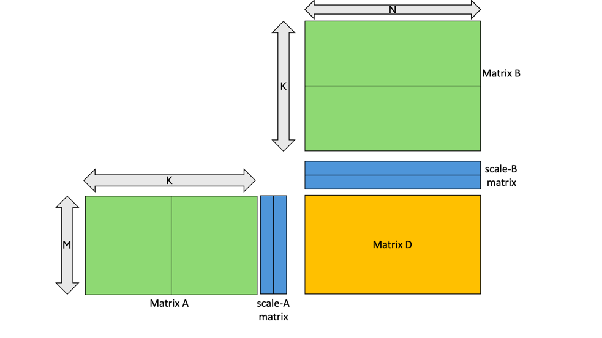
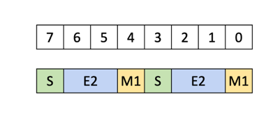
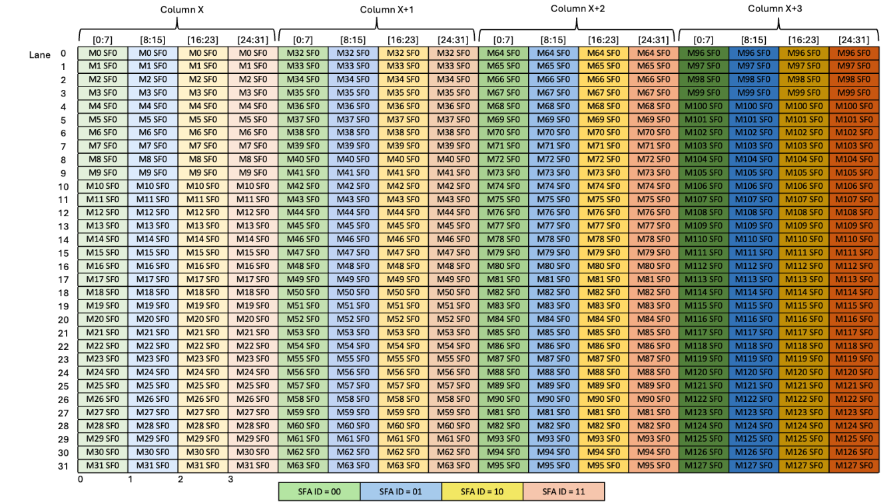
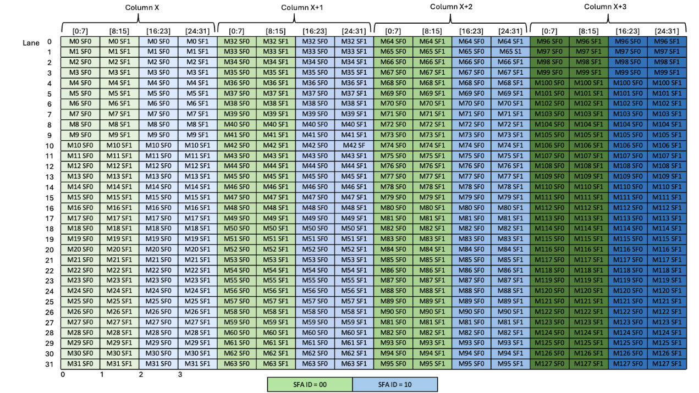
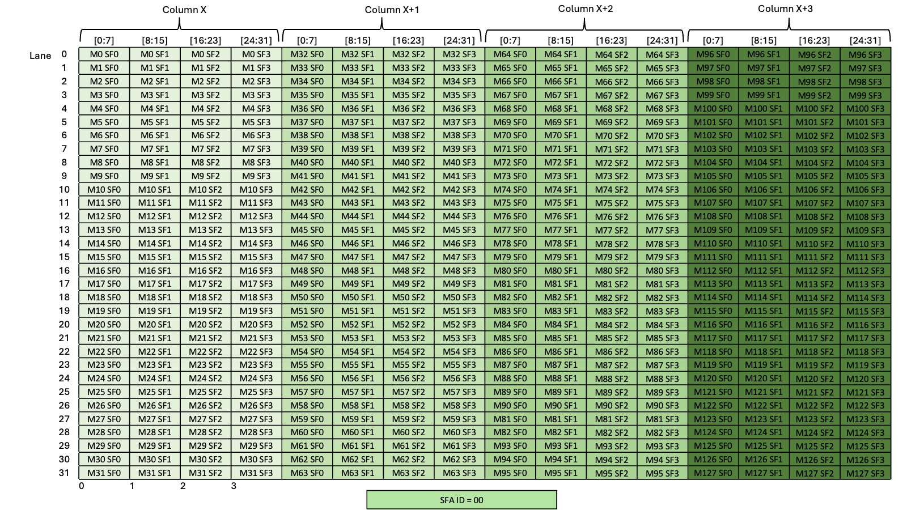
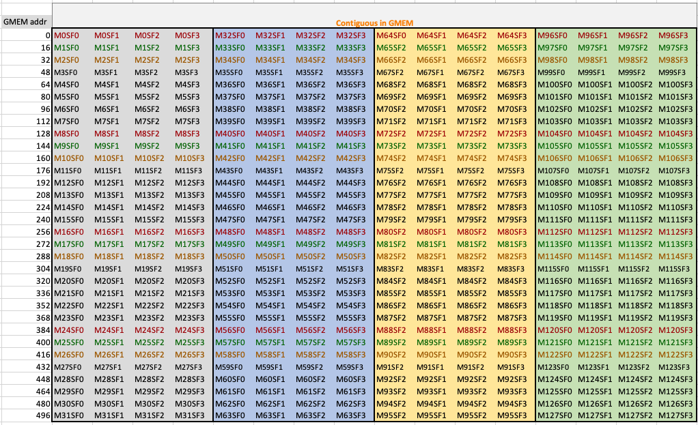
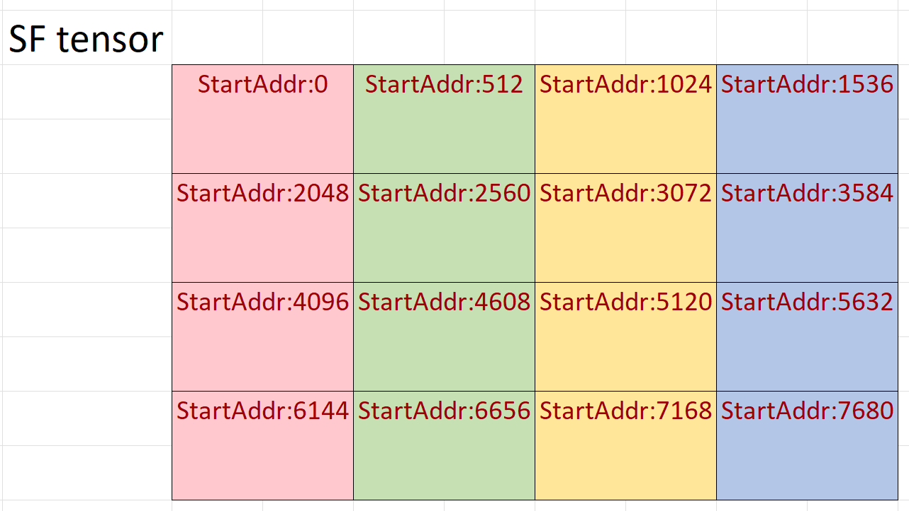
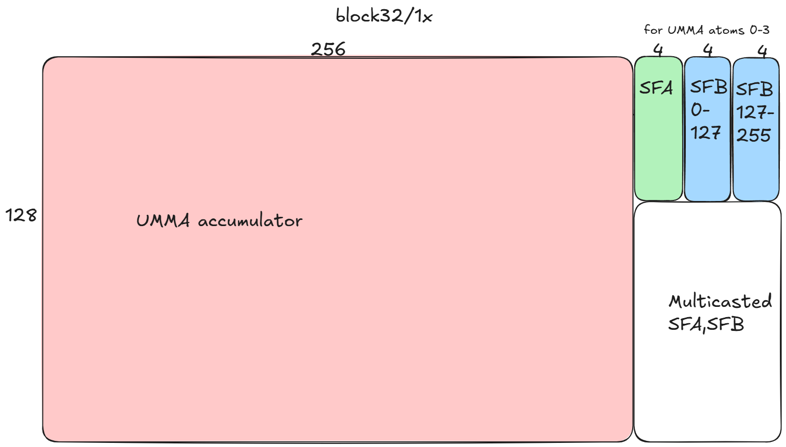
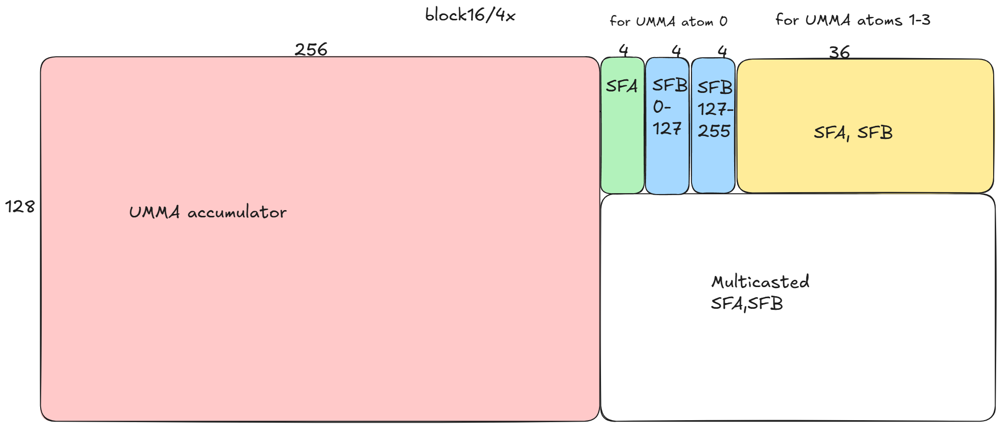
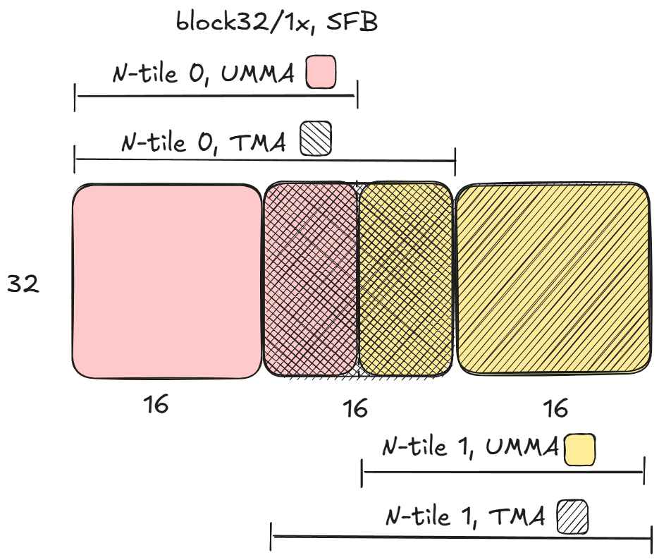

# CUTLASS 教程：使用 NVIDIA Blackwell GPU 进行硬件支持的块扩展

原文标题：CUTLASS Tutorial: Hardware-supported Block-scaling with NVIDIA Blackwell GPUs

英文对照：[articles-en/cutlass-tutorial-hardware-supported-block-scaling-with-nvidia-blackwell-gpus.en.md](../articles-en/cutlass-tutorial-hardware-supported-block-scaling-with-nvidia-blackwell-gpus.en.md)

欢迎来到我们研究 NVIDIA Blackwell 架构上的 GEMM 系列的第 4 部分。到目前为止，我们已经讨论了新的 Blackwell Tensor Core UMMA 指令的功能，包括处理子字节数据类型，以及如何在 CUTLASS 中使用它们。在这一部分中，我们将通过讨论如何利用 UMMA 的块扩展支持来继续探索低精度计算。

我们在上一篇文章中简要讨论了块缩放，但简而言之，它是一种反量化技术，其中操作数数据在乘加之前乘以缩放因子。更准确地说：

```
D = (A * scale_A) @ (B * scale_B) + C
```

在AI应用中，块缩放用于补偿低精度数字格式的低动态范围，通过使用缩放因子在量化之前将原始高精度权重或激活张量的所有条目缩放到统一范围。为了实现缩放，缩放因子使用了一系列粒度。在一种极端情况下，我们可以单独缩放每个矩阵条目；在另一个极端，我们可以将单个公共比例因子与整个矩阵相关联。 Blackwell Tensor Core 为中间方案提供硬件支持，其中（对于密集 GEMM）每个 row/column 在 K 模式下被分为 16 或 32 个元素块，每个块乘以自己的比例因子。



这里，A和B的每个row/column被分为两个块并乘以两个比例因子。换句话说，我们可以为 K 模式中的每个 16 或 32 元素向量设置一个缩放因子。允许的块数量和大小取决于数据类型，我们将在接下来讨论。

在[上一篇文章](https://research.colfax-intl.com/cutlass-tutorial-sub-byte-gemm-on-nvidia-blackwell-gpus/)，我们讨论了 Blackwell 上使用的五种子字节浮点格式。块缩放 GEMM 的操作数矩阵的基本组成部分最好被视为新数据类型的对象：低精度数字的固定长度向量，以及每个向量的比例因子。 Blackwell 块缩放支持操作数数据类型、向量长度和缩放因子数据类型的五种不同组合。

比例因子始终是无符号 8 位浮点数。这`UE4M3`类型用于`nvf4`只是一个非负数`E4M3`浮点数（即，符号位始终为0）。这`UE8M0`相比之下，类型使用所有 8 位以标准的、有偏差的方式表示浮点指数 – 因此，a 的可能值`UE8M0`比例因子为 2^x，且 -127 ≤ x ≤ 127。两种类型都支持 NaN，但不支持无穷大。相比`UE8M0`, `UE4M3`提供更高的精度，但代价是范围大大缩小 - 最大可能值仅为 448，这使得最大值可以用`nvf4`向量 6 x 448 = 2688。

这三种 mx 类型在开放计算项目的微尺度格式规范中得到了正式化（[PDF](https://www.opencompute.org/documents/ocp-microscaling-formats-mx-v1-0-spec-final-pdf)），而`nvf4`格式是[NVIDIA具体](https://developer.nvidia.com/blog/introducing-nvfp4-for-efficient-and-accurate-low-precision-inference/)。 与 mx 类型相比，`nvf4`格式提供了更细粒度的缩放因子以及每个缩放因子更少的元素，但因此导致用于缩放因子的字节数增加了一倍。

带块缩放的 UMMA PTX 指令的语法如下：

```

tcgen05.mma.cta_group.kind.block_scale{.scale_vectorsize}
                                        [d-tmem],  a-desc,  b-desc, idesc,
                                        [scale-A-tmem], [scale-B-tmem],enable-input-d;

tcgen05.mma.cta_group.kind.block_scale{.scale_vectorsize}
                                        [d-tmem], [a-tmem], b-desc, idesc,
                                        [scale-A-tmem], [scale-B-tmem],enable-input-d;

.kind = { .kind::mxf8f6f4, .kind::mxf4, .kind::mxf4nvf4 }
.cta_group      = { .cta_group::1,   .cta_group::2 }
.scale_vectorsize = { .scale_vec::1X, .scale_vec::2X, .scale_vec::4X, .block16, .block32 }
```

该语法的大部分内容已在[第 1 部分](https://research.colfax-intl.com/cutlass-tutorial-writing-gemm-kernels-using-tensor-memory-for-nvidia-blackwell-gpus/)，包括指令描述符、A和B的SMEM描述符、从TMEM而不是SMEM读取A的能力，以及`enable-input-d`标志累积到 D 而不是覆盖它。对于块缩放指令，必须从 TMEM 中读出缩放因子；这`scale-A-tmem`和`scale-B-tmem`参数需要它们的基地址 i.e。它们的 (0, 0) 条目的 TMEM 地址。除了比例因子的 TMEM 布局之外，我们还必须解释`.kind`和`.scale_vectorsize`预选赛。

## `.kind`

这`.kind`预选赛有三个选项：

- `mxf8f6f4`– 支持 8、6 和 4 位数据类型的混合输入。
- `mxf4`– 4 位输入`ue8m0`比例因子。
- `mxf4nvf4`– 4 位输入的更通用指令。

限定符类型影响可用的操作数数据类型和比例因子类型。

预选赛`mxf8f6f4`是块级版本`f8f6f4`我们在上一篇文章中讨论过的数据类型。它的要求与`f8f6f4`– 操作数的可用输入类型以及 16 字节 ZXQPH0ZXQEM/TMEM 填充要求与`f8f6f4`类型。因此，我们将遵循上一篇文章的操作数`mxf8f6f4`.

`mxf4`和`mxf4nvf4`两者都只适用于 4 位输入，具体来说`e2m1`。使用 4 位独占版本的优点是，与`mxf8f6f4`数据类型，4位数据类型不需要填充。相反，两个元素可以打包到一个 8 位容器中：



与使用 4 位数据类型相比，这会将 SMEM 的使用量减少两倍`mxf8f6f4`预选赛。因此，如果您知道工作负载专门使用 fp4，建议使用`mxf4`或者`mxf4nvf4`.

`mxf4`进一步假设比例因子类型是`ue8m0`，同时对于`mxf4nvf4`，两种比例因子类型都是可能的。与操作数类型一样，比例因子数据类型是在运行时通过[指令描述符](https://docs.nvidia.com/cuda/parallel-thread-execution/#tcgen05-instruction-descriptor).

## `.scale_vectorsize`

通过设置`.scale_vectorsize`预选赛`.block16`或者`.block32`，可以指定每个比例因子的操作数条目数：对于 mx 类型为 32，对于 mx 类型为 16`nvf4`.

然而，在内部，Tensor Core 似乎以不同的方式考虑向量大小。回想一下，A 和 B 的 UMMA 输入原子在 K 模式中始终为 32 字节宽（我们将这些称为“UMMA 原子行”，将 K 模式视为两个矩阵的行模式）。 我们会写`atom_K`对于 MMA 原子的大小，所以`atom_K = 32`为了`mxf8f6f4`和`atom_K = 64`为了`mxf4`和`mxf4nvf4`。 与之前的文章一样，我们将使用 (bM, bN, bK) 作为主循环tile的大小，该tile通常由几个 UMMA 原子组成，在 K 模式中重复。在这篇文章中，我们将始终采取`bK`添加最多 4 个 UMMA 原子（128 字节或 1 个缓存行），所以`bK = 128`对于8位输入和`bK = 256`对于 4 位输入。

现在，指定缩放向量大小相当于指定 UMMA 原子行消耗的缩放因子的数量：

```
atom_SFK = atom_K / sf_vec_size
```

这`.block16`和`.block32`限定符实际上是别名`.scale_vec::1X`, `2X`， 和`4X`，其中数字 1、2 或 4 是每个 UMMA 原子行的比例因子数。这直接影响 UMMA 消耗的比例因子的形状，如下表所示；它还会影响 TMEM 中的比例因子布局，我们将在下一节中看到。

并非所有选项都适用于不同的数据类型。完整的表格可以在[PTX 文档](https://docs.nvidia.com/cuda/parallel-thread-execution/index.html#tcgen05-mma-scale-valid-comb-detail)。值得注意的是，block32 是唯一支持的选项`mxf8f6f4`和`mxf4`操作数类型。对于前者，有`.scale_vec`= 1X，因为唯一支持的值`atom_K`是 32。对于后者，有`.scale_vec`= 2X，因为唯一支持的值`atom_K`是 64。`mxf4nvf4`支持block16（相当于`.scale_vec`= 4X) 或块32 (`.scale_vec`= 2X); block32 必须与`E8M0`而 block16 可以与任一配对`E8M0`或者`E4M3`.

最后，我们来讨论如何存储比例因子以供 UMMA 使用。 UMMA 消耗 TMEM 中的比例因子。 TMEM 中比例因子的布局取决于`.scale_vec`。在本节中，我们将介绍三个示例，显示 1X、2X 和 4X 情况。为了简单起见，我们限制为密集的 MMA 和`bM`= 128 每个 CTA。`bN`范围是 8 到 256。

## block32/1X ，atom_K=32`mxf8f6f4`

此格式是唯一可用的选项`mxf8f6f4`数据类型，并且仅用于该数据类型。让我们从 A 矩阵开始。每个 MMA 块的比例因子向量为 Mx1。该向量预计存储在 32 通道 x 4 列tile的 1 字节对齐子列（每列由 4 个子列组成）中，子列由两位索引`SFA_ID`.



请注意，此图代表 4 个不同的 UMMA，每个子列一个。例如，一个UMMA将使用存储在子列中的比例因子`SFA_ID`=00 横跨 4 列，另一列将使用`SFA_ID`=01 值等等。 UMMA 使用哪一个子列在指令描述符中设置。参见 e.g。[PTX 文档中的表 43](https://docs.nvidia.com/cuda/parallel-thread-execution/index.html#tcgen05-instruction-descriptor)，它记录了用于的指令描述符的位 29-30`SFA_ID`。因为我们假设`bM`= 128，TMEM 的 4 列将始终用于 SFA。

对于 SFB 矩阵，它的格式与 SFA 完全相同，只是我们使用 1 到 8 之间的可变列数，具体取决于所选的 bN 值（从 8 到 256）。 两个比例因子总共最多需要 12 列 TMEM。

请注意，虽然我们只使用 TMEM 的 32 个通道用于这些 sf 块，但稍后我们会看到其他 96 个通道也被占用，因此不能用于其他目的。

## block32/2X，对于 mxf4/mxf4nvf4，atom_K=64

此格式是唯一可用的选项`mxf4`数据类型，并且用于两者`mxf4`和`mxf4nvf4`类型。让我们再次从 A 矩阵开始。每个 MMA 块的比例因子向量为 Mx2。该向量预计存储在两个对齐到 2 个字节的相邻子列中。子列仍然由两位索引`SFA_ID`由起始子列决定，因此两个选项是 00 和 10。



该图代表 2 个不同的 UMMA；一个使用存储在的比例因子`SFA_ID`=00 和另一个`SFA_ID`=10。再次强调，B 比例因子的格式是相同的，只是列数不同。自从`bK`= 256 由于 4 位输入，TMEM 对比例因子的要求加倍：SFA 为 8 列，SFB 为 16 列。

## block16/4X，对于 mxf4nvf4，atom_K=64

此格式仅适用于`mxf4nvf4`数据类型。再次从 A 矩阵开始，每个 MMA 块的比例因子向量为 Mx4。在这种情况下，唯一有效的 SFA_ID 是 00。



该图适用于单个 UMMA。尽管只有一个有效`SFA_ID`00，仍然需要它，因为它用于指令描述符。再次，B 是相同的，但列数可变。 现在每个主循环tile的比例因子是原来的两倍，因此我们需要更多的 TMEM：SFA 为 16 列，SFB 为 32 列，总共最多 48 列。

现在我们讨论CUTLASS中块缩放的实现，参考CuTeDSL示例[dense_blockscaled_gemm_persistent.py](https://github.com/NVIDIA/cutlass/blob/3476ddb7bd6ca4161a0169103ceaa20ce0eb891f/examples/python/CuTeDSL/blackwell/dense_blockscaled_gemm_persistent.py)，并重点关注与标准 UMMA 的差异。

## 操作数

首先是操作数。我们在上一篇文章中讨论了 SMEM 中必需的数据格式`f8f6f4`，以及子字节类型的特殊 TMA 张量映射；完全相同的要求和说明用于`mxf8f6f4`。 块缩放 GEMM 的tile 大小受到更多限制：我们现在要求`bM`= 128（对于 1-CTA MMA）和 128 或 256（对于 2-CTA MMA）。为简单起见，我们将忽略 2-CTA MMA 的情况`bM` = 128.

当使用任一`mxf4`或者`nvf4`数据类型，我们之前看到 SMEM 中的数据被打包成 1 个字节。就像其他子字节数据类型一样，有一个特殊的 TMA 张量图`CU_TENSOR_MAP_DATA_TYPE_16U4_ALIGN8B`用于此 TMA 操作。由于这是一种打包数据类型，因此无需更改布局； CUTLASS 抽象了底层 TMA 的子字节性质。

## 比例因子布局

比例因子始终采用 8 位 dtype，因此可以像任何其他 8 位 dtype 一样加载 TMA。然而，这种负载呈现出不同的问题。比例因子最终必须按照上述布局组织在 TMEM 中，以供 Tensor Core 使用。设置负载最简单的方法是将它们排列在 GMEM 中*相同的布局*。这张图片来自于[CUTLASS 文档](https://docs.nvidia.com/cutlass/4.3.4/media/docs/cpp/blackwell_functionality.html#scale-factor-layouts)显示了具有以下布局的 SFA 的 GMEM tile的图片：



然后，这个 512B 平铺将平铺在整个 SFA 张量上：



对于平铺操作，通常也可以方便地将比例因子向量大小（即，block16 或 block32）本身包含在形状中作为广播维度（步幅为 0），并将静态模式分组在一起。例如，对于 block16，我们将使用广播的 SFA 布局

```

(((32, 4), REST_M), ((16, 4), REST_K)) : (((16, 4), 512 * REST_K), ((0, 1), 512))
```

有这个的瓷砖**交错布局**可以以矢量化、合并、无银行冲突的方式透明地从 GMEM 加载到 SMEM，然后从 SMEM 加载到 TMEM。请注意，这与比例因子向量大小或 MMA k-tile 大小无关 - 这些仅决定需要从 A 加载哪些相应数据，以及上面的tile对应于多少个MMA原子。

单纯的量化可能会产生一个简单的 K 大调的比例因子张量。在这种情况下，我们必须排列并渲染它连续才能使其处于交错布局中：

```

def interleave_sf_tensor(sf: torch.Tensor) -> torch.Tensor:
    M, SF_K = sf.shape
    REST_M = M // 128
    REST_K = SF_K // 4
    # Reshape M -> (REST_M, 4, 32), SF_K -> (REST_K, 4)
    out = sf.reshape(REST_M, 4, 32, REST_K, 4)
    # Permute to (REST_M, REST_K, 32, 4, 4)
    # and make contiguous to get right strides
    out = out.permute(0, 3, 2, 1, 4).contiguous()
    # Permute to (32, 4, REST_M, 4, REST_K)
    out = out.permute(2, 3, 0, 4, 1)
    return out
```

请注意，我们没有通过解压来获取广播模式，也没有按照可爱的布局对模式进行分组，因为火炬张量不支持这种模式；我们也可以只返回形状的连续张量`(REST_M, REST_K, 32, 4, 4)`。实际上，比例因子张量将在内核内部被赋予适当的可爱布局。

此外，如果量化数据是由上游内核产生的，那么该内核还可以以这种交错格式写出比例因子，以消除额外的内存移动内核。

## 平铺 MMA

CuTeDSL提供了辅助函数，`make_blockscaled_trivial_tiled_mma`，定义内核使用的平铺 MMA。

```

tiled_mma = sm100_utils.make_blockscaled_trivial_tiled_mma(
    self.a_dtype,
    self.a_major_mode,
    self.b_major_mode,
    self.sf_dtype,
    self.sf_vec_size,
    self.cta_group,
    self.mma_inst_shape_mn, 
)
```

查看辅助函数内部，我们看到与前面提到的 PTX 指令相当直接对应的对象：

```

if ab_dtype in {Float8E4M3FN, Float8E5M2}:
    mma_op = MmaMXF8Op(
        ab_dtype,
        (*mma_tiler_mn, 32), # mma instruction shape, e.g. (128, 256, 32)
                             # atom_K must be 32 bytes
        cta_group,           # specifies 1 or 2 CTA UMMA
        a_source,            # can be SMEM or TMEM
        a_leading_mode,       # mxfp8 allows A and B operands to be either major
        b_leading_mode,
    ) 
elif ab_dtype == Float4E2M1FN:
    # atom_K = 64 for an instruction, and operands must be K-major
    if sf_vec_size == 32:
        mma_op = MmaMXF4Op(
            (*mma_tiler_mn, 64),
            cta_group,
            a_source,)
    elif sf_vec_size == 16:
        mma_op = MmaMXF4NVF4Op(
            sf_dtype,      # can be either E8M0 or E4M3
            (*mma_tiler_mn, 64),
            cta_group,
            a_source,)
return cute.make_tiled_mma(
    cute.make_mma_atom(mma_op, loc=loc, ip=ip), loc=loc, ip=ip)
```

回想一下，atom_K 必须为 32`MXF8`或 64 为`MXF4/MXF4NVF4`。由于 TMEM 比例因子的结构和交错布局，加载足够的数据来一次计算 4 个 MMA 原子是有意义的，从而导致以下 mma_tiler （和`bK = 4 * atom_K`).

```

mma_inst_shape_k = cute.size(tiled_mma.shape_mnk, mode=[2])
mma_inst_tile_k = 4
self.mma_tiler = (
    self.mma_inst_shape_mn[0],
    self.mma_inst_shape_mn[1],
    mma_inst_shape_k * mma_inst_tile_k,
)
```

## TMA 操作数负载和比例因子

然后可以使用平铺的 MMA 来使用更多辅助函数来定义 TMA 原子：

```

a_op = sm100_utils.cluster_shape_to_tma_atom_A(
    self.cluster_shape_mn, tiled_mma.thr_id
)
a_smem_layout = cute.slice_(self.a_smem_layout_staged, (None, None, None, 0))
tma_atom_a, tma_tensor_a = cute.nvgpu.make_tiled_tma_atom_A(
    a_op,
    a_tensor,
    a_smem_layout,
    self.mma_tiler,
    tiled_mma,
    self.cluster_layout_vmnk.shape,
)
```

可以使用相同的方法构建 SFA 的 TMA 原子。尽管采用交错布局，每个 128 x`sf_tile_size_k`SFA 在 GMEM 中仍然是连续的，这正是 CTA 每次 TMA 调用加载的内容。

注意上面的`tma_atom_a`和`tma_tensor_a`在主机上创建，然后作为参数传递到设备代码中，其中`tma_tensor_a`被重命名为`mA_mkl`，并且一系列操作给出了正确的信息`g2s`每个 CTA 和每个主循环迭代的负载。 这些操作与 B 和 SFA 类似，也与我们在 CUTLASS C++ 中看到的类似。例如，我们跟踪下面的 gmem SFA 张量操作序列：

```

# (bM, bK, RestM, RestK, RestL)
gSFA_mkl = cute.local_tile(
    mSFA_mkl, cute.slice_(self.mma_tiler, (None, 0, None)), (None, None, None)
)
...
# (MMA, MMA_M, MMA_SFK, RestM, RestK, RestL)
tCgSFA = thr_mma.partition_A(gSFA_mkl)
# ((atom_v, rest_v), RestM, RestK, RestL)
tAsSFA, tAgSFA = cute.nvgpu.cpasync.tma_partition(
    tma_atom_sfa,
    block_in_cluster_coord_vmnk[2],
    sfa_cta_layout,
    cute.group_modes(sSFA, 0, 3),
    cute.group_modes(tCgSFA, 0, 3),
)
tAsSFA = cute.filter_zeros(tAsSFA)
tAgSFA = cute.filter_zeros(tAgSFA)
...
# after assignment of worktiles:
# ((atom_v, rest_v), RestK)
tAgSFA_slice = tAgSFA[
    (None, mma_tile_coord_mnl[0], None, mma_tile_coord_mnl[2])
]
…
cute.copy(
    tma_atom_sfa,
    tAgSFA_slice[(None, ab_producer_state.count)],
    tAsSFA[(None, ab_producer_state.index)],
    ...
)
```

注意`gSFA_mkl`实际上并没有切入`mSFA_mkl`但这只是一种重新安排。 由于内核使用持久tile调度程序，这会分离出不依赖于特定工作tile的逻辑 - 我们保留`RestM`模式，直到我们到达分配work tile的代码，然后`tAgSFA`被切片成为`tAgSFA_slice`在调用TMA之前复制。

SFA 和 SFB 在内核的同一点与 A 和 B 一样需要，因此可以使用相同的 TMA 管道加载它们。

辅助函数`make_smem_layout_sfa`和`make_smem_layout_sfb`从`cutlass.utils.blockscaled_layout`用于构建非常适合 GMEM -> SMEM -> TMEM 副本的比例因子的 SMEM 布局。

为了`mxf8`和一个 128 x 256 的tile，它们看起来像这样：

```

# sfa_smem_layout_staged:
# (((sf_tile_M, rest_atom_M), (sf_vec_K, rest_atom_K)), MMA_M, MMA_K, STAGE)
((((32,4),1),(32,1)),1,4,4):((((16,4),0),(0,0)),0,1,512)

# sfb_smem_layout_staged:
# (((sf_tile_N, rest_atom_N), (sf_vec_K, rest_atom_K)), MMA_N, MMA_K, STAGE)
((((32,4),2),(32,1)),1,4,4):((((16,4),512),(0,0)),0,1,1024)
```

请注意以下事项：

- 这`sfa_smem_layout_staged`的布局与 TMEM 图相匹配[图4](https://research.colfax-intl.com/cutlass-tutorial-hardware-supported-block-scaling-with-nvidia-blackwell-gpus/#figure-4): 32 : 0 对应于 sf_vec_K — 单个 SFA 元素应用于 K 方向上的 A 的 32 个元素  在这种情况下，32 也是 MMA 原子的 K 范围。  4 : 1 对应于 MMA_K — 4 个连续的 SFA 元素用于在 K 方向上重复的 4 个单独的 MMA 原子  (32, 4) : (16, 4) 对应于 sf_tile_M — 32 个比例因子行对应于 32 个 MMA A 行（跨tile的 1 行，i.e。在 GMEM 和 SMEM 中为 16 个值），然后接下来的 32 个 MMA A 行在比例因子布局中重复 4 列，并且等等。
- `sfb_smem_layout_staged`类似，除了注意有一个非平凡模式 2 : 512`rest_atom_N`。 这意味着在另一个更粗的尺度上交错比例因子——对于 N128 到 N255，SF tile需要重复一次，因此每个 SF tile仅保存 UMMA 原子的 B 操作数的一半的比例因子。
- 由于每个比例因子tile在 SMEM 中是连续的，并且将由扭曲宽度复制到 TMEM`tcgen05.cp`指令，它不需要被混合。

如果我们这样做`nvf4`GEMM（对应`.block16/.scale_vec::4X`TMEM布局[图5](https://research.colfax-intl.com/cutlass-tutorial-hardware-supported-block-scaling-with-nvidia-blackwell-gpus/#figure-5)），比例因子tile将如下所示：

```

# sfa_smem_layout_staged: 
# (((sf_tile_M, rest_atom_M), (sf_vec_K, rest_atom_K)), MMA_M, MMA_K, STAGE)
((((32,4),1),(16,4)),1,4,3):((((16,4),0),(0,1)),0,512,2048)

# sfb_smem_layout_staged: 
# (((sf_tile_N, rest_atom_N), (sf_vec_K, rest_atom_K)), MMA_N, MMA_K, STAGE)
((((32,4),2),(16,4)),1,4,3):((((16,4),2048),(0,1)),0,512,4096)
```

现在请注意：

- `sf_vec_K`已缩减至 16 个，但`rest_atom_K`（对于主循环tile）已上升到 4，因为每个 MMA 原子消耗 64 K 值。这也意味着每个 MMA 原子消耗 SFA 和 SFB 的整个交错tile。
- 这`MMA_K`mode 的步幅为 512 — 为了容纳 4 个 MMA 原子，我们需要 4 个比例因子tile，其中有 32x4x4=512 个元素。
- 这`rest_atom_N`模式为`sfb_smem_layout_staged`步长为 2048 – 因此 UMMA 原子的一半的比例因子实际上是 SMEM 中相隔几个 SF tile。 我们将看到 TMEM 中的情况并非如此，其中两半的比例因子相邻，因此由`s2t`复制。
- 总的来说，与 block32/1X 相比，用于比例因子的字节数是 block32/1X 的四倍。

我们还展示了 block32/2X 的布局，并将理解它们作为读者的练习：

```

# sfa_smem_layout_staged: 
# (((sf_tile_M, rest_atom_M), (sf_vec_K, rest_atom_K)), MMA_M, MMA_K, STAGE)
((((32,4),1),(32,2)),1,(2,2),4):((((16,4),0),(0,1)),0,(2,512),1024)

# sfb_smem_layout_staged: 
# (((sf_tile_N, rest_atom_N), (sf_vec_K, rest_atom_K)), MMA_N, MMA_K, STAGE)
((((32,4),2),(32,2)),1,(2,2),4):((((16,4),1024),(0,1)),0,(2,512),2048)
```

## 将比例因子数据加载到 TMEM

一旦加载到SMEM，比例因子数据就需要加载到TMEM。这是使用异步完成的[`tcgen05.cp`操作说明](https://docs.nvidia.com/cuda/parallel-thread-execution/index.html#tcgen05-instructions-tcgen05-cp)。喜欢`tcgen05.ld`和`tcgen05.st`, `tcgen05.cp`只能移动a中的数据[非常有限的模式集](https://docs.nvidia.com/cuda/parallel-thread-execution/index.html#tcgen05-data-movement-shape)，但这些对于这种类型的内核来说已经足够了。此操作应该由发出 MMA 的扭曲来完成，因为 SMEM -> TMEM 副本 (`tcgen05.cp`）和 MMA 指令（`tcgen05.mma`）是在同一内部管道上排序的异步指令。

在 MMA 扭曲的分支中，我们看到：

```

# Accumulator TMEM tensor
acc_tmem_ptr = tmem.retrieve_ptr(self.acc_dtype)
# (MMA, MMA_M, MMA_N, STAGE)
# ((128,256),1,1,1):((65536,1),0,0,0)          
tCtAcc_base = cute.make_tensor(acc_tmem_ptr, tCtAcc_fake.layout)

# SFA TMEM tensor
sfa_tmem_ptr = cute.recast_ptr(
    acc_tmem_ptr + tcgen05.find_tmem_tensor_col_offset(tCtAcc_base),
    dtype=self.sf_dtype,
)
tCtSFA_layout = blockscaled_utils.make_tmem_layout_sfa(
    tiled_mma,
    self.mma_tiler,
    self.sf_vec_size,
    cute.slice_(sfa_smem_layout_staged, (None, None, None, 0)),
)
tCtSFA = cute.make_tensor(sfa_tmem_ptr, tCtSFA_layout)
# Construction of tCtSFB is similar
```

效用函数`find_tmem_tensor_col_offset`顾名思义，返回输入张量在 TMEM 中占用的列数（以 32 位单元为单位）。 对于具有 (128, 256) 平铺尺寸的 mxf8，

```

tcgen05.find_tmem_tensor_col_offset(tCtAcc_base) = 256
tcgen05.find_tmem_tensor_col_offset(tCtSFA) = 4
tcgen05.find_tmem_tensor_col_offset(tCtSFB) = 8
```

正如预期的那样。

打印输出`tCtSFA`和`tCtSFB`给出

```

# tCtSFA:
# (((atom_M, multicast_M), (sf_vec_K, rest_atom_K)), MMA_M, MMA_K)
((((32,4),4),(32,1)),1,4):((((262144,4),8388608),(0,0)),0,1)
# tCtSFB: 
# (((atom_N, multicast_N), (sf_vec_K, rest_atom_K)), MMA_N, MMA_K)
((((32,8),4),(32,1)),1,4):((((262144,4),8388608),(0,0)),0,1)
```

形状与 SMEM 中这些张量的形状几乎相同，但有一些看起来奇怪的数字值得更多关注：

- 32：262144指的是SFA的32个通道。正如我们在[本系列的第 1 部分](https://research.colfax-intl.com/cutlass-tutorial-writing-gemm-kernels-using-tensor-memory-for-nvidia-blackwell-gpus/)，TMEM 中的相邻通道的地址跨度为 65536（另请参阅[PTX 文档](https://docs.nvidia.com/cuda/parallel-thread-execution/index.html#tensor-memory-layout)）。但是，TMEM 列的宽度为 4 个字节，并且 CUTLASS 在内部向地址添加两个低位以跟踪列内字节的位置。因此，从 CUTLASS 的角度来看，字节大小数据的通道之间的步幅为 4 * 65536 = 262144。
- MMA_K 的 4:1 证实了这一点 — 这些单独的比例因子是位于同一 TMEM 列中的相邻字节。

4 : 8388608，其中 8388608 = 32 * 262144，是一种我们称为“多播”的新模式。正如我们在[第 1 部分](https://research.colfax-intl.com/cutlass-tutorial-writing-gemm-kernels-using-tensor-memory-for-nvidia-blackwell-gpus/)，扭曲通常只能从 TMEM 的 32 个通道加载或存储，对应于其在warpgroup中的位置。然而，这是可能的`tcgen05.cp`一个 warp 将相同的数据复制到所有 4 个 32 通道象限，这就是这里正在做的事情。准确地说，内核中构建的 s2t 副本[`mainloop_s2t_copy_and_partition`方法](https://github.com/NVIDIA/cutlass/blob/main/examples/python/CuTeDSL/blackwell/dense_blockscaled_gemm_persistent.py#L1534)是 CUTLASS 类的实例`cute.nvgpu.tcgen05.Cp4x32x128bOp`，扭曲`tcgen05.cp`和`.shape = .32x128b`（即，1 个 SF 瓷砖）和`.multicast = .warpx4`。从MMA的角度来看，[PTX 文档](https://docs.nvidia.com/cuda/parallel-thread-execution/index.html#tcgen05-block-scaling)确认“A 和 B 矩阵的比例因子需要复制到张量内存的所有 32 个通道分区。”

因此，本例的 TMEM 布局如下所示：



同样，打印输出为`s2t`副本看起来像这样：

```

  Tiled Copy
  Tiler MN:        (512:1,1:0,4:1)
  TV Layout tiled: (1,(32,(4,4),4)):(0,(1,(512,32),128))
Copy Atom
  ThrID:           1:0
  TV Layout Src:   (1,(4,128,4)):(0,(1,4,0))
  TV Layout Dst:   (1,2048):(0,1)
  Value type:      f8E8M0FNU
```

我们在这里看到，值布局的大小是单个图原子中 32*16 SFA 元素的 4 倍，但源具有 4:0 广播模式，对应于多播。与[UMMA 的平铺 MMA](https://research.colfax-intl.com/cutlass-tutorial-writing-gemm-kernels-using-tensor-memory-for-nvidia-blackwell-gpus/)，ThrID 索引参与 MMA 的 CTA 而不是线程。

再次，让我们将其与打印输出进行比较`nvf4` (`.block16/.scale_vec::4X`).

```

# (((atom_M, multicast_M), (sf_vec_K, rest_atom_K)), MMA_M, MMA_K)
((((32,4),4),(16,4)),1,4):((((262144,4),8388608),(0,1)),0,16)
# (((atom_N, multicast_N), (sf_vec_K, rest_atom_K)), MMA_N, MMA_K)
((((32,8),4),(16,4)),1,4):((((262144,4),8388608),(0,1)),0,32)
```

就像在 SMEM 中一样，SF 值`tCtSFA`相邻的 UMMA 原子相距 16 列（i.e。相距 1 个 SF 平铺），而 block32/1x 原子相距 1 列。与 SMEM 不同，SF 值`tCtSFB`对应e.g。`N`=0 且`N`UMMA 原子中的 =128 位于相邻的 SF 区块中，而不是相隔 4 个 SF 区块。

block16/4x 占用 TMEM 的对象如下所示：



## 发行GEMM

最后我们看一下主循环：

```

for k_tile in range(k_tile_cnt):
    if is_leader_cta:
        # Conditionally wait for AB buffer full
        ab_pipeline.consumer_wait(
            ab_consumer_state, peek_ab_full_status
        )
        # Copy SFA/SFB from smem to tmem
        s2t_stage_coord = (
            None,
            None,
            None,
            None,
            ab_consumer_state.index,
        )
        tCsSFA_compact_s2t_staged = tCsSFA_compact_s2t[s2t_stage_coord]
        tCsSFB_compact_s2t_staged = tCsSFB_compact_s2t[s2t_stage_coord]
        cute.copy(
            tiled_copy_s2t_sfa,
            tCsSFA_compact_s2t_staged,
            tCtSFA_compact_s2t,
        )
        cute.copy(
            tiled_copy_s2t_sfb,
            tCsSFB_compact_s2t_staged,
            tCtSFB_compact_s2t,
        )
        # tCtAcc += (tCrA * tCrSFA) @ (tCrB * tCrSFB)
        num_kblocks = cute.size(tCrA, mode=[2])
        for kblock_idx in cutlass.range(num_kblocks, unroll_full=True):
            kblock_coord = (
                None,
                None,
                kblock_idx,
                ab_consumer_state.index,
            )
            # Set SFA/SFB tensor to tiled_mma
            sf_kblock_coord = (None, None, kblock_idx)
            tiled_mma.set(
                tcgen05.Field.SFA,
                tCtSFA[sf_kblock_coord].iterator,
            )
            tiled_mma.set(
                tcgen05.Field.SFB,
                tCtSFB_mma[sf_kblock_coord].iterator,
            )
            cute.gemm(
                tiled_mma,
                tCtAcc,
                tCrA[kblock_coord],
                tCrB[kblock_coord],
                tCtAcc,
            )
            # Enable accumulate on tCtAcc after first kblock
            tiled_mma.set(tcgen05.Field.ACCUMULATE, True)
        # Async arrive AB buffer empty
```

有几点需要注意：

- 保留语法`cute.gemm`，比例因子 TMEM 张量实际上并不是它的参数。相反，在每次 gemm 调用之前，我们需要将 SFA 和 SFB 字段设置为 TMEM 中的正确起始地址。
- 这`ab_consumer_state`管道状态用在两个地方：确定 A 和 B 的哪些 SMEM 切片发送到 gemm 调用，以及确定 SFA 和 SFB 的哪些 SMEM 切片复制到 TMEM。 TMEM 中的比例因子tile不使用循环缓冲区。
- 根据 PTX 文档，`s2t`copy 是异步的，但我们没有看到之间有任何同步代码`s2t`复制和 gemm 调用。 这是因为`tcgen05.cp`和`tcgen05.mma`形成隐含的[“tcgen05 管道”](https://docs.nvidia.com/cuda/parallel-thread-execution/index.html#tcgen05-memory-consistency-model-pipelined-instructions)，保证按照与指令发出相同的顺序执行。这也解释了为什么 TMEM 中的比例因子tile没有使用循环缓冲区：MMA 只会等待最后发出的`tcgen05.cp`来完成，所以没有办法重叠这两个指令。

## 一对-UMMA

让我们看看 2-CTA UMMA 的tile 大小 (256, 256) 有何变化。在不详细了解所有受影响对象的情况下，我们观察到 TMA 复制的 SFA 数据在一对 CTA 之间分割，就像操作数数据 A 一样，但每个 CTA 仍然接收 SFB 的两个tile。如果我们打印出内核为 SFA 和 SFB 选择的 TMA 副本原子，我们会看到这一点：

```

sfa_op: cp.async GMEM -> SMEM bulk tensor copy Operation
  CTA group = 2
sfb_op: cp.async GMEM -> SMEM bulk tensor multicast copy Operation
  CTA group = 2
```

因此，SFB 的 TMA 负载将数据多播到两个 CTA。 （“CTA 组 = 2”指的是两个 CTA 均到达领导者 CTA 的管道障碍，正如我们在[第2部分](https://research.colfax-intl.com/cutlass-tutorial-gemm-with-thread-block-clusters-on-nvidia-blackwell-gpus/).)

对于 s2t 副本，平铺副本对象看起来与 1-CTA 情况类似，除了带有`ThrID`共 2 个，对应 2 个 CTA：

```

tiled_copy_s2t_sfa: 
Tiled Copy
  Tiler MN:        (512:1,1:0,4:1)
  TV Layout tiled: (2,(32,(4,4),4)):(0,(1,(512,32),128))
Copy Atom
  ThrID:           2:1
  TV Layout Src:   (2,(4,128,4)):(0,(1,4,0))
  TV Layout Dst:   (2,2048):(0,1)
  Value type:      f8E8M0FNU
```

在PTX中，这对应于`.cta_group::2`预选赛`tcgen05.cp`，并且意味着虽然只有领导者 CTA 发出`s2t`副本，副本对于两个 CTA 执行相同。

因此，在年底`s2t`副本中，该对中的每个 CTA 在其 TMEM 中都有 SFA 的不同一半（在其 4 组 32 通道中多播 4 次），并且两个 CTA 都具有相同的 SFB 块（也是多播）。

## `bN`= 64 和`bN` = 192

因为每个比例因子tile对应于 128 个值`M`或者`N`方向，当 UMMA 原子形状不是 128 的倍数时，还会出现额外的复杂情况`M`和`N`。 我们重点关注以下两个案例：[dense_blockscaled_gemm_persistent.py](https://github.com/NVIDIA/cutlass/blob/3476ddb7bd6ca4161a0169103ceaa20ce0eb891f/examples/python/CuTeDSL/blackwell/dense_blockscaled_gemm_persistent.py), `bN`= 64 和`bN`= 192，尽管这些想法可以推广到所有可能的值`bN`.

即使我们理想情况下只希望加载 0.5 和 1.5 SFB 块`bN`= 64 和`bN`= 192，这些使用交错布局的负载将不合并。因此，示例内核中采用的方法是将两个tile的tile数四舍五入到最接近的整数。`g2s`和`s2t`，使用一些额外的逻辑来确保在 MMA 期间消耗正确的比例因子。

CuTeDSL 示例通过假 TiledMMA 使用同一组辅助函数构建正确的布局和副本，`tiled_mma_sfb`，其中`N`mode 已四舍五入到最接近的 128（M 模式是 per-CTA 以确保正确的多播）。

```

self.mma_inst_shape_mn_sfb = (
    self.mma_inst_shape_mn[0] // (2 if self.use_2cta_instrs else 1),
    cute.round_up(self.mma_inst_shape_mn[1], 128),
)
...
tiled_mma_sfb = sm100_utils.make_tiled_mma(
    ...,
    cute.nvgpu.tcgen05.CtaGroup.ONE,
    self.mma_inst_shape_mn_sfb,
)
```

SFB 对象和方法的其余部分基于这些汇总，从而得出`g2s`字节，使用的 SMEM 空间，以及`s2t`SFB 的字节数相同`bN`= 192 至此`bN`= 256，同样适用于`bN`= 64 对于 bN = 128。 例如，打印 B 和 SFB 的 SMEM 布局`bN` = 192:

```

# ((atom_N, atom_K), MMA_N, MMA_K, STAGE)
b_smem_layout_staged: S<3,4,3> o 0 o ((192,32),1,4,5):((128,1),0,32,24576)
# (((sf_tile_N, rest_atom_N), (sf_vec_K, rest_atom_K)), MMA_N, MMA_K, STAGE)
sfb_smem_layout_staged: ((((32,4),2),(32,1)),1,4,5):((((16,4),512),(0,0)),0,1,1024)
```

请注意，虽然第一个模式的形状`b_smem_layout_staged`准确显示UMMA原子形状，`sfb_smem_layout_staged`与 bN = 256 的情况相同，只是由于 B 块较小，允许在 SMEM 中容纳更多级，因此增加了级模式。

定义后`tma_atom_sfb`和`tma_tensor_sfb`在一般情况下，有一个`constexpr`修改条件块`ArithTuple`的布局`tma_tensor_sfb`在这种情况下`bN`= 192. 这些操作会导致以下结果`tBgSFB`:

```

# ((atom_v, rest_v), RestN, RestK, RestL)
(((16,32,2),1),(2,16),64,(1,1)):(((1@0,1@1,1@2),0),(1@2,3@2),1@3,(0,1@4))
```

比较bN=256情况下的相同张量：

```

# ((atom_v, rest_v), RestN, RestK, RestL)
(((16,32,2),1),32,64,(1,1)):(((1@0,1@1,1@2),0),2@2,1@3,(0,1@4))
```

ArithTuple 有 5 个维度，按顺序对应于 SFB tile的行、SFB tile的列、SFB tile坐标`N`, SFB 中的tile坐标`K`, SFB 批处理模式下的tile坐标`L`（我们假设在这篇文章中微不足道）。

回想一下，对 TMA 副本的调用会加载所提供张量的第一个模式，因此两者`bN`= 192 和 256 加载 SFB 的两个tile，但是`RestN`模式看起来很奇怪`bN`= 192 — 是 (2,16) : (1@2, 3@2)。即踩工作砖`N`坐标按 1 移动仅移动 1 个 SFB 方块，同时在`N`方向移动 3 个 SFB 格。 换句话说，每个奇怪的工作瓷砖`N`方向步进 1 SFB 区块，每个偶数工作区块步进 2 SFB 区块。图片看起来像这样：



因此，来自主机 SFB 张量的数据的三分之一被加载到平时两倍的 CTA 中。 该方案与我们在 MMA 期间看到的逻辑相匹配 - 在每个`N`-奇数tile，TMEM中的SFB指针向前移动两列，用于`bN` = 192:

```

if cutlass.const_expr(self.cta_tile_shape_mnk[1] == 192):
    # If this is an ODD tile, shift the TMEM start address for cta_tile_shape_n=192 case by two words (ignores first 64 columns of SFB)
    offset = cutlass.Int32(2) if mma_tile_coord_mnl[1] % 2 == 1 else cutlass.Int32(0)
    shifted_ptr = cute.recast_ptr(
        acc_tmem_ptr
        + tcgen05.find_tmem_tensor_col_offset(tCtAcc_base)
        + tcgen05.find_tmem_tensor_col_offset(tCtSFA)
        + offset,
        dtype=self.sf_dtype,
    )
    tCtSFB_mma = cute.make_tensor(shifted_ptr, tCtSFB_layout)
```

这是因为第一个 SFB tile的前半部分`N`-奇数work tile实际上对应于前一个work tile的输入。

为了`bN` = 64, `tBgsFB`与相同`bN`= 128（因此每个 CTA 加载所需数据的两倍）。 然而，有一个额外的条件块`bN`= 64 之后：

```

slice_n = mma_tile_coord_mnl[1]
if cutlass.const_expr(self.cta_tile_shape_mnk[1] == 64):
    slice_n = mma_tile_coord_mnl[1] // 2
    # ((atom_v, rest_v), RestK)
    tBgSFB_slice = tBgSFB[
        (None, slice_n, None, mma_tile_coord_mnl[2])
    ]
```

这导致 N 方向上的每个偶数tile和随后的奇数tile都加载相同的 SFB 块，偶数tile在 mma 期间使用 SFB 块的前半部分，而奇数tile使用 SFB 块的后半部分。 该示例使用另一个`constexpr`用于偏移 SFB 指针的条件块，但所需的逻辑与`bN`= 192 情况 — 在 N 方向上的每个奇数tile处将 SFB 指针向前移动两列。

在这篇博文中，我们研究了 Blackwell 硬件支持的块缩放对 UMMA 的使用，并演练了 CuTeDSL 示例[dense_blockscaled_gemm_persistent.py](https://github.com/NVIDIA/cutlass/blob/3476ddb7bd6ca4161a0169103ceaa20ce0eb891f/examples/python/CuTeDSL/blackwell/dense_blockscaled_gemm_persistent.py)。我们检查了 TMEM 中需要使用的比例因子布局，发现它们被组织成 32 x 16 字节的tile，所需的tile数量取决于 UMMA 原子大小和比例因子数据类型。我们跟踪了这些比例因子如何从全局内存加载到共享内存，最后加载到张量内存。我们还研究了块缩放中出现的其他复杂情况，以及当 N 不能被 128 整除时处理这些问题的一些方法，以及pair-UMMA 情况。

CuTeDSL 示例内核是一个很好的起点，但远未优化。在 Blackwell 上优化块级 GEMM 内核是最近的主题[GPU模式比赛](https://luma.com/9n27uem4)——如果你想了解更多，可以从中学到很多东西[获奖作品](https://www.gpumode.com/leaderboard/597?tab=rankings)!
