# CUTLASS 教程：Persistent Kernels 与 Stream-K

原文标题：CUTLASS Tutorial: Persistent Kernels and Stream-K

英文对照：[articles-en/cutlass-tutorial-persistent-kernels-and-stream-k.en.md](../articles-en/cutlass-tutorial-persistent-kernels-and-stream-k.en.md)

欢迎来到 GEMM（通用矩阵乘法）教程系列的第 3 部分。在[第 1 部分](https://research.colfax-intl.com/cutlass-tutorial-wgmma-hopper/)和[第 2 部分](https://research.colfax-intl.com/cutlass-tutorial-design-of-a-gemm-kernel/)中，我们从单个线程块的视角详细讨论了 GEMM，介绍了 WGMMA 原语、流水线和 warp specialization。本篇则把视角提升到整个网格层面。在这个层面上，主要有两类优化：(1) 使用 threadblock swizzle 和集群来提升 L2 缓存命中率；(2) 更合理地在线程块之间划分工作，使 GPU 计算资源尽可能饱和并实现良好的负载均衡。本文重点讨论后者，不过附录中也会涉及前者。

具体来说，我们将讨论一种名为 [Stream-K](https://arxiv.org/abs/2301.03598) 的策略，它旨在解决 **wave quantization** 问题：当 tile 的数量不能被流式多处理器（SM）的数量整除时，就会出现这种现象。当标准的基于 tile 的输出分区无法充分占用 GPU 时（例如 M 和 N 较小但 K 较大），Stream-K 也同样有效。

本文结构如下。首先，我们介绍 wave quantization 问题以及 persistent kernel 的概念。接着，我们讨论几种在线程块之间划分 GEMM 工作负载的策略，包括 Stream-K 及其前身 [Split-K](https://github.com/NVIDIA/cutlass/blob/main/media/docs/efficient_gemm.md#parallelized-reductions)，重点比较它们如何应对 wave quantization。随后，我们解释内核作者如何编写自己的 tile scheduler；例如，我们在本教程系列第 2 部分中给 GEMM 内核加入的 Stream-K 实现，[可以在 GitHub 上找到](https://github.com/ColfaxResearch/cfx-article-src/tree/master/streamk)。最后，附录会进一步分析 CUTLASS 中的 Stream-K 实现。

## 大局观：波量化问题

一个 NVIDIA GPU 由多个流式多处理器（SM）组成：每个 SM 都拥有自己的共享内存、寄存器文件、Tensor Core 等资源，并且彼此独立运行。理想情况下，工作负载应当在所有 SM 之间均匀分布，使每个 SM 在内核执行期间都保持忙碌。如果某些 SM 比其他 SM 更早完成分配给自己的那部分工作，它们就会闲置等待剩余 SM 完成，这就是典型的**负载不平衡**。

考虑一种可被拆分成多个等大小 **work unit** 的计算，其中每个工作单元都可以由单个 SM 在相同时间内完成。例如，在 GEMM 中，常见做法是把计算划分成若干工作单元，每个工作单元负责一个 `bM x bN` 的输出 tile。随后，这些工作单元会被分配给 CTA（线程块），每个 CTA 在某个可用 SM 上执行自己对应的工作。我们把 work unit 在 SM 之间的分配方式称为**调度**。

如果工作单元的数量超过可用 SM 的数量，那么这些工作单元就会分成多轮来执行；这里的一轮通常称为一个 **wave**，表示每个可用 SM 各处理一个工作单元。

当工作单元的数量不能被可用 SM 的数量整除时，就会出现 **wave quantization**。例如，考虑有 10 个工作单元和 4 个 SM 的情况，那么执行时间线如下所示：

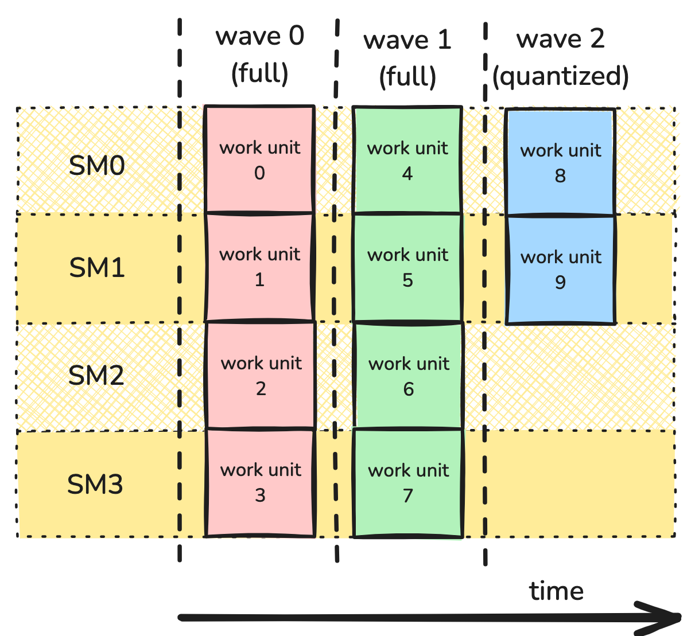

在这个例子中，前两波都是 **full wave**，也就是每个 SM 都有活干；最后一波则是 **partial wave**，只有一半的 SM 被占用。

波量化会严重降低性能，当*工作项的数量相对于 SM 的数量较小*。例如，在具有 114 个 SM 的 H100 PCIe GPU 上，具有 115 个工作单元的计算将需要 2 个波形 - 与具有 228 个工作单元的计算完全相同！换句话说，大约添加第115个工作单元*一半*设备的利用率。另一方面，虽然具有 114,001 个工作单元的计算会遭受相同的量化效应，但与内核的总成本相比，其成本微不足道。您可以在以下位置找到更多信息[NVIDIA 深度学习性能指南](https://docs.nvidia.com/deeplearning/performance/dl-performance-matrix-multiplication/index.html#wave-quant).

为了在示例中观察波量化的影响，让我们使用我们在本系列第 2 部分中创建的 GEMM 内核，并测量不同波数的性能。考虑 MxK 矩阵 A 和 KxN 矩阵 B 的 GEMM。令`bM`和`bN`是tile的尺寸，为简单起见，假设它们均匀地划分 M 和 N。那么波的总数由下式给出`ceil((M/bM * N/bN)/num_SMs)`。为了研究量化的效果，我们想要改变由下式给出的每 SM 的tile：`(M/bM * N/bN)/num_SMs`;小数代表最后一波的满度。因此，我们将修复这些值`M=1024`和`K=4096`并有所不同`N`增量为`bN`（对于我们来说，这是 192）。

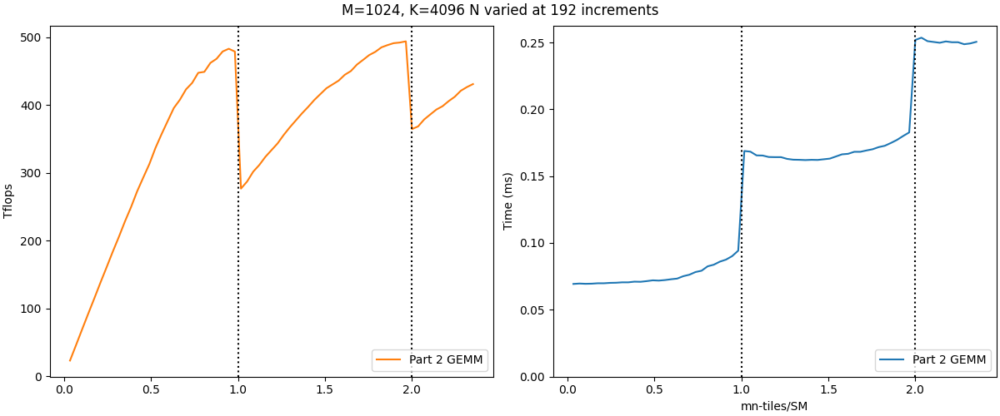

左图显示了 TFLOPs/s 的性能，右图显示了经过的时间，基准测试是在 H100 PCIe GPU 上进行的。垂直虚线表示波边界，其中tiles-per-SM 与整数值交叉。左图显示了波量化效应——跨越波边界时性能急剧下降。相应地，右图显示，经过的时间主要由作为离散参数的波总数决定（对于`x`在`(0,1]`, 2 为`x`在`(1,2]`， 等等）。

请注意，第二个量化效果比第一个量化效果小——波量化的影响随着波数的增加而减小。然而，增加 Wave 数量可能很困难，特别是考虑到 NVIDIA GPU 上的 SM 数量随着更新的架构而持续增长。因此，重要的是我们要制定策略来减轻波量化的影响，而不对问题的规模做出假设。

#### Persistent Kernel

为了解决 wave quantization，我们需要更好的分区与调度方案。到目前为止，本文展示的内核都使用依赖于问题维度的网格，使每个 CTA 只处理一个工作单元。在 GEMM 里，这个 work unit 通常就是 `MxN` 输出矩阵中的一个 `bM x bN` tile，其中 `bM` 和 `bN` 在编译期固定。于是，每个工作单元都对应网格中的一个 CTA，网格大小就是 `M/bM x N/bN`。对应的启动参数如下：

```

dim3 dimGrid(ceil_div(M, bM), ceil_div(M, bN));
```

这种方法的问题在于：虽然我们对线程块如何被分配到 SM 上有一定控制，但要实现更复杂的调度策略仍然比较困难。因此，我们采用另一种设计方式：**persistent kernel**。在 persistent kernel 中，网格大小是固定的，通常就等于可用 SM 的数量，因此每个 CTA 基本上都会“常驻”在自己的 SM 上。可以用下面这段 CUDA 代码查询 SM 数量，并据此设置 `dimGrid`：

```

int num_SMs;
cudaGetDeviceAttribute(&num_SMs, cudaDevAttrMultiProcessorCount, device_id);

dim3 dimGrid(num_SMs);
```

每个 CTA 都保留在其 SM 上，处理多个工作单元，直到所有工作完成。此设计更改通过告诉每个 CTA 如何迭代工作单元，为程序员提供了对调度的更多控制。有了这种灵活性，我们可以以最小化波量化和负载不平衡的方式分配工作。

在实践中，CTA 的 work unit 分配通常交给 **tile scheduler** 处理。它本质上是一个“增强版迭代器”，告诉每个 CTA 下一个 work unit 在哪里，以及何时停止。虽然每个输出 tile 的总工作量并没有改变，但通过更换 tile scheduler，我们就能探索更复杂的策略来尽量减少负载不平衡，例如 **Stream-K**。

## 使用 persistent kernel 处理波量化

为了达到 Stream-K，研究一些更简单但效率低下的波量化方法也是很有用的。这[关于Stream-K的论文](https://arxiv.org/abs/2301.03598)对此有深入的讨论，我们建议阅读。为了方便读者，我们在这里对他们的讨论进行总结。

为了让我们的数字在本节中更容易解析，我们将考虑一个虚构的 GPU，**[喜帕恰斯](https://en.wikipedia.org/wiki/Hipparchus)H10**，其中只有 4 个 SM。

#### 数据并行

我们将从最基本的版本开始，即简单地以 M 和 N 模式均匀分割tile，并以循环格式分配它们。请注意，这与使用非持久性tile网格启动内核时的情况本质上相同；唯一的区别是保证订购。但仍然值得研究以了解波量化成为问题的情况。由于work unit之间不存在依赖性，因此称为**数据并行**工作安排。


图 1 展示了一个示例划分。这里，GEMM 工作负载被分为 9 个tile。由于工作项目相同，瓷砖会分批加工。具体来说，这 9 个tile将在 H10 的 4 个 SM 上分 3 波进行处理：2 个full wave，以及仅占用 4 个 SM 中的 1 个的partial wave。如果每个tile在其 SM 上实现 100% 利用率，则整个计算的利用率为 2.25/3 = 75%。

最直接的方法是回到这样的认识：如果有更多的工作单元，波量化就不成问题——并且我们可以通过减小每个工作单元来增加工作单元的数量。


在图 2 中，我们在 N 方向上将 bN 除以 2。我们现在有 18 个tile，可以分 5 波执行：4 个full wave和一个partial wave，其中 4 个 SM 中的 2 个被占用。再次假设每个tile的利用率为 100%，则整个计算的利用率为 4.5/5 = 90%。此外，图 2 中的每个tile需要的 FLOP 次数是图 1 中tile的一半 — 初步估计，每个波所需的时间应该是图 1 中的波的一半。因此，尽管图 2 中有 5 个波，而图 1 中有 3 个波，但图 2 中花费的时间仅为图 1 的 (5*0.5)/3 = 83%！可能会出什么问题？

不幸的是，我们做了太多的简化假设，并且不再正确地对喜帕恰斯 H10 的行为进行建模。核心问题是，随着tile 大小的减小，work tile的计算可能会变得效率较低。因此，假设将tile 大小减半也会使计算时间减半或保持单个 CTA 的利用率恒定，这可能是不正确的。

主要缺点之一是丢失[算术强度](https://docs.nvidia.com/deeplearning/performance/dl-performance-matrix-multiplication/index.html#math-mem)。由于内存访问非常耗时，我们希望有大量的算术运算来掩盖内存访问延迟。对于GEMM，CTA计算amatmul 瓷砖将执行算术运算和GMEM 访问。观察减半将第一个数字减半，但不将第二个数字减半。例如，128 x 128 x 128 tile大小将导致每次 GMEM 传输执行 85.3 次操作，而 128 x 64 x 128 tile大小将导致每次 GMEM 传输仅执行 64 次操作。

另一个复杂因素是，假设 CTA 大小没有改变，将tile 大小减半意味着 CTA 中的每个扭曲处理一半的指令。这减少了 warp 调度程序可用的延迟隐藏机会，这对于流水线 GEMM 的良好性能至关重要。

最后，与 MMA 原子的选择相关的tile 大小可能存在限制。例如，H10 可能需要使用 128 x 128 x 16 WGMMA 原子才能获得最大吞吐量。这对tile的最小尺寸增加了另一个限制。

这些考虑因素之间的平衡并不完全明显，并且为特定问题找到合适的tile尺寸可能需要反复试验 - 例如，使用[CUTLASS 分析仪](https://github.com/NVIDIA/cutlass/blob/main/media/docs/profiler.md).

#### Split-K

到目前为止，我们只分裂了 M 模式和 N 模式，但我们还可以分裂另一个维度：K 模式。当K很大时这最有效；和以前一样，当 bK 变得太小时，算术强度和延迟隐藏都会付出代价。

这**Split-K**调度沿着 K 模式将tile分割成恒定数量的块。例如，在图 3 中，我们沿着 K 模式分为 2 个工作项。

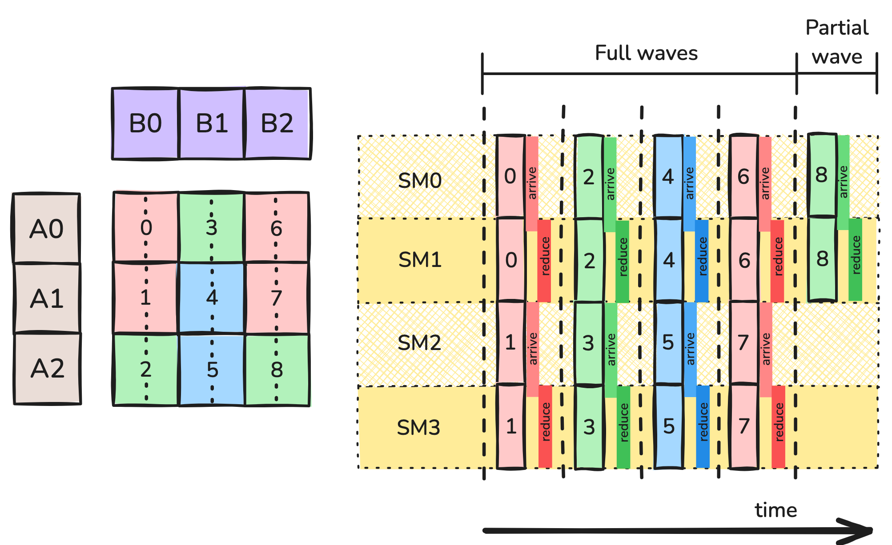

该策略引入了一个新的复杂性：每个 CTA 仅为其 bM x bN 输出 tile积累了部分结果。为了完成计算，处理此输出 tile的 CTA 需要合并其结果。处理这个问题的典型方法是**减少十字转门**在辅助 GMEM 工作区中。每个在给定tile上协作的 CTA 都会等待处理先前 K 索引的 CTA 到达屏障，之后它将其部分结果减少到工作空间中，并且自身到达屏障。最终的 CTA 不是归约到工作区，而是从工作区归约到它自己的累加器并计算尾声。请注意，额外的 GMEM 访问和屏障同步会引入额外的开销，如**图3**以“到达”和“减少”块的形式。

Split-K 引入了一个新的超参数，即分割数量，它有自己的一套权衡。

- 增加分割数量会降低波量化效果，从而可能实现更好的 SM 整体利用率。
- 增加分割数会减小 K 方向上的分片大小，这可能会增加 GMEM 访问计算的比率。
- 增加分割数量还会减少每个 CTA 的指令数量，从而减少隐藏延迟的机会。
- 我们引入了同步和减少开销，这是 Split-MN 中未见的额外成本。分裂越多，同步的成本就越高。

#### Stream-K

到目前为止考虑的策略有*改进的*波量化问题，但他们还没有*消除了*它。回到我们最初的例子，9 个tile分布在 4 个 SM 上，如果每个 SM 可以运行 2.25 波，那就太理想了。这就是背后的动机**Stream-K**.

Stream-K 策略为每个 SM 分配一个单一的、持久的 CTA。每个 CTA 都分配有一个*分数*tile的数量，其中任何被分割的tile都沿着 K 模式分割。与 Split-K 策略一样，对于拆分的每个work tile，在该tile上协作的 CTA 可以使用 GMEM 工作空间中的十字转门缩减来组合其结果。

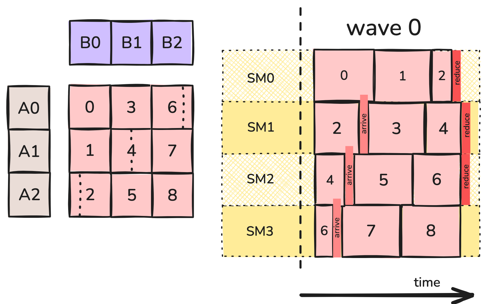

例如，在图 4 中，SM0 上的持久 CTA 计算work tile 0 的全部、work tile 1 的全部以及work tile 2 的 1/4。SM1 上的持久 CTA 计算work tile 2 的剩余部分、work tile 3 的全部以及work tile 4 的一半，依此类推。安排部分tile，以便work tile的第一块在其最后一块之前计算，从而最大限度地减少同步开销（但请注意，对于 K 方向上非常长的tile，这可能并不总是可能的。）

让我们将 Stream-K 与我们之前讨论过的策略进行比较。

- 我们通过消除波来消除量子化。每个 CTA 计算 2.25 个tile。除了同步和缩减所需的额外时间之外，与原始内核所需的 3 个单位相比，总计算量应约为 2.25 个单位。
- 许多原始的 128 x 128 x 128 tile完全由单个 CTA 处理，因此我们部分保留了大型tile的优点：高计算内存比、长指令序列以及大型 WGMMA 指令的可用性。如果第一个内核能够以每个 CTA 100% 的利用率运行，那么这个内核也可以。
- 在许多情况下，我们可以在计算最终片段之前安排输出 tile的早期片段的计算，以便负责尾声的 CTA 实际上不需要在其屏障处等待很长时间。
- 内核确实需要额外的 GMEM 传输，以便可以在 CTA 之间共享部分切片的数据。

#### 混合动力 Stream-K

我们可以对内核进行最后一项改进，这与缓存性能有关。分片 GEMM 内核的本质是每个操作数分片都需要计算多个输出工作分片。例如，在拆分 MN 情况下，需要使用tile B0 来计算输出的tile 0、1 和 2。

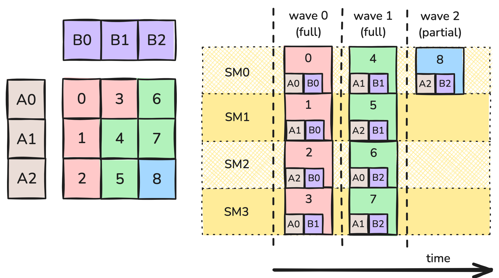

这里同时计算输出 tile 0、1 和 2。当其中一个 CTA 从全局内存中抓取tile B0 时，它也会被放入二级缓存中。其他也请求tile B0 的 CTA 随后将命中缓存并能够更快地加载它。缓存的大小是有限的，旧数据可能会被驱逐，这使得这些请求大约在同一时间发生非常重要。

更准确地说，操作数块也在 K 方向上分区，并且每个 CTA 都在其操作数块的 K 块上执行内部循环。当第 0 波开始时，SM 0、1、2 将同时请求tile B0 的第 0 个 K 块，其中两个将命中缓存。在循环的下一次迭代中，SM 0、1 和 2 将请求tile B0 的第一个 K 块，依此类推。

然而，stream-K内核引入了**倾斜**：由于每个 SM 首先计算不同大小的部分tile，因此它们往往会同时处理不同的 K 偏移量。回到图 4，SM 0 和 1 都在第 0 波波开始时使用来自 B0 的数据 — 但 SM0 需要其第 0 个 K 块，而 SM1 需要中间的数据。事实上，该调度中的 K 偏移量从未对齐，这使得缓存命中变得更加困难。总而言之，消除“波动”并调度不同的 SM 彼此不同步会导致缓存性能较差的隐性成本。

我们可以通过将计算重新安排为persistent kernel 和 普通数据并行内核之间的混合来解决该问题。由于数据并行调度不会受到偏差的影响，因此尽可能长时间地使用此调度是有意义的，保留 Stream-K 只用于足够的tile来处理波量化效果。为了在 Stream-K 阶段正确平衡 SM 之间的工作负载，有必要向该阶段分配 1 个full wave和任何剩余的分波。

该时间表如图 6 所示。初始 Stream-K 阶段在 1 到 2 个full wave计算之间进行处理。每个 SM 最多接收 2 个部分tile。根据设计，这些tile的总大小与 CTA 无关，因此所有 CTA 都希望大约在同一时间完成此阶段的计算。此阶段完成后，仅保留整个tile，并且剩余的数量可被 SM 的数量整除。因此，可以使用非持久的数据并行策略来计算这些tile，该策略不会受到波量化的影响，并且具有更好的缓存性能。如图 6 所示：

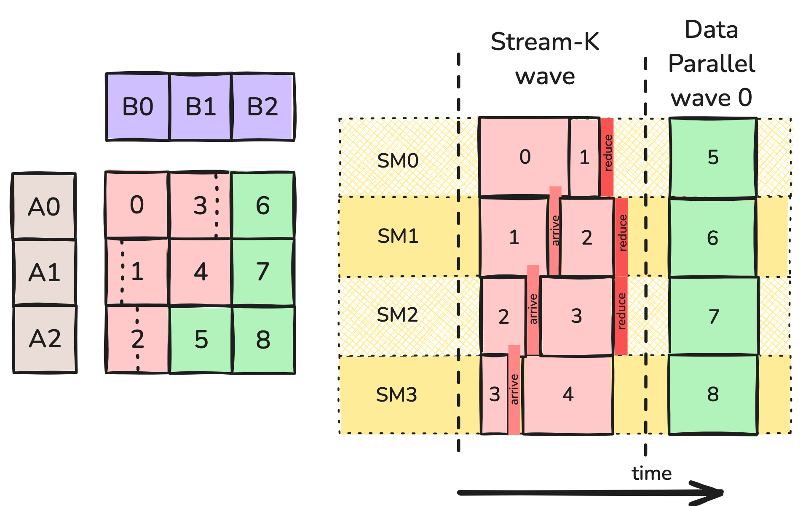

在这里，我们可以预期tile 6、7 和 8 的计算几乎同时发生，并导致操作数块 B2 的缓存命中。类似地，work tile 5 和 8 将能够使用其共享 A tile的缓存。在这种情况下，数据并行阶段仅由 1 个波组成，但具有更多tile的较大 GEMM 将具有更长的数据并行阶段，并且更多地使用缓存。

## tile调度程序抽象

由于分区和调度工作的问题在很大程度上与每个 CTA 内存和计算操作分开，因此像 CUTLASS 这样的 GEMM 实现通常会将它们包装在称为**瓷砖调度程序**。 （这比 GEMM 更通用——例如，[FlashAttention-3还支持具有tile调度程序类的persistent kernel](https://github.com/Dao-AILab/flash-attention/blob/main/hopper/tile_scheduler.hpp).) 在下一节中，我们将具体研究 CUTLASS 的实现；在这里，我们概述了tile scheduler的职责。

首先，我们内核的网格形状取决于tile调度。因此tile调度器负责确定内核的网格大小。对于非持久性内核，这将与逻辑网格相同并取决于问题的大小；对于persistent kernel，它将是固定的并且可能等于 SM 的数量。我们在开始时查询tile调度程序的网格大小，并将其用于内核启动。

在内核中，每个线程将构造一个tile调度程序的实例。主循环和尾声现在将被包装在**工作循环**在调度程序提供的tile上，可能如下所示：

```

for (auto worktile = scheduler.get_initial_tile();
    scheduler.is_valid(worktile);
    worktile = scheduler.get_next_tile(worktile)) {
        auto [m_block, n_block, k_block_start, k_block_stop] = worktile.get_block_coord();
        for (k_block = k_block_start; k_block &lt; k_block_stop; ++k_block) {
            // mainloop
        }
        // epilogue
}
```

实现这些迭代器原语的一个简单方法是让调度程序维护tile的线性索引。对于persistent kernel，每个 CTA 最初接收索引处的tile`blockIdx.x`（这只是底层SM的线性索引）；它通过前进到下一个tile`gridDim.x`（SM的数量）；只要其索引不超过tile总数，该tile就有效。将线性索引映射到实际（M，N）tile坐标的工作被委托给`worktile`目的。

这对于持久数据并行调度来说已经足够了，但是更复杂的调度需要更多功能。对于 Stream-K，K 方向上的工作分配的大小取决于tile，这意味着work tile实际上应该为内核提供四个坐标，如代码清单中所示。

对于 Stream-K 和 Split-K，部分或全部 CTA 将输出部分结果，然后必须对其进行聚合，具有以下含义。

- 需要额外的 GMEM 工作空间，既用于部分结果，也用于障碍对象数组，以允许在单个tile上工作的 CTA 之间进行同步。所需的空间量取决于问题的大小，因此必须在内核启动之前动态分配。在内核期间，调度程序应向 CTA 提供指向工作区的适当指针。
- 当开始新的work tile时，需要通知每个 CTA 这是一个完整的输出 tile（因此结果应存储到输出张量）还是部分输出 tile（因此结果应存储到工作区）。
- 只有一个 CTA 负责执行输出块中的尾声。该 CTA 必须从工作区缩减到其累加器中，然后执行尾声，而不是缩减到工作区中。调度程序需要通知每个 CTA 是否负责其处理的每个tile上的尾声。

正如 CUTLASS 实现所示，可以对这个简单的轮廓进行许多改进，包括让调度程序决定以什么顺序启动块、使用启发式从 Stream-K 回退到 Split-K 或数据并行模式，以及在 Hopper 上正确使用集群。接下来我们将研究这些。

[我们在 GitHub 上的代码示例](https://github.com/ColfaxResearch/cfx-article-src/tree/master/streamk)提供了调度程序的三个示例：一个简单的非持久调度程序，它在由问题形状确定的网格上为每个 CTA 分配 1 个tile；数据并行持久调度程序；以及 Stream-K 混合调度器，其中包含一些但不是全部的 CUTLASS 优化。在实践中，我们发现 CUTLASS 的许多优化对于获得合理的性能是必要的：值得注意的是，额外的 GMEM 访问和减少导致的更小的切片大小是真正的成本，并且需要仔细调整 Stream-K 工作分配的边界以最小化这种成本。

Stream-K tile scheduler的一些性能指标如下所示。相对于数据并行调度器，我们的 Stream-K 实现在每个波的早期都表现良好，减少了波量化效应，但随着部分尾波开始填充，其性能受到影响。“启发式”曲线使用 CUTLASS 的启发式，一旦尾波至少半满，就从 Stream-K 切换到数据并行。这显然是一个不错的选择。

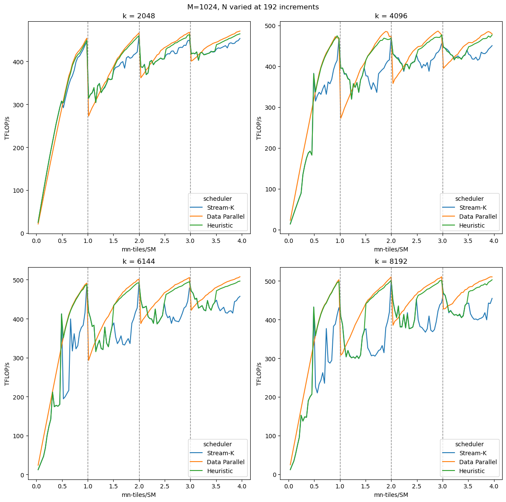

## 结论

在本文中，我们讨论了波量化及其如何影响 GEMM 的性能。我们在第 2 部分中创建的 GEMM 实现中观察到波量化带来的显着性能波动。然后我们讨论了对抗波量化的各种策略，重点是 Stream-K。最后，我们提出了 Stream-K tile scheduler的一个版本，以消除 GEMM 实现中波量化的影响。关于使用 ZXQPH1ZXQ/ZXQPH3ZXQ 抽象实现基于 Hopper 的高性能 GEMM 的三部分系列到此结束。

## 附录：CUTLASS中的Stream-K

本附录探讨了 CUTLASS 中 Stream-K 的一些更详细的细节：如何使用它、它相对于其他调度程序的性能以及编写它时使用的一些优化。

#### 将 Stream-K 与 GEMM API 结合使用

首先我们讨论如何将 Stream-K 调度程序与 CUTLASS 3.X GEMM API 一起使用。我们首先简要回顾一下 CUTLASS 3.X GEMM API。讨论将仅限于与 Stream-K 相关的部分，但您可以找到更多[细节](https://github.com/NVIDIA/cutlass/blob/main/media/docs/gemm_api_3x.md)和[例子](https://github.com/NVIDIA/cutlass/tree/main/examples)在 CUTLASS 存储库上。这里的代码示例基于CUTLASS[实施例48](https://github.com/NVIDIA/cutlass/blob/main/examples/48_hopper_warp_specialized_gemm/48_hopper_warp_specialized_gemm.cu).

CUTLASS GEMM API 分为三个部分：

- 尾声 – 定义如何组合部分结果以及如何进行可能的修改
- Mainloop – 定义如何计算各个tile
- 内核——尾声和主循环的包装。

它们是使用各自的 CollectiveBuilders 创建的，使开发人员能够配置 GEMM 内核。开发人员还可以选择让 CUTLASS 根据内部启发式自动选择合适的配置。这是使用此自动功能的 GEMM 内核：

```

using CollectiveEpilogue = typename cutlass::epilogue::collective::CollectiveBuilder&lt;
    cutlass::arch::Sm90, cutlass::arch::OpClassTensorOp,
    TileShape, ClusterShape,
    cutlass::epilogue::collective::EpilogueTileAuto,
    ElementAccumulator, ElementAccumulator,
    ElementC, LayoutC, AlignmentC,
    ElementC, LayoutC, AlignmentC,
    cutlass::epilogue::collective::EpilogueScheduleAuto
  >::CollectiveOp;

using CollectiveMainloop = typename cutlass::gemm::collective::CollectiveBuilder&lt;
    ArchTag, OperatorClass,
    ElementA, LayoutA, AlignmentA,
    ElementB, LayoutB, AlignmentB,
    ElementAccumulator,
    TileShape, ClusterShape,
    cutlass::gemm::collective::StageCountAutoCarveout&lt;
      static_cast&lt;int>(sizeof(typename CollectiveEpilogue::SharedStorage))>,
    cutlass::gemm::collective::KernelScheduleAuto
  >::CollectiveOp;

using GemmKernel = cutlass::gemm::kernel::GemmUniversal&lt;
    Shape&lt;int,int,int>, // Indicates ProblemShape
    CollectiveMainloop,
    CollectiveEpilogue
>;
```

要指定GEMM内核使用Stream-K，我们需要指定`GemmKernel`使用`StreamKScheduler`.

```

using GemmKernel = cutlass::gemm::kernel::GemmUniversal<
    Shape<int,int,int>, // Indicates ProblemShape
    CollectiveMainloop,
    CollectiveEpilogue,
    cutlass::gemm::StreamKScheduler
>;
```

此外，只有某些主循环和尾声时间表支持 Stream-K。我们将使用`TmaWarpSpecializedCooperative`对于 Mainloop 和 Epilogue。

```

using CollectiveEpilogue = typename cutlass::epilogue::collective::CollectiveBuilder&lt;
    // ..... //
    cutlass::epilogue::TmaWarpSpecializedCooperative
  >::CollectiveOp;

using CollectiveMainloop = typename cutlass::gemm::collective::CollectiveBuilder&lt;
    // ..... //
    cutlass::gemm::KernelTmaWarpSpecializedCooperative
  >::CollectiveOp;
```

这个 GEMM 内核现在已经配置为使用 Stream-K scheduler。 An important note about the Stream-K scheduler is that it does not always use Stream-K partitioning.相反，默认情况下它将使用内部启发式来确定最佳分区方案。 CUTLASS 调度程序有四个定义的选项**分解模式**.

- `DataParallel`– K 方向无分裂。
- `SplitK`– 使用用户定义的分割来实现 SplitK。
- `StreamK`– 实施 Stream-K 分区。
- `Heuristic`– CUTLASS 将根据问题选择模式。

稍后我们将更深入地讨论分解模式。现在，我们可以通过在调度程序参数中设置它来强制它使用 Stream-K 分解。我们可以将其作为`Gemm`论据。

```

using DecompositionMode = typename cutlass::gemm::kernel::detail::PersistentTileSchedulerSm90StreamKParams::DecompositionMode;
DecompositionMode decomp = DecompositionMode::StreamK;

int splits=1;
typename Gemm::GemmKernel::TileScheduler::Arguments scheduler_args;
scheduler_args = { splits, static_cast&lt;int>(options.swizzle), options.raster, decomp};

typename Gemm::Arguments arguments{
    cutlass::gemm::GemmUniversalMode::kGemm,
    {options.m, options.n, options.k},
    {block_A.get(), stride_A, block_B.get(), stride_B},
    {{options.alpha, options.beta}, block_C.get(), stride_C, block_D.get(), stride_D},
    hw_info,
    scheduler_args
};
```

除了`DecompositionMode`，调度程序参数还采用与 Split-K 和threadblock rasterization相关的选项（我们也在下面的附录中讨论）。最后，通过论证和`GemmKernel`准备好后，我们可以使用 Stream-K 分区来运行 GEMM。

```

using Gemm = cutlass::gemm::device::GemmUniversalAdapter&lt;GemmKernel>;
Gemm gemm;

size_t workspace_size = Gemm::get_workspace_size(arguments);

cutlass::device_memory::allocation&lt;uint8_t> workspace(workspace_size);
CUTLASS_CHECK(gemm.can_implement(arguments));
CUTLASS_CHECK(gemm.initialize(arguments, workspace.get()));
CUTLASS_CHECK(gemm.run());
```

#### Stream-K性能

现在我们已经讨论了如何使用特定的调度程序运行 GEMM，让我们看看它们在给定不同输入大小的情况下如何执行。再次，我们将固定 M 和 K，然后使用tiles-per-SM 以tile 大小的增量改变 N，`(M/bM * N/bN)/num_SMs`, for the x-axis.我们对 Stream-K、Split-K 和 DataParallel 三种模式进行了基准测试进行比较。此外，我们还针对不同的K值重复了这个过程。基准测试数据是在 H100 PCIe GPU 上获取的。

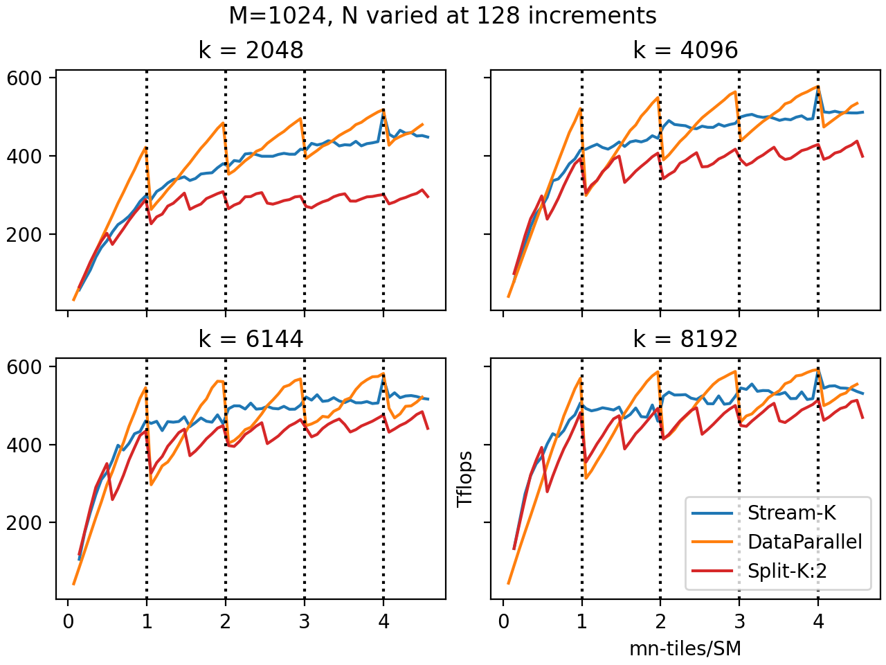

竖直虚线表示 wave 的边界。 As expected, there is a sharp drop in performance for the DataParallel mode when going over wave boundaries.这就是波的量子化效应。The DataParallel mode matches or outperforms all other modes when the last wave is mostly full (tiles-per-SM is just under a whole integer), and underperforms when it is nearly empty (tiles-per-SM is just over a whole integer).最后，我们可以看到，当波总数较低时，波量化效果最明显。

使用 Split-K 后，wave quantization 的影响会减弱。 Split-K 有效地将tile的数量乘以 K 倍，因此波数也增加了 K 倍。您可以在图中看到这一点，因为具有 2 个分割的 Split-K 的性能振荡频率是 DataParallel 的两倍。不幸的是,减少额外的费用似乎超过了大多数情况下的好处,而Split-K与其他两个调度器相比,很少表现得很好 (通常是在太少的块时,使得GPU会被严重不充分利用而不会被分割).为了保持整洁，该图仅显示了 K 为 2 的 Split-K；除了非常小的 X 之外，较高的 K 值通常比 K=2 表现更差。

相比之下，Stream-K 性能不显示波量化，随着波数的变化波动很小。一般来说，Stream-K 分区与 Split-K 匹配或优于 Split-K，并且当最后一个波接近空时，以较大的 K 值击败 DataParallel 分区。在 N=7296 处，DataParallel 和 Stream-K 得到相同的结果，对应于 X=1024*7296/114=4。由于tile可均匀分配到 CTA，因此不需要部分tile或减少。因此 DataParallel 和 Stream-K 得到相同的结果。

CUTLASS除了三种显式分解模式外，还具有Heuristic模式。确切的启发式方法将在后面的部分中讨论，但我们可以看到它针对 Stream-K 和 DataParallel（已删除 split-K）的效果如何。

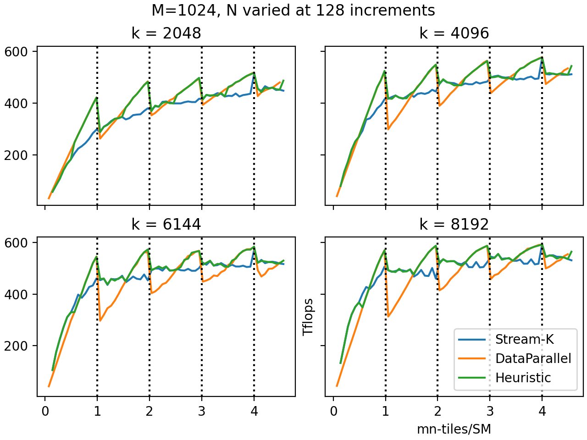

正如您所看到的，CUTLASS 启发式模式在预测最佳性能分解模式方面做得非常好。当量化效果较低时选择DataParallel模式，当量化效果较高时选择Stream-K。由于启发式模式是默认的，因此您通常最好不要指定分解模式并让 CUTLASS 决定。

#### CUTLASS 实现细节

接下来我们讨论 CUTLASS 版本的 Stream-K 调度程序的细节（从 CUTLASS 3.6 开始）。

**日程。**CUTLASS 实现了上面解释的混合调度的一个版本，其中调度程序在以数据并行方式组织其余工作之前最多将两波专用于 Stream-K 工作。由于数据并行波往往同时在相同的 K 偏移上工作，因此应该提高 L2 缓存性能。

**减少。**默认情况下，CTA 在同一输出 tile上协作以“十字转门”方式进行。假设给定的输出 tile由 CTA 0、1、...、n 处理，并按分配的 K 索引范围递增排序。首先，CTA 0 将计算其结果，并将其写入全局内存工作区。 CTA 1 在屏障处等待 CTA 0 完成写入，然后将其输出减少到同一全局内存工作区中。CTA 2 等待 CTA 1，然后减少其输出，依此类推。最后，CTA n 等待 CTA n-1，但它不是归约到工作区，而是从工作区归约到其累加器，最后计算尾声并写入输出张量。

在另一种“非确定性模式”中（由用户使用参数指定`ReductionMode::Nondeterministic`），CTA 1, …, n-1 不再相互等待，而是简单地原子缩减到工作空间中。所有CTA仍然需要等待CTA 0，来初始化工作空间； CTA n 仍需等待 CTA 0, …, n-1。不确定性源于以下事实：约简 1, …, n-1 现在可以以任何顺序发生（并且浮点加法是非关联的）。

**分解模式。**CUTLASS Stream-K 调度器还支持 Split-K 和数据并行持久调度，用户可以使用`decomposition_mode`争论。 (Passing an argument`splits`不等于 1 将强制调度程序以给定的分割数运行 split-K。）用户还可以选择`DecompositionMode::Heuristic`，其中调度程序可以从流 K 回退到更简单的调度之一：如果没有波量化，或者尾波至少是半满，则调度程序回退到数据并行；如果分配给流 K 工作的 CTA 数量是它们应处理的流 K tile数量的倍数，则调度程序将回退到 split-K。由于 Stream-K 会带来一些与缩减和同步相关的额外开销，因此如果波量化不会成为问题，那么回退到数据并行是有意义的。根据我们的测试，这种启发式几乎总是在各种问题规模上做出最佳选择。

**threadblock rasterization。**独立于波量化问题的persistent kernel的一个优点是能够选择tile的启动顺序。对于 GEMM，这主要是因为缓存性能：如果输出矩阵的同一行或列（相同的 M 或 N 索引）中的tile大约在同一时间进行处理，它们将同时从 GMEM 的操作数矩阵之一加载数据，这很可能会命中二级缓存。

因此，提高persistent kernel缓存性能的最简单方法是按照 M 或 N 模式按顺序启动tile。例如，如果我们沿着 N 模式启动tile，并尽可能长时间地保持 M 固定，则通常会在缓存中找到来自操作数矩阵 A 的数据。在CUTLASS中，可以通过`raster_order`调度程序的参数，`RasterOrderOptions::AlongM`和`AlongN`给予这种行为。通常，人们希望沿着*更短*两种模式中的一种，以tile为单位测量；`RasterOrderOptions::Heuristic`会自动解决这个问题。

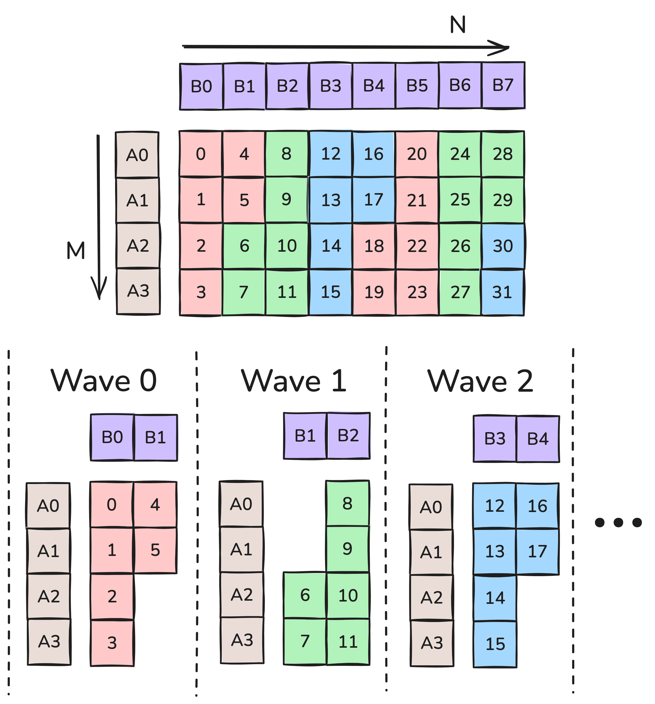

图 7 显示了该案例的threadblock rasterization`M<N`带有 6 个 SM。`RasterOrderOptions::Heuristic`会选择`Along`在这种情况下是M。例如，在第 0 波中，SM 在tile 0 到 5 上工作，并且来自 HBM 的操作数加载数量从*先验*计数为 12 到 6（假设这适合 L2 缓存）。

更先进的技术是尝试考虑两个维度的接近度。例如，在图7中，tile在M方向上相邻，但在N方向上偏移M。我们可以通过沿着 N 维度移动 2 个tile，然后沿着 M 方向移动来改进这一点。这就是所谓的**threadblock swizzle**，专门针对`swizzle=2`。我们可以使用参数指定要混合的tile数量`max_swizzle_size`，但顾名思义，如果问题不够大，调度程序可能会选择较小的 swizzle 大小。可能的调配大小为 1（无调配）、2、4 或 8。图 8 显示了处理work tile的顺序`AlongM`光栅顺序和 2 或 1 的 swizzle 大小。（请注意，这与中讨论的 XOR swizzle 不同）[这篇文章](https://research.colfax-intl.com/tutorial-matrix-transpose-in-cutlass/).)

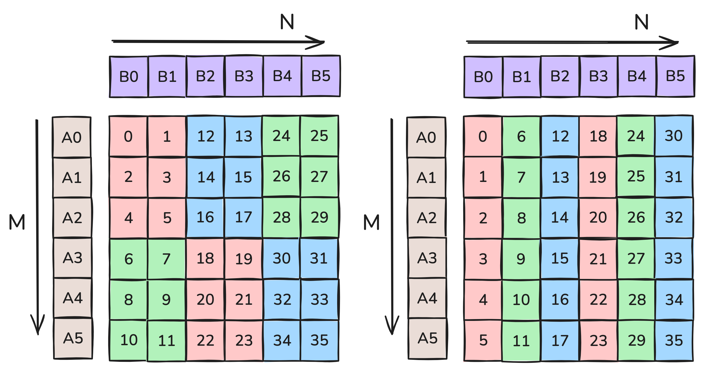

在图8中，每个波`swizzle=2`加载 5 个操作数块，而每个波`swizzle=1`加载 7（再次假设所有内容都适合 L2）。因此，对于 6 个波形，有 30 个操作数 tile加载`swizzle=2`和 42 个操作数块加载`swizzle=1`。 The correct swizzle size for a given problem varies a lot with the problem and device characteristics. However, generally swizzle is only effective when there are enough tiles in the rasterized direction. More precisely, we would want the number of M tiles to be greater than`SM/swizzle`;否则，无论如何都会加载光栅化方向上的所有操作数块。对于 114 个 SM，2、4 和 8 的 swizzle 的截止值分别为 57、31 和 15。

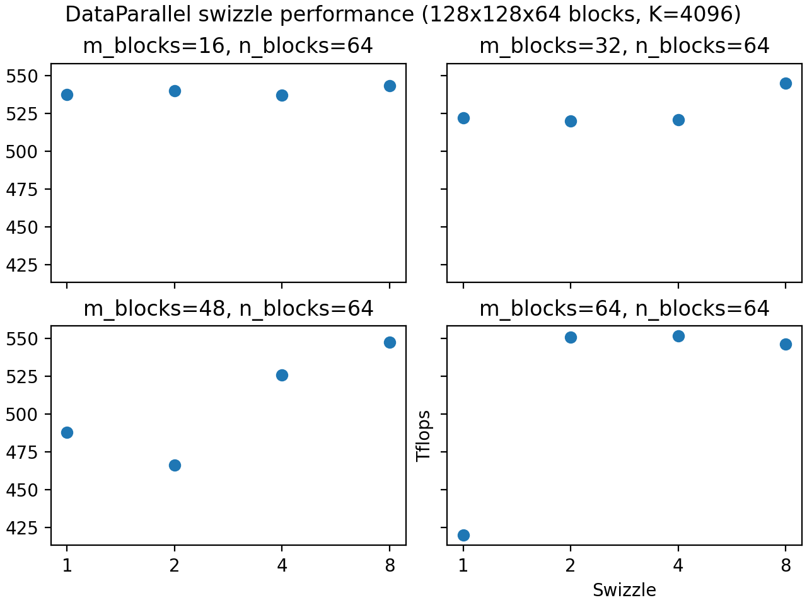

上图反映了这些截止值，一旦有足够的tile，混合效果就会更好。但正如之前提到的，瓷砖的数量并不是唯一的考虑因素； L2 缓存大小等其他因素可能会进一步影响 swizzle 性能。所以我们建议使用[CUTLASS 轮廓仪](https://github.com/NVIDIA/cutlass/blob/main/media/docs/profiler.md)找到适合您工作负载的最佳 swizzle 数字。

**集群和多播。**Hopper架构介绍**线程块簇**，在同一个 GPU 处理集群 (GPC) 上同时调度的 CTA 组，可以快速访问彼此的共享内存。对于当前的讨论来说最重要的是，TMA 负载可以是[组播](https://research.colfax-intl.com/tutorial-hopper-tma/)，在一次操作中同时将相同的数据加载到集群中所有 CTA 的 SMEM 中。

这对于tile scheduler的构建有一些深刻的影响。我们说过，尝试在同一行或列中大约同时安排tile对于缓存性能非常重要。但尝试将它们分配到同一集群也很重要，因为这样来自操作数矩阵之一的数据可以进行多播。此外，对于流 K 工作，集群中的 CTA 理想情况下应该同时处理相同的 K 偏移量（即，证明混合调度合理的偏差问题在集群内也很重要）。

CUTLASS 优雅地处理了这个问题。首先，整个调度是通过将输出矩阵划分为tile簇而不是单个tile来构建的：例如，如果簇形状为 2×4，则在每个数据并行波期间，每个簇将在输出矩阵中的矩形 2×4 块区域上工作。其次，对于stream-K阶段，调度程序尝试将执行stream-K工作的集群均匀地划分为“组”，其中每个组同时分配具有相同K偏移的工作。完整的算法有些复杂，但幸运的是，除了指定簇形状之外，用户实际上不必考虑它。
