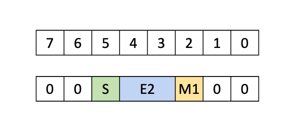
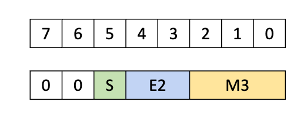

# CUTLASS 教程：NVIDIA® Blackwell GPU 上的子字节 GEMM

原文标题：CUTLASS Tutorial: Sub-byte GEMM on NVIDIA® Blackwell GPUs

英文对照：[articles-en/cutlass-tutorial-sub-byte-gemm-on-nvidia-blackwell-gpus.en.md](../articles-en/cutlass-tutorial-sub-byte-gemm-on-nvidia-blackwell-gpus.en.md)

欢迎来到我们研究 NVIDIA Blackwell 架构上的 GEMM 系列的第 3 部分。在第 1 部分和第 2 部分中，我们研究了新 Blackwell Tensor Core UMMA 指令的张量内存和 2 个 SM 功能，以及如何在 CUTLASS 中使用它们。在这一部分中，我们介绍低精度计算，然后讨论如何对 Blackwell GEMM 进行低精度计算，特别关注子字节（6 位和 4 位）格式以及这些格式如何影响数据的内存布局设置。主要要点是对于混合输入 UMMA 类型`f8f6f4`（即允许支持的8位、6位和4位操作数的任意组合），UMMA需要以一定的方式读取数据*拆开包装的*格式，并且在执行 GMEM 到 SMEM 内存加载时，TMA 可以处理解包为这种正确的格式。然而，这对 GMEM 中允许的切片大小、主维和数据地址对齐施加了一些额外的限制。在编写 CUTLASS 内核代码方面，我们可以在第 1 部分和第 2 部分中开发的理解的基础上额外合并`f8f6f4`混合输入的情况，正如我们将要展示的。

Blackwell 还支持块级格式，`mx`遵循 OCP 规范或 NVIDIA 自己的类型`nvf4`数据类型。有关 Blackwell 上支持的低精度类型的完整列表，请参阅此[CUTLASS 文档](https://github.com/NVIDIA/cutlass/blob/main/media/docs/cpp/blackwell_functionality.md#blackwell-narrow-precision-data-types)。我们将块扩展的讨论推迟到下一篇文章。

**精度低**通常指使用比 32 位单精度浮点更少的位数的数据类型，由 1985 年的 IEEE 754 正式化。在许多 AI 工作负载中，低精度类型比单精度更受欢迎，因为它们可以显着减少模型大小和计算负载。近年来，硬件和软件的紧密耦合发展朝着降低精度的方向发展：

- NVIDIA 的 Volta 架构于 2017 年推出，其特点是 Tensor Core 支持半精度 (FP16) 矩阵乘法和 FP32 累加。
- 2018年，Google Brain设计了bfloat16格式，原生支持[谷歌的TPU](https://www.nextplatform.com/2018/05/10/tearing-apart-googles-tpu-3-0-ai-coprocessor/)。与 FP16 不同，BF16 有 8 个指数位，使其具有与 FP32 相同的动态范围，但精度低得多。 NVIDIA Ampere 架构等其他芯片很快也支持 BF16。
- 安培还介绍了[TF32](https://developer.nvidia.com/blog/accelerating-ai-training-with-tf32-tensor-cores/)，19位格式，范围为FP32，精度为FP16。
- 量化到 INT8 是 AI 中一项历史悠久的技术，特别是用于推理，起源于数字信号处理领域。然而，整数计算的范围和精度与浮点数显着不同，使得整数格式不太适合训练，并且需要对模型训练进行重大更改才能在推理过程中成功工作。针对这个问题，[米奇克维丘斯等人。 (2022)](https://arxiv.org/abs/2209.05433)为 AI 应用提出了两种 8 位浮点格式：一种具有 4 个指数和 3 个尾数位，另一种具有 5 个指数和 2 个尾数位。 NVIDIA Hopper 架构为两种格式提供了加速矩阵乘法原语。
- 最近，Blackwell 架构推出了**子字节**对 6 位和 4 位浮点的精度支持。这些格式都见过[被 AI 研究人员快速采用](https://arxiv.org/abs/2501.17116)以实现更低的模型大小和更高的计算吞吐量。

低精度格式的使用通常涉及**混合精度**计算，意味着使用多种数据类型的计算。举几个例子：

- 大多数 Tensor Core 指令以比操作数更高精度的数据类型进行累加，通常为 FP32 或 INT32。
- 在Hopper架构上，[深度搜索](https://arxiv.org/abs/2412.19437v2)通过将 Tensor Core 累加与 CUDA 核心累积交替，进一步减轻了 FP8 GEMM 的精度损失（在[我们之前的帖子](https://research.colfax-intl.com/deepseek-r1-and-fp8-mixed-precision-training/)).
- **混合输入**GEMM（其中操作数具有不同的数据类型）也可能很有用——例如，我们可能希望通过将其权重量化为 8 位或更低来减少模型的内存占用，同时通过保持激活的更高精度来保持质量。

由于低精度类型的范围往往较小，因此简单地量化可能会导致非常大的值被截断或非常小的值归零。为了补偿这一点，可以将每组值除以高精度**比例因子**在量化之前将它们置于可接受的范围内。然后保存这些比例因子并在计算结束时相乘。对于如何对缩放值进行分组有几种合理的选择：

- 整个张量的单个比例因子（便宜，但会导致严重的饱和问题）。
- 相反：每个值的比例因子（允许高精度但具有巨大的内存开销）。
- 每个矩阵行或列的比例因子。
- **平铺方式**缩放：输出的每个固定大小矩阵tile的比例因子，例如 128×128。
- **堵塞**缩放：每行tile的比例因子，例如 1×32。

Blackwell 的 UMMA 指令本身支持与 1×32 或 1×16 块相关的缩放因子的块缩放。比例因子形成额外的张量，必须正确加载并馈送到 Tensor Core，从而增加了内核的复杂性。我们将在这篇文章中坚持未缩放的情况，并在本系列的最后（也是最后）部分讨论块缩放。

CUTLASS支持多种数据类型，包括许多不同的低精度数据类型。完整的[支持的数据类型列表](https://github.com/NVIDIA/cutlass/blob/main/media/docs/cpp/fundamental_types.md#numeric-types)可以在 CUTLASS 文档中找到。对于本博客，我们的主要兴趣是浮点数据类型，因此在讨论新的子字节数据类型之前，我们将首先简要回顾一下该数据类型的存储方式。

浮点数据中的位分为三部分：符号、指数和尾数。 （有关浮点的一些背景知识，请参见[这里](https://fabiensanglard.net/floating_point_visually_explained/)或者[这里](https://float.exposed/0x0010).) 符号（如果存在）只需要一位，但指数和尾数可以是任意位数。尾数上的位数越多，精度越高，而指数上的位数越多，范围越大。但由于所使用的总位数有限，因此在分配给指数和尾数的位数之间需要进行权衡。在低精度格式中，总位数很少，这种权衡变​​得更加重要。

## 字节和子字节格式

NVIDIA GPU 支持五种基本浮点数据类型，大小最多为 1 字节：

- `E5M2`：8 位浮点，具有 5 个指数位和 2 个尾数位，最大有限值为 57344。
- `E4M3`：8 位浮点，具有 4 个指数位和 3 个尾数位，最大有限值为 448，但精度高于`E5M2`.
- `E3M2`：6 位浮点数，具有 3 个指数位和 2 个尾数位，范围为 -28 到 28。
- `E2M3`：6 位浮点，具有 2 个指数位和 3 个尾数位，范围为 -7.5 到 7.5，但精度比`E3M2`.
- `E2M1`：4位浮点数，2个指数位和1个尾数位，可以精确表示数字{0, 0.5, 1, 1.5, 2, 3, 4, 5, 6}及其负数。

与 IEEE 格式不同，6 位和 4 位类型没有 NaN 或 ±∞。

现在我们深入了解一下低精度UMMA是如何做到的。我们将再次与[PTX 为 UMMA](https://docs.nvidia.com/cuda/parallel-thread-execution/#tcgen05-mma-instructions)。 UMMA 的数据类型由`.kind`限定符，并且它支持多种数据类型，包括子字节数据类型。尤其，`tcgen05.mma`和`.kind::f8f6f4`支持 MMA 运算，其操作数是上面讨论的 5 种低精度数据类型中的任何一种（具有 FP32 或 FP16 累加）。请注意，A 和 B 的数据类型不必相同，因此这可以用于混合输入 UMMA。

## 操作限制

这`f8f6f4`type 对操作数和输出张量进行了一些限制，可以在[支持的矩阵表](https://docs.nvidia.com/cuda/parallel-thread-execution/#tcgen05-matrix-shape)在 PTX 文档中。值得注意的是，对于密集 GEMM，MMA tile的 K 范围始终为 32。一般来说，密集 GEMM 的操作数块在 K 方向上必须为 32B 宽，并且正如我们稍后将看到的，f8f6f4 指令的操作数值被填充，以便每个值占用 1 个字节。

## 动态数据类型

在第 5 代之前的 Tensor Core 指令中（[PTX mma指令](https://docs.nvidia.com/cuda/parallel-thread-execution/#warp-level-matrix-instructions-mma)），所有数据类型都在指令本身中编码，因此必须在编译时已知。另一方面，对于`tcgen05.mma`与`.kind::f8f6f4`限定符，支持上面列出的 5 种数据类型的任意组合。有关数据类型的信息现在编码在[指令描述符](https://docs.nvidia.com/cuda/parallel-thread-execution/#tcgen05-instruction-descriptor)，这是一个*运行时*在设备上构造的 PTX 指令的参数。因此，可以支持多种数据类型，而无需为每种类型单独编译二进制文件。

## 操作数布局和 TMA 加载

### SMEM 和 GMEM 布局

在简单的 GEMM 内核等典型用例中，操作数源自 SMEM。在这种情况下，SMEM中的操作数数据必须存储在[特定的 16 字节对齐格式](https://docs.nvidia.com/cuda/parallel-thread-execution/#tcgen05-packing-formats-mxf8f6f4-smem)，其中 16 个连续的 4 位或 6 位元素被连续打包，然后填充到 16 字节边界。像往常一样，SMEM中的数据可以是[以几种方式混合](https://docs.nvidia.com/cuda/parallel-thread-execution/#tcgen05-canonical-layouts)，所有这些都遵循这些 16 字节边界。


**图 1.**SMEM 中的 4 位和 6 位数据类型打包，来自[PTX 文档](https://docs.nvidia.com/cuda/parallel-thread-execution/#tcgen05-packing-formats-mxf8f6f4-smem).

结果之一是为子字节操作数分配 SMEM 空间，就好像它们是字节操作数一样（这是允许动态传递数据类型的一部分）。不支持 SMEM 中完全压缩的连续数据`.kind::f8f6f4`限定符。当我们在下一篇文章中讨论块扩展时，我们将讨论`mxf4`类型确实支持打包的 SMEM 格式。

SMEM 中的操作数块可能会使用 TMA 从 GMEM 加载。当然，可以用相同的填充格式在 GMEM 中定义操作数布局，但这会浪费大量 GMEM 空间和 TMA 带宽。鉴于低精度量化的部分目的是减少 GPU 内存中的模型大小，这是一个非常次优的解决方案。理想情况下，我们能够以打包格式将张量存储在 GMEM 中，并在加载到 SMEM 的过程中扩展到适当的填充格式。

TMA 具有这种精确的功能。这[张量图对象](https://docs.nvidia.com/cuda/cuda-driver-api/group__CUDA__TENSOR__MEMORY.html#group__CUDA__TENSOR__MEMORY_1ga7c7d2aaac9e49294304e755e6f341d7)，它是用于构造 TMA 描述符的低级 CUDA 抽象，具有选项`tensorDataType`这决定了数据类型。该参数有两个选项，可以为我们提供所需的精确副本：

- `CU_TENSOR_MAP_DATA_TYPE_16U4_ALIGN16B`– 将 GMEM 中的 16 个打包 4 位元素复制到 SMEM 中的 16 字节对齐空间，并添加 8 字节填充。
- `CU_TENSOR_MAP_DATA_TYPE_16U6_ALIGN16B`– 将 GMEM 中的 16 个打包 6 位元素复制到 SMEM 中的 16 字节对齐空间，并添加 4 字节填充。

TMA 负载的这些版本在 PTX 中对应于`cp.async.bulk.tensor`与数据类型`.b4x16_p64`或者`.b6x16_p32`


**图 2.**TMA 数据类型为 .b4x16_p64 或 .b6x16_p32，来自[PTX 文档](https://docs.nvidia.com/cuda/parallel-thread-execution/index.html#tensor-dimension-size-format-sub-bytes).

通过将 TMA 与这些类型之一一起使用，我们可以从 GMEM 中的打包数据源有效地获取所需的格式。这些类型对 TMA 施加了一些额外的限制，在 CUDA 驱动程序 API 参考中进行了解释：

- TMA 的基地址必须是 32B 对齐（而不是通常的 16B 对齐要求）。
- TMA 张量在连续方向上的大小（即，主维）必须是 128 个元素的倍数。
- 仅支持 128B 混合模式，或不支持混合模式。*（h/t Together AI 的 Alex Angus 向我们指出了这一点！）*

在CUTLASS中，可以使用[`sm1xx_gemm_is_aligned()`](https://github.com/NVIDIA/cutlass/blob/c2ad7c5b20f131c4ba33601860f1da3f9c9df0f3/include/cutlass/gemm/collective/builders/sm1xx_common.inl#L357)检查 GMEM 的对齐要求，以及`sm1xx_gemm_check_for_f8f6f4_mix8bit_requirement()`检查tile尺寸要求。请注意，CUTLASS 实际上[断言](https://github.com/NVIDIA/cutlass/blob/c2ad7c5b20f131c4ba33601860f1da3f9c9df0f3/include/cutlass/detail/layout.hpp#L372)4 位数据应为 64 字节对齐，6 位数据应为 96 字节对齐，因为这可确保满足前导维度和基地址对齐约束。

最后，请注意，还有第三种用于子字节数据的 Tensor Map 数据类型，`CU_TENSOR_MAP_DATA_TYPE_16U4_ALIGN8B` (`.b4x16`（PTX），它将 GMEM 中的打包 4 位数据复制到 SMEM 中的打包、未填充格式。这对我们来说没有用，但对于可以使用这种打包格式的 UMMA 的仅 FP4 版本很有用。

### TMEM 布局

除了从 SMEM 获取数据外，UMMA 还可以从 TMEM 获取操作数 A（但不能从操作数 B）。对于 TMEM，UMMA 操作期望将子字节数据类型填充到 1 字节容器，包括 4 位数据。






**图 3.**TMEM 4 位和 6 位数据类型的打包格式，来自[PTX 文档](https://docs.nvidia.com/cuda/parallel-thread-execution/#tcgen05-packing-formats-mxf8f6f4-tmem).

再次注意，为了分配 TMEM 空间，可以假装所有值都是 1 字节宽。

要将 GEMM 的子字节数据加载到 TMEM 中，典型的过程是：

- 将数据打包在全局内存中。
- 使用上述“解包”TMA 类型之一从 GMEM 加载到 SMEM，在 SMEM 中生成 16 字节对齐的填充数据。
- 最后，使用以下命令从 SMEM 加载到 TMEM[具有可选解压缩功能的 tcgen05.cp 指令](http://tcgen05.cp)。这会将数据从 16 字节填充的 SMEM 格式转换为所需的字节填充 TMEM 格式。

现在我们已经在硬件层面讨论了子字节 UMMA，接下来我们来探讨一下它在 CUTLASS 中是如何抽象的。子字节 UMMA 没有 CuTe 示例，因此我们将直接查看[CUTLASS内核代码](https://github.com/NVIDIA/cutlass/blob/main/include/cutlass/gemm/collective/sm100_mma_warpspecialized.hpp)。您可能还想咨询这个[高级示例](https://github.com/NVIDIA/cutlass/blob/main/examples/72_blackwell_narrow_precision_gemm/72c_blackwell_mixed_mxfp8_bf16_gemm.cu)，它使用 Collective Builder API 构建低精度 GEMM 内核，最终调用我们正在查看的内核代码。

First, we’ll start with the data types.在 CUTLASS 中，子字节数据类型由中定义的这些类型表示[cutlass/float_subbyte.h](https://github.com/NVIDIA/cutlass/blob/main/include/cutlass/float_subbyte.h):

- `cutlass::float_e3m2_t`
- `cutlass::float_e2m3_t`
- `cutlass::float_e2m1_t`

这些都是从基类继承的类`float_exmy_base`，表示通用 IEEE 类型浮点数。值得注意的是，基本的数学运算是在这个父类中定义的。换句话说，不同数据类型的浮点数可以混合并匹配简单的数学运算符（如 + 和 *）。然而，对于子字节数据，这些操作没有硬件支持，并且是在`fp32`.

此外，CUTLASS还有专门为UMMA和TMA设计的特殊子字节数据类型。

- `cutlass::float_e3m2_unpacksmem_t`
- `cutlass::float_e2m3_unpacksmem_t`
- `cutlass::float_e2m1_unpacksmem_t`

这些类型将指示 TMA 在适用时使用 16 字节填充副本。因此，这些类型应该在基本子字节数据类型上使用`f8f6f4`UMMA 内核。

```

using ElementAMma = cutlass::float_e2m3_unpacksmem_t; 
using ElementBMma = cutlass::float_e2m1_unpacksmem_t;
using ElementCMma = cutlass::half_t; 
```

[建筑师](https://github.com/NVIDIA/cutlass/blob/main/include/cutlass/gemm/collective/builders/sm100_umma_builder.inl#L198)使用以下命令将普通类型转换为这些拆包类型[cutlass::gemm::collective::detail::sm1xx_kernel_input_element_to_mma_input_element](https://github.com/NVIDIA/cutlass/blob/b244379d9b15574e07b73b814b88bd2233f0b3ce/include/cutlass/gemm/collective/builders/sm1xx_common.inl#L65)。内核代码期望[从 TiledMma 中读取适当的类型](https://github.com/NVIDIA/cutlass/blob/main/include/cutlass/gemm/collective/sm100_mma_warpspecialized.hpp#L127).

接下来我们需要反映 16 字节对齐数据的 SMEM 布局。正如我们所看到的，对于所有子字节类型，这些 SMEM 布局实际上与 8 位数据相同，因此我们可以使用以下命令定义 SMEM 布局`uint8_t`。我们可以在下面的摘录中看到这一点[sm100_umma_builder.inl](https://github.com/NVIDIA/cutlass/blob/main/include/cutlass/gemm/collective/builders/sm100_umma_builder.inl#L250):

```

using ElementAMma_SmemAllocType =
               cute::conditional_t<cute::sizeof_bits_v<ElementAMma> < 8,  
                                   uint8_t, ElementAMma>;
 
using SmemLayoutAtomA =
               decltype(cutlass::gemm::collective::detail::sm100_smem_selector<
                                 UmmaMajorA, ElementAMma_SmemAllocType,
                                 SmemShape_M, SmemShape_K >());
```

这里，`sm100_smem_selector`是一个实用函数，它在给定输入参数的情况下选择具有最大 swizzle 的布局。

继续到 TMA，不需要进行任何更改`make_tma_atom`或者除了选择子字节数据类型并使用上面填充的 SMEM 之外的 2SM 等效项。 CUTLASS TMA 将使用特殊的 16 字节对齐 TMA`fp4`和`fp6`基于`unpacksmem`数据类型。我们可以看到从这些数据类型到适当的张量映射数据类型的映射[cute/arch/copy_sm90_desc.hpp](https://github.com/NVIDIA/cutlass/blob/b244379d9b15574e07b73b814b88bd2233f0b3ce/include/cute/arch/copy_sm90_desc.hpp):

```

if constexpr (is_same_v<T, float_e2m1_unpacksmem_t>) { 
  return CU_TENSOR_MAP_DATA_TYPE_16U4_ALIGN16B;  
} else if constexpr (is_same_v<T, float_e2m3_unpacksmem_t>) { 
  return CU_TENSOR_MAP_DATA_TYPE_16U6_ALIGN16B; 
} else if constexpr (is_same_v<T, float_e3m2_unpacksmem_t>) { 
  return CU_TENSOR_MAP_DATA_TYPE_16U6_ALIGN16B;
 } else ...
```

最后，除了使用适当的方法之外，平铺 MMA 的创建不需要任何更改`F8F6F4`原子：

```

TiledMMA tiled_mma = make_tiled_mma(SM100_MMA_F8F6F4_SS<ElementAMma, ElementBMma,
                                                         ElementCMma,                 
                                                         128, 256,
                                                         UMMA::Major::K, 
                                                         UMMA::Major::K>{});
```

正如我们在之前的博客中看到的，`SS`原子名称中的 意味着两个操作数都源自 SMEM。这里的元素类型可以是`unpacksmem`类型或默认类型； CUTLASS MMA 已设置为接受两者。也就是说，集体建设者使用`unpacksmem`MMA 和 TMA 的版本，这似乎是首选类型。

## 运行时数据类型

要使用运行时操作数数据类型，请指定以下类型之一：

- `cutlass::type_erased_dynamic_float8_t`
- `cutlass::type_erased_dynamic_float6_t`
- `cutlass::type_erased_dynamic_float4_t`

对于 SMEM 布局，使用这些类型不需要进行任何更改，因为 SMEM 布局的计算方式就像数据是 8 位一样。类似地，对于 TMA，数据格式并不重要（尽管位数很重要，因为需要构建张量图），因此除了使用这些之外不需要进行任何更改`type_erased`类型。然而，对于MMA本身，我们需要手动更新指令描述符。例如，我们在以下摘录中看到了这一点[sm100集体主循环代码](https://github.com/NVIDIA/cutlass/blob/8bdbfca68287232e5bf5793145f987569ecd312e/include/cutlass/gemm/collective/sm100_mma_warpspecialized.hpp#L567):

```

tiled_mma.idesc_.a_format_ = uint8_t(runtime_data_type_a_) & 0b111;
tiled_mma.idesc_.b_format_ = uint8_t(runtime_data_type_b_) & 0b111;
```

这里的`runtime_data_types`是在中使用的数据类型的整数表示[指令描述符](https://docs.nvidia.com/cuda/parallel-thread-execution/index.html#tcgen05-instruction-descriptor)。在 CUTLASS 中，这些可以作为[传递给内核的参数](https://github.com/NVIDIA/cutlass/blob/8bdbfca68287232e5bf5793145f987569ecd312e/include/cutlass/gemm/collective/sm100_mma_warpspecialized.hpp#L296)，作为成员[枚举类 cute::UMMA::MXF8F6F4](https://github.com/NVIDIA/cutlass/blob/f12b1d75c904c05b10650809af39511080a06ff3/include/cute/arch/mma_sm100_desc.hpp#L168).

在这篇博文中，我们研究了 NVIDIA Blackwell 架构的低精度支持，特别关注子字节数据类型。我们首先研究 PTX 和硬件，并讨论了 16 字节对齐、填充的 SMEM 格式和运行时数据类型选择等细节。然后我们查看了 CUTLASS 实现：创建 SMEM 布局、指示 TMA 格式化数据以及使用运行时数据类型。

这些低精度数据类型最常见的操作之一是通过块缩放进行量化。现在，Blackwell GPU 上的硬件支持大小小于或等于 1 字节的数据类型。我们将在本系列的下一篇也是最后一篇中讨论。
