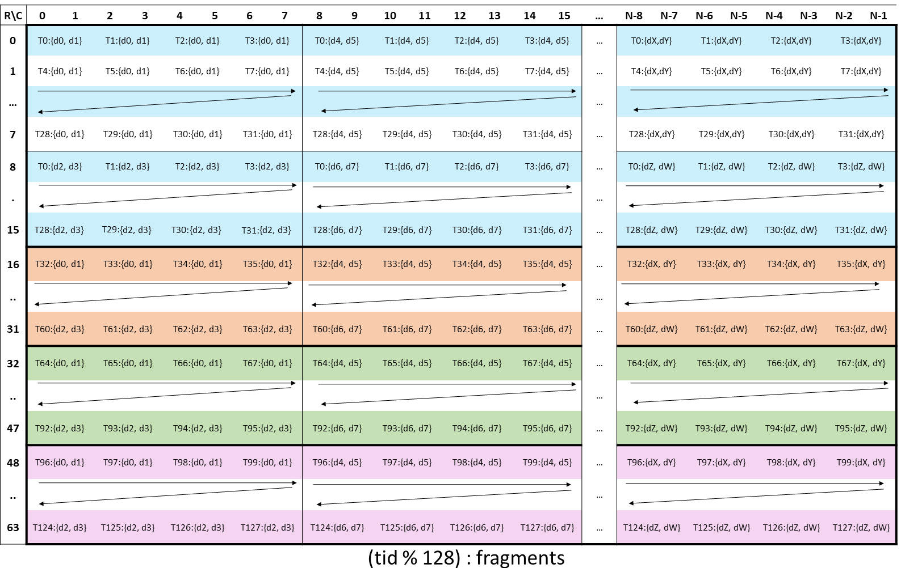
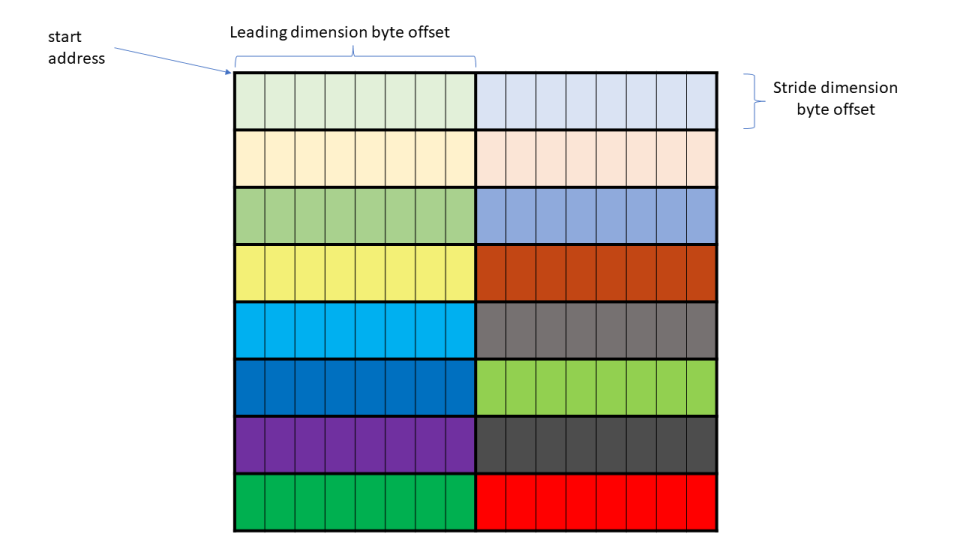
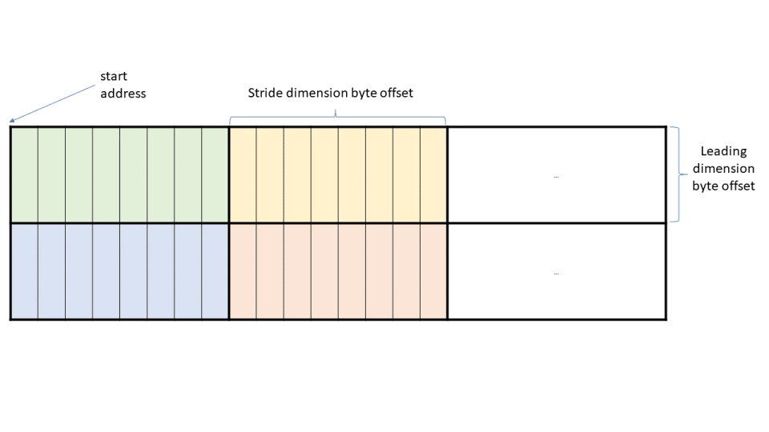

# CUTLASS 教程：在 NVIDIA® Hopper™ GPU 上使用 WGMMA 进行快速矩阵乘法

原文标题：CUTLASS Tutorial: Fast Matrix-Multiplication with WGMMA on NVIDIA® Hopper™ GPUs

英文对照：[articles-en/cutlass-tutorial-wgmma-hopper.en.md](../articles-en/cutlass-tutorial-wgmma-hopper.en.md)

如果一个 CUDA® 教程系列里没有 GEMM（通用矩阵乘法），那几乎是不完整的。GEMM 可以说是现代 GPU 上最重要的基础例程之一：神经网络、大语言模型，以及大量图形应用中的主要计算，都建立在它之上。尽管 GEMM 无处不在，但要把它写得高效并不容易。

这个由 3 部分组成的教程系列旨在帮助读者全面了解如何使用 CUTLASS 库在 NVIDIA Hopper GPU 上编写高效的 GEMM 内核。

- [第 1 部分（也就是本文）] 讨论 warpgroup 矩阵乘加（WGMMA）指令，它们是面向 Hopper 架构 NVIDIA GPU 上 Tensor Core 的底层原语。
- [第 2 部分](https://github.com/NVIDIA/cutlass/blob/main/media/docs/efficient_gemm.md)讨论高效 GEMM 内核的整体设计，包括 CUTLASS 内核中使用的 advanced 技术，例如 warp specialization 和 ping-pong 调度。
- [第 3 部分] 讨论 persistent kernel 与 [Stream-K](https://arxiv.org/abs/2301.03598)，也就是 GEMM 中的负载均衡策略，它们能够在大量问题形状上实现非常高的效率。

**大局。**我们系列中的 3 个部分大致遵循 GEMM 内核的整个开发过程，但是“由内而外”。首先，我们有平铺 GEMM 原语，它调用 Tensor Cores 来最终进行计算。其次，我们有 GEMM 内核设计，如“per CTA”所示——由*序幕*, *主循环*， 和*结语*— 主要挑战是不要在内存负载上限制快速 Tensor Cores。最后，我们在最外层网格级别进行 CTA 调度，其中负载平衡考虑因素成为最重要的因素。

我们希望在读完本系列之后，读者将成为 GEMM 算法的专家，并可以利用该算法中的一些美妙想法在自己的工作中设计和实现其他内核。

### 异步 warpgroup MMA（WGMMA）

Hopper 引入了异步的 warpgroup 级矩阵乘加操作（WGMMA）。一个 *warpgroup* 由 4 个连续的 warp 组成，也就是 128 个连续线程；其中第一个 warp 的编号必须是 4 的倍数。`wgmma.mma_async` 指令由一个 warpgroup 中全部 128 个线程共同执行。它通常具有以下两种形式之一，其中矩阵 `C` 作为累加器：

- `C = A * B + C`
- `C = A * B`，其中来自累加器的输入`C`已禁用。

WGMMA 的一个值得注意的要求是操作数`B`必须始终存储在共享内存（SMEM）中。相反，操作数`A`可以位于 SMEM 或寄存器存储器（RMEM）中，并且累加器`C`始终保存在 RMEM 中。

本文结构如下。首先，我们讨论在 CUTLASS 中调用 `wgmma.mma_async` 的关键点，这包括构建相应的 `TiledMMA` 对象，以及创建并分区与 WGMMA 兼容的 SMEM 张量。其次，我们讨论保证 WGMMA 正确性所需的同步机制。最后，我们会更深入地解释 WGMMA 中使用的布局，包括所谓的 *core matrix* 与 *matrix descriptor* 等概念，它们都与源自 SMEM 的操作数有关。

为了简洁起见，我们将在全文中缩写`wgmma.mma_async`作为`wgmma`。我们的主要代码参考将是 CUTLASS[wgmma教程](https://github.com/NVIDIA/cutlass/blob/be60a0b27204078dc0f3f1d6ed4a95cdb2114111/examples/cute/tutorial/wgmma_sm90.cu)由 Pradeep Ramani 贡献，在 3.5.1 版本中添加。

### CUTLASS 内核中的 WGMMA

本教程的主要目标是解释`wgmma`用于调用 Hopper Tensor Cores 执行基于tile的 GEMM 的原语，以及如何将其作为`cute::gemm`称呼。为了做好准备，请考虑采用输入矩阵的标准 GEMM 内核`A`和`B`有尺寸`MxNxK`并计算`C=A*B`。为了并行化计算，内核修复了静态tile 大小`bM`, `bN`， 和`bK`并启动一个网格`⌈M/bM⌉x⌈N/bN⌉`许多 CTA，每个 CTA 计算一个`bMxbN`瓦`rC`的输出矩阵。这将在写回全局之前保存在 CTA 的 RMEM 中`C`矩阵。

根据 CTA，我们得到了内核的*主循环*。超过`⌈K/bK⌉`许多次迭代，我们循环内部维度并连续加载`bMxbK`和`bNxbK`的瓷砖`A`和`B`从全局内存到共享内存`sA`和`sB`;请注意，在 CUTLASS 中，我们修复了`sB`是数学上的转置。 （事实上​​，按照常见的做法，我们加载的tile`A`和`B`进入循环 SMEM 缓冲区，其中阶段数由编译时整数给出，例如 2 或 3。形状元组的最后一个模式为`sA`和`sB`然后由该阶段计数给出。）`cute::gemm`然后调用计算（的分阶段切片）的乘积`sA`和`sB`并将该值依次累加到`rC`。主循环完成后，尾声会写出`rC`到全局内存。

现在，我们想解释以下内容`cute::gemm`调用以及进入其中的参数，正如它们出现在我们有选择地从以下代码片段中提取的那样[wgmma教程](https://github.com/NVIDIA/cutlass/blob/main/examples/cute/tutorial/wgmma_sm90.cu#L73)（隐藏与我们无关的程序部分，例如管道 TMA 加载）：

```

template <class TiledMMA, ... >
__global__ device_gemm(TiledMMA tiled_mma, ...) {
  // PROLOGUE
  // ...
  // Define A/B partitioning and C accumulators
  ThrMMA thr_mma = tiled_mma.get_thread_slice(threadIdx.x);
  Tensor tCsA = thr_mma.partition_A(sA);  // (MMA,MMA_M,MMA_K,PIPE)
  Tensor tCsB = thr_mma.partition_B(sB);  // (MMA,MMA_N,MMA_K,PIPE)
  Tensor tCgC = thr_mma.partition_C(gC);  // (MMA,MMA_M,MMA_N)

  // Allocate accumulators and clear them
  Tensor tCrC = thr_mma.make_fragment_C(tCgC);  // (MMA,MMA_M,MMA_N)
  clear(tCrC);

  // Allocate "fragments"
  Tensor tCrA = thr_mma.make_fragment_A(tCsA);  // (MMA,MMA_M,MMA_K,PIPE)
  Tensor tCrB = thr_mma.make_fragment_B(tCsB);  // (MMA,MMA_N,MMA_K,PIPE)
  
  // PIPELINED MAIN LOOP
  while (k_tile_count > -K_PIPE_MAX) {
    // ...
    // MMAs to cover 1 K_TILE
    cute::warpgroup_arrive();
    // (V,M,K) x (V,N,K) => (V,M,N)
    cute::gemm(tiled_mma, tCrA(_,_,_,read_pipe), tCrB(_,_,_,read_pipe), tCrC);
    cute::warpgroup_commit_batch();
    // Wait for all MMAs in a K_TILE to complete
    cute::warpgroup_wait<0>();
    // ...
  }

  // EPILOGUE
  // ...
}
```

在CUTLASS中[MMA 的范例](https://github.com/NVIDIA/cutlass/blob/main/media/docs/cute/0t_mma_atom.md)， 这`cute::gemm`方法旨在通过统一的接口公开特定于体系结构的 MMA 指令。 （事实上​​，如果你检查[SM80教程 GEMM内核](https://github.com/NVIDIA/cutlass/blob/main/examples/cute/tutorial/sgemm_sm80.cu#L275)，你会看到`cute::gemm`call there 在语法上与上面给出的相同。）但是，涉及参数的定义`cute::gemm`调用涉及许多 WGMMA 特定的方面：

- 的定义`TiledMMA`目的`tiled_mma`封装了所需的信息`cute::gemm`发送到特定的`wgmma`PTX指令。
- SMEM 张量的布局`sA`和`sB`必须定义为兼容`wgmma`.
- 碎片`tCrA`, `tCrB`， 和`tCrC`使用以下方法将数据构造为线程级分区`TiledMMA`对象，因此具有程序员应该注意的 WGMMA 特定布局。
- 碎片`tCrA`（如果采购操作数`A`来自 SMEM）和`tCrB`不是寄存器支持的张量，其值是从 SMEM 复制的，而是在 SMEM 之上构造的矩阵描述符。

最后，当然还有围绕`cute::gemm`称呼。我们将依次解释所有这些概念。

### WGMMA 的 TiledMMA 对象

接下来，假设数据类型为 FP16，并且`A`和`B`是`MN`-major，所以在 BLAS 表示法中，我们正在计算 NT gemm。我们构建`TiledMMA`主机上的对象使用`cute::make_tiled_mma`方法如下：

```

TiledMMA tiled_mma = cute::make_tiled_mma(
  SM90_64x64x16_F16F16F16_SS<GMMA::Major::MN,GMMA::Major::MN>{});
```

尽管`cute::make_tiled_mma`还有一些可选参数，让我们关注手头的一个 -*MMA原子*。这是一个包装底层 PTX 调用的结构，在本例中是：

```

wgmma.mma_async.sync.aligned.m64n64k16.f16.f16.f16
```

CUTLASS 表示法使得人们可以立即读出包装的 PTX 指令和 MMA 原子之间的关系。首先，SM90 是 Hopper 架构的不同名称。 SM90 MMA 原子被标记为`SM90_MxNxK_XYZ_SS`或者`SM90_MxNxK_XYZ_RS`，有两个模板参数，可以是`GMMA::Major::MN`或者`GMMA::Major::K`。它们的含义如下：

- `X`和`Y`是操作数的数据类型。
- `Z`是累加器的数据类型。
- `MxNxK`是瓷砖尺寸`wgmma`指令使用“wgmma 原子”进行计算。并非所有值`MxNxK`是可能的。这是[允许的形状列表](https://docs.nvidia.com/cuda/parallel-thread-execution/index.html#asynchronous-warpgroup-level-matrix-shape): `M`始终是 64，`N`是从 8 到 256 的 8 的倍数，对于 16 位操作数数据类型，`K`是 16（更一般地说，`K`固定为 32 字节）。
- 后缀`RS`或者`SS`指示是否操作数`A`来自寄存器（`R`）或共享内存（`S`）。操作数`B`总是来自共享内存，因此`S`.
- 两个模板参数表示操作数是否`A`和`B`是内存连续的`MN`模式或`K`模式。例如，在 BLAS 表示法中，操作数都是`K`-major 对应于 TN gemm（参见[这张桌子](https://github.com/NVIDIA/cutlass/blob/main/media/docs/cute/0x_gemm_tutorial.md#aside-m-major-n-major-k-major)）。请注意，对于 16 位操作数数据类型，内存布局具有灵活性：`MN`-主要或`K`-主要的。然而，对于非 16 位操作数数据类型，**布局必须始终是`K`-主要的**.

这就是您需要了解的 MMA Atom 语法！现在，我们强调 WGMMA 是一个*warpgroup范围*操作说明。在代码中，您可以使用 TiledMMA 对象定义的 MMA 操作来检索参与 MMA 操作的线程数*尺寸*。例如以下主机代码

```

dim3 dimBlock(cute::size(tiled_mma));
```

规定内核中的每个 CTA 以 1 个 128 个线程的 warpgroup 启动。

假设我们想要*2 个warpgroup*执行 WGMMA，使用单独的warpgroup独立计算输出 tile的一半（并且每个warpgroup发出各自的`wgmma`指示）。为此，我们可以传递一个不平凡的布局（`AtomLayoutMNK`）到`make_tiled_mma`方法作为其第二个参数。例如下面的代码

```

 TiledMMA tiled_mma = make_tiled_mma(
  SM90_64x64x16_F16F16F16_SS{},
  Layout<Shape<_2,_1,_1>>{});
```

定义了一个 WGMMA 操作，其中 warpgroup 1 和 2 计算输出 tile的上半部分和下半部分，并沿`M`模式（现在假设`bM`是 128 的倍数）。而且，`size(tiled_mma)`则等于 256。

一般来说，两个可选的布局参数`make_tiled_mma` — `AtomLayoutMNK`和`PermutationMNK`— 对于任何 MMA Atom 都具有相同的作用。为了理解的用途`PermutationMNK`，我们推荐 Cris Cecka 的[很好的解释](https://github.com/NVIDIA/cutlass/discussions/1345).

### SMEM WGMMA 的布局约束

接下来，我们解释在选择 MMA 原子的情况下，SMEM 中操作数矩阵的tile 大小和布局的约束。首先，对于任何 MMA 指令，`MxNxK`MMA 原子的原子需要分为操作数和累加器块的原子。在我们的例子中，这意味着`bM`应该是 64 的倍数，`bN`64 的倍数，以及`bK`16的倍数。

其次，WGMMA 对 SMEM 布局特别施加了一个附加约束：`sA`和`sB`（形状和步幅），并且此约束根据所选的混合模式而变化。特别是（的阶段切片）的布局`sA`不简单`(bM,bK):(1,bM)`或者`(bM,bK):(bK,1)`一般来说，对于`sB`.

要深入理解这些要求，需要以下概念：*核心矩阵*，下面我们就来介绍一下。然而，实际上，我们总是可以构建保证兼容的布局`wgmma`使用 CUTLASS 提供的某些预定义布局原子，然后是`cute::tile_to_shape`方法。在我们的示例中，我们准备了tile尺寸和`sA`, `sB`在主机上如下（与`T=cutlass::half_t`这是 CUTLASS 对 FP16 的名称）：

```

auto bM = Int<128>{};
auto bN = Int<128>{};
auto bK = Int< 64>{};  
auto bP = Int<  3>{};  // Pipeline

auto sA = cute::tile_to_shape(
	GMMA::Layout_MN_SW128_Atom<T>{},
	cute::make_shape(bM, bK, bP)
);
auto sB = cute::tile_to_shape(
	GMMA::Layout_MN_SW128_Atom<T>{},
	cute::make_shape(bN, bK, bP)
);
```

这里，`MN`表示布局原子适合`MN`-主操作数，和`SW128`是128字节的swizzle模式。打印输出`sA`或者`sB`显示

```

Sw&lt;3,4,3> o smem_ptr[16b](unset) o ((_64,_2),(_8,_8),_3):((_1,_512),(_64,_1024),_8192)
```

这个布局从何而来？`cute::tile_to_shape`采用一个布局（同名tile）并将其复制到更大的形状上（类似于`numpy.tile`）。抛开 swizzle 函数`Sw<3,4,3>`，我们有布局原子由下式给出`(64,8):(1,64)`并平铺在形状上`(128, 64, 3)`在**专栏专业**时尚，所以对于`MxK`形状，较小的外步幅`512`在于`M`模式，而较大的外步幅`1024`在于`K`模式。 （最大的步幅`8192`在于阶段数`P`模式，这是有道理的，因为不同的阶段切片`sA`或者`sB`不应该混合在内存中。）

注意`64`次`sizeof(half_t)`等于 128 字节，这是 swizzle 模式的名称。这是设计使然：由于核心矩阵的工作方式，我们总是将连续方向上的布局原子的长度安排为等于 swizzle 字节数 - 或者`16`不调酒，或其中之一`32`, `64`， 或者`128`.

相反，如果我们考虑：

```

auto sA = cute::tile_to_shape(
  GMMA::Layout_K_SW128_Atom<T>{},
  cute::make_shape(bM,bK,bP)
);
auto sB = cute::tile_to_shape(
  GMMA::Layout_K_SW128_Atom<T>{},
  cute::make_shape(bN,bK,bP)
);
```

然后打印`sA`会给我们

```

Sw&lt;3,4,3> o smem_ptr[16b](unset) o (_128,_64,_3):(_64,_1,_8192)
```

因为我们改为平铺`(8,64):(64,1)`超过`(128,64,3)`。 （注意布局`((_8,_16),(_64,_1),_3):((_64,_512),(_1,_0),_8192)`合并为`(_128,_64,_3):(_64,_1,_8192)`).

一般来说，我们可以选择`8`布局原子的可能性，对应于`MN`或者`K`-主要和四种混合模式之一：

- 不搅拌：不搅拌。隐式 16 字节边界。
- 32 字节混合：混合 2 个连续的 16 字节段。
- 64 字节混合：混合 4 个连续的 16 字节段。
- 128 字节混合：混合 8 个连续的 16 字节段。

布局原子被定义[这里](https://github.com/NVIDIA/cutlass/blob/36cbfcf483cc9d2ee65a55c199176ce96da1e33e/include/cute/atom/mma_traits_sm90_gmma.hpp#L66)在 CUTLASS 代码库中为：

```

GMMA::Layout_MN_INTER_Atom<T>
GMMA::Layout_MN_SW32_Atom<T>
GMMA::Layout_MN_SW64_Atom<T>
GMMA::Layout_MN_SW128_Atom<T>

GMMA::Layout_K_INTER_Atom<T>
GMMA::Layout_K_SW32_Atom<T>
GMMA::Layout_K_SW64_Atom<T>
GMMA::Layout_K_SW128_Atom<T>
```

然后必须将这些布局原子传递到`tile_to_shape`形状为 SMEM`sA`和`sB`给出的`make_shape(bM,bK,bP)`或者`make_shape(bN,bK,bP)`，给定形状的众数**按这个顺序**，使得布局原子的平铺大小分为较大的 SMEM 形状的平铺大小。这最终是由选择混合模式引起的对 SMEM 形状的约束，并且与 MMA 原子形状施加的其他约束分开。

### WGMMA 片段和描述符

我们已经创建了`TiledMMA`对象并相应地在主机上准备 SMEM 布局。现在，在设备上我们可以使用`TiledMMA`目的`tiled_mma`构造适当的分区张量以传递到`cute::gemm`称呼。首先，我们创建一个`ThrMMA`称为的对象`thr_mma`通过调用`get_thread_slice`方法上`tiled_mma`与线程索引，它包含从`0`到`127`在我们的例子中。

然后，参考上面的内核代码片段，打印张量`tCsA`和`tCsB` **对于任何线程索引**显示以下内容：

```

tCsA: Sw&lt;3,4,3>_smem_ptr[16b](0x7f8800000400) o
	((_64,(_8,_2)),_2,_4,_3):((_1,(_64,_1024)),_512,_2048,_8192)
tCsB: Sw&lt;3,4,3>_smem_ptr[16b](0x7f880000c400) o
	((_64,(_8,_2)),_2,_4,_3):((_1,(_64,_1024)),_512,_2048,_8192)
```

根据评论，形状`tCsA`应该被认为是`(MMA,MMA_M,MMA_K,PIPE)`:

- `MMA`是`NxK`MMA Atom 的形状。
- `MMA_M`和`MMA_K`是其平铺的范围`M`和`K`的模式`sA`（以便`MMA_M=bM/64=2`和`MMA_K=bK/16=4`).
- `PIPE`是阶段数。

跨步和混合模式继承自`sA`。这里需要注意的是 WGMMA 特定的事情是`tCsA`实际上并不是 SMEM 的线程级切片，而是经过重新组织布局的整个 SMEM 张量。

接下来，打印“片段”`tCrA`和`tCrB`对于任何线程索引显示：

```

tCrA: GMMA::DescriptorIterator o (_1,_2,_4,_3):(_0,_64,_256,_1024)
tCrB: GMMA::DescriptorIterator o (_1,_2,_4,_3):(_0,_64,_256,_1024)
```

在内部，CUTLASS 构造了一个“[矩阵描述符](https://docs.nvidia.com/cuda/parallel-thread-execution/index.html#asynchronous-warpgroup-level-matrix-shared-memory-layout-matrix-descriptor)“，这是保存在寄存器中的 64 位值，以适合使用的方式描述 SMEM`wgmma`操作说明。对于程序员来说，最重要的是要记住 SMEM 的值是**不是**复制到RMEM；相反，访问的值`tCrA`和`tCrB`相反，访问这些 64 位描述符。此外，这些张量是“迭代器”，意味着只有单个 64 位描述符用于给定的`wgmma`指令一次保存在寄存器中（例如，而不是全部 24 个）。

与操作数相比，累加器张量以更标准的方式定义。打印输出`tCgC`和`tCrC`对于线程 0 显示：

```

tCgC: gmem_ptr[16b](0x7f877a780000) o ((_2,_2,_8),_2,_2):((512,_8,4096),_64,32768)
tCrC: ptr[16b](0x7feee1fffbe0) o ((_2,_2,_8),_2,_2):((_1,_2,_4),_32,_64)
```

`tCgC`是输出 GMEM 张量的切片，我们要将累加器的值复制到尾声中，并且`tCrC`是创建的寄存器支持的张量，用于保存在主循环中计算的这些值。这`(MMA,MMA_M,MMA_N)`这些张量的形状可以解释如下：在 MMA 原子的`MxN=64x64`输出tile，128 个线程中的每一个都保存`32=2*2*8`价值观，以及`MMA_M=MMA_N=2`与相同`tCsA`和`tCsB`.

每个线程以一种需要将 32 分解为 (2,2,8) 的方式来保存原子的 32 个值，以便能够为布局定义相应的步幅`tCgC`。具体的分区模式可以从这张照片中读出[来自 PTX 文档](https://docs.nvidia.com/cuda/parallel-thread-execution/index.html#wgmma-64n16-d):



这说明了复制的 Z 模式，其中保存了线程的 32 个值。例如，线程 0 保存 (0,0)、(0,1)、(8,0)、(8,1) 处的值，并向右每 8 列重复一次。

### 重新审视 gemm 调用

让我们回到上面内核代码片段的第 25 行：

```

// (V,M,K) x (V,N,K) => (V,M,N)
cute::gemm(tiled_mma, tCrA(_,_,_,read_pipe), tCrB(_,_,_,read_pipe), tCrC);
```

的各种过载`cute::gemm`方法用于首先循环外部模式`MMA_M/N`和`MMA_K`。一旦选择了这些坐标，我们就只需使用 MMA 原子tile形状进行计算。换句话说，我们首先减少过载`cute::gemm`为[调度形状](https://github.com/NVIDIA/cutlass/blob/be60a0b27204078dc0f3f1d6ed4a95cdb2114111/include/cute/algorithm/gemm.hpp#L178) `(V)x(V)=>(V)`.

然后代码调用[`fma`手术](https://github.com/NVIDIA/cutlass/blob/be60a0b27204078dc0f3f1d6ed4a95cdb2114111/include/cute/arch/mma_sm90_gmma.hpp#L401)MMA 原子（准确地说，在[mma_解压](https://github.com/NVIDIA/cutlass/blob/be60a0b27204078dc0f3f1d6ed4a95cdb2114111/include/cute/atom/mma_traits.hpp#L112)方法）。这包含内联 PTX 程序集：

```

CUTE_HOST_DEVICE static void
  fma(uint64_t const& desc_a,
      uint64_t const& desc_b,
      uint32_t& d00, uint32_t& d01, uint32_t& d02, uint32_t& d03,
      uint32_t& d04, uint32_t& d05, uint32_t& d06, uint32_t& d07,
      uint32_t& d08, uint32_t& d09, uint32_t& d10, uint32_t& d11,
      uint32_t& d12, uint32_t& d13, uint32_t& d14, uint32_t& d15,
      GMMA::ScaleOut const scale_D = GMMA::ScaleOut::One)
  {
#if defined(CUTE_ARCH_MMA_SM90A_ENABLED)
    asm volatile(
    "{\n"
      ".reg .pred p;\n"
      "setp.ne.b32 p, %18, 0;\n"
      "wgmma.mma_async.sync.aligned.m64n64k16.f16.f16.f16 "
      "{%0,  %1,  %2,  %3,  %4,  %5,  %6,  %7,  "
      " %8,  %9,  %10, %11, %12, %13, %14, %15},"
      " %16,"
      " %17,"
      " p,   %19, %20, %21, %22;\n"
    "}\n"
      : "+r"(d00), "+r"(d01), "+r"(d02), "+r"(d03),
        "+r"(d04), "+r"(d05), "+r"(d06), "+r"(d07),
        "+r"(d08), "+r"(d09), "+r"(d10), "+r"(d11),
        "+r"(d12), "+r"(d13), "+r"(d14), "+r"(d15)
      : "l"(desc_a),
        "l"(desc_b),
        "r"(int32_t(scale_D)),
        "n"(int32_t(scaleA)),
        "n"(int32_t(scaleB)),
        "n"(int32_t(tnspA)),
        "n"(int32_t(tnspB)));
#else
    CUTE_INVALID_CONTROL_PATH(
    	"Attempting to use SM90_64x64x16_F16F16F16_SS " 
    	"without CUTE_ARCH_MMA_SM90A_ENABLED");
#endif
  }
```

该语法对应的 PTX 文档是[这里](https://docs.nvidia.com/cuda/parallel-thread-execution/index.html#asynchronous-warpgroup-level-matrix-instructions-wgmma-mma)。与张量的描述一致`tCrA`, `tCrB`， 和`tCrC`上面，观察我们有`uint64`变量`desc_a`和`desc_b`对于操作数以及 16`uint32`累加器的变量。`scale_D`是`0`或者`1`，并控制累加器是否进行零初始化。

此外，变量`scaleA`, `scaleB`, `tnspA`, `tnspB`是在编译时外部确定的`fma`通过模板参数的方法。`scaleA`和`scaleB`为 1 或 -1 来否定操作数，而`tnspA`和`tnspB`表示是否转置操作数，为0或1`GMMA::Major::K`或者`GMMA::Major::MN`， 分别。

### WGMMA 的同步

仍然需要解释围绕`cute::gemm`称呼：

```

cute::warpgroup_arrive();
cute::gemm(tiled_mma, tCrA(_,_,_,read_pipe), tCrB(_,_,_,read_pipe), tCrC);
cute::warpgroup_commit_batch();
cute::warpgroup_wait<0>();
```

为什么需要这些额外的命令？它们与`wgmma`的本质是*异步*操作说明。在Hopper架构的背景下，*异步*表明`wgmma`可以与其他操作同时运行，因此需要依赖步骤的同步机制。该机制在 PTX 中有详细阐述[内存一致性模型](https://docs.nvidia.com/cuda/archive/12.3.2/parallel-thread-execution/index.html#program-order-async-operations)。代码中不正确的同步可能会导致 (a) 微妙的竞争条件，从而导致具有挑战性的错误，(b) 编译器序列化`wgmma`指令，这可能会导致性能显着下降，或 (c) 未定义的行为。

突出显示的`cute`方法包装以下 PTX 指令：

- `cute::warpgroup_arrive()` — `wgmma.fence.sync.aligned`;
- `cute::warpgroup_commit_batch()` — `wgmma.commit_group.sync.aligned`;
- `cute::warpgroup_wait<N>()` — `wgmma.wait_group.sync.aligned N`;

（请注意，我们一直在使用`wgmma`作为简写`wgmma.mma_async`让我们将这些命令的用法与以下基于 WGMMA 的 GEMM 的逐字描述联系起来：[PTX 文档](https://docs.nvidia.com/cuda/archive/12.3.2/parallel-thread-execution/index.html#asynchronous-warpgroup-level-matrix-multiply-accumulate-instructions):

1. 加载矩阵`A`, `B`， 和`D`进入寄存器或共享内存。
2. 执行以下操作`fence`运营：`wgmma.fence`操作来指示跨warpgroup的register/shared-memory已被写入。  `fence.proxy.async`操作使通用代理操作对异步代理可见。
3. 使用以下命令发出异步矩阵乘法和累加运算`wgmma.mma_async`对输入矩阵的运算。这`wgmma.mma_async`操作在异步代理中执行。
4. 创建一个 wgmma-group 并提交所有先前未完成的`wgmma.mma_async`操作进入组，通过使用`wgmma.commit_group`手术。
5. 使用以下命令等待所需的 wgmma-group 完成`wgmma.wait_group`.
6. 一旦 wgmma-group 完成，所有`wgmma.mma_async`操作已执行并完成。

我们按顺序解释这些要点。首先，一个`wgmma.fence`指令确保`wgmma.mma_async`仅在对某些 RMEM 地址的所有先前访问完成后才访问此类地址。如果没有`wgmma.fence`，行为未定义。此规则的一个例外是 Hopper 允许*多种的*`wgmma.mma_async`指示同时飞行。只要有这些`wgmma.mma_async`指令具有相同的累加器形状，它们可以共享相同的累加器张量 即，写入相同的寄存器内存地址。在这种情况下，不需要围栏。例如，我们不需要插入`wgmma.fence`在循环内`MMA_K`作为一部分完成`cute::gemm`称呼。

一样[TMA操作](https://research.colfax-intl.com/tutorial-hopper-tma/), `wgmma.mma_async`执行于[异步代理](https://docs.nvidia.com/cuda/parallel-thread-execution/#async-proxy)。因此，*如果*在通用代理中执行的操作会影响 SMEM 读取`wgmma.mma_async`，我们需要发出`fence.proxy.async`。例如，如果我们复制，就会出现这种情况`A`和`B`通过普通方式进入SMEM`ld.global` / `st.shared`运营。由于我们使用TMA负载，所以我们不需要`fence.proxy.async`在我们的示例中，它确实没有出现在 WGMMA 教程代码中或 CUTLASS Hopper GEMM 内核的主循环中。 （为了验证这一点，请注意`fence.proxy.async`被包裹着`cutlass::arch::fence_view_async_shared()`).

这`wgmma.commit_group`指令为每个 warpgroup 创建一个新的 wgmma-group 并批处理所有先前的`wgmma.mma_async`指令由执行 warpgroup 发起，但未提交给任何 wgmma-group 到新的 wgmma-group。在我们的例子中，`cute::warpgroup_commit_batch()`批次`MMA_M*MMA_N*MMA_K`许多`wgmma.mma_async`将指令放入一个 wgmma 组中。

最后，`wgmma.wait_group`带论证的指令`N`将使执行线程等待，直到`N`或更少的最新 wgmma 组处于待处理状态，并且由执行线程提交的所有先前的 wgmma 组均已完成。在我们的例子中，我们让`N=0`，因此 warpgroup 只是等待整个 wgmma-group 的完成，然后再继续执行任何后续指令。

在 warpgroup 有机会执行独立计算的情况下，参数的灵活性`N`派上用场了。例如，这与设计中采用的 GEMM-softmax 重叠策略一起发挥作用[FlashAttention-3](https://research.colfax-intl.com/flashattention-3-fast-and-accurate-attention-with-asynchrony-and-low-precision/).

### WGMMA 核心矩阵

最后一节进一步讨论矩阵tile的布局要求`A`和`B`加载到 SMEM 中，假设`wgmma`其两个操作数均来自 SMEM。为了简化讨论，首先假设`A`是行主并且`B`是列主（即，两者都是`K`-主要的）。还记得`wgmma`指令的tile形状`MxNxK`受到约束，使得`M`是 64，`K`乘以数据类型的大小 32 字节，并且`N`是 8 的倍数，从 8 到 256。为了避免与`A`/`B`或者`sA`/`sB`，我们将 WGMMA 原子tile记为`wA`和`wB`.

矩阵`wA`和`wB`被分成许多较小的矩阵，称为*核心矩阵。*每个核心矩阵都有一个*迈步*方向和一个*连续的*方向，使其在跨步方向上的长度为 8，在连续方向上的长度为 16 个字节。矩阵`wA`是由`8x2`核心矩阵和矩阵`wB`是由`2x(N/8)`核心矩阵。我们展示了一个平铺`wA`和`wB`按如下核心矩阵（图像取自 PTX 文档）：





如上所述，`wgmma`在SS模式下需要[矩阵描述符](https://docs.nvidia.com/cuda/parallel-thread-execution/index.html#asynchronous-warpgroup-level-matrix-shared-memory-layout-matrix-descriptor)对于两者`wA` (`desc-a`） 和`wB` (`desc-b`）作为输入。该描述符编码五个参数：

- 起始地址：SMEM 中操作数的起始基地址。
- LBO (*主维字节偏移量*): 中两个相邻核心矩阵之间的距离（以字节为单位）`K`方面。
- SBO (*步幅维度字节偏移量*): 中两个相邻核心矩阵之间的距离（以字节为单位）`M`或者`N`方面。
- 调配模式：无、32、64 或 128 字节。
- 矩阵基偏移量：这用于解决 SMEM 地址未与混合模式的重复模式的字节边界对齐的情况下的 SMEM 对齐问题。

LBO 和 SBO 如上图所示。

这[`make_gmma_desc`](https://github.com/NVIDIA/cutlass/blob/06b21349bcf6ddf6a1686a47a137ad1446579db9/include/cute/atom/mma_traits_sm90_gmma.hpp#L194C1-L194C54)CUTLASS 中的方法构造描述符（作为`GmmaDescriptor`）基于作为输入提供的 SMEM 张量布局。假设输入张量的布局是使用八个规范 GMMA 布局原子之一创建的，并且`tile_to_shape`，如先前在“SMEM WGMMA 的布局约束”中详细介绍的，`make_gmma_desc`将准确计算LBO和SBO，确定swizzling模式，并构造描述符。例如，`GmmaDescriptor`描述了以下允许的 WGMMA 布局`K`-主要情况（其中`T*sizeof(dtype)=16`):

```

No swizzle       : Swizzle&lt;0,4,3> o smem_ptr o ((8,m),(T,2)):((1T,SBO),(1,LBO))
32-byte swizzle  : Swizzle&lt;1,4,3> o smem_ptr o ((8,m),(T,2)):((2T,SBO),(1, T ))
64-byte swizzle  : Swizzle&lt;2,4,3> o smem_ptr o ((8,m),(T,2)):((4T,SBO),(1, T ))
128-byte swizzle : Swizzle&lt;3,4,3> o smem_ptr o ((8,m),(T,2)):((8T,SBO),(1, T ))
```

对于[*袖珍的*](https://github.com/NVIDIA/cutlass/blob/be60a0b27204078dc0f3f1d6ed4a95cdb2114111/include/cute/layout.hpp#L415)由 GMMA 布局原子生成的布局 =>`tile_to_shape`模式（注意 GMMA 布局`K`原子具有较大的`K`-模式比 64 和 128 字节混合情况下的 WGMMA 原子形状！），我们有 LBO 和 SBO 的相应值：

```

No swizzle       : LBO = 16x8 = 128 bytes. SBO = 32x8 = 256 bytes.
32-byte swizzle  : SBO = 32x8 = 256 bytes.
64-byte swizzle  : SBO = 64x8 = 512 bytes.
128-byte swizzle : SBO = 128x8 = 1024 bytes.
```

最值得注意的是，对于 64 和 128 字节 swizzle，步长使得给定的可接受的 WGMMA 布局为**不是**袖珍的。相反，有一组 2 或 4 个 WGMMA 原子操作数块并排堆叠在`K`- 方向，导致大步前进`4T`和`8T`对于核心矩阵`M`-模式。换句话说，当混合一个内存中的交错时，2、4 或 8 个核心矩阵在逻辑上相邻`K`-mode，这些核心矩阵将属于*不同的*用于 64 和 128 字节混合的 WGMMA 原子。

为了完整起见，我们还给出了可接受的 WGMMA 布局`MN`-重大案件：

```

No swizzle       : Swizzle&lt;0,4,3> o smem_ptr o ((T,1,m),(8,k)):((1,T,SBO),(1T,LBO))
32-byte swizzle  : Swizzle&lt;1,4,3> o smem_ptr o ((T,2,m),(8,k)):((1,T,LBO),(2T,SBO))
64-byte swizzle  : Swizzle&lt;2,4,3> o smem_ptr o ((T,4,m),(8,k)):((1,T,LBO),(4T,SBO))
128-byte swizzle : Swizzle&lt;3,4,3> o smem_ptr o ((T,8,m),(8,k)):((1,T,LBO),(8T,SBO))
```

### 结论

在 GEMM 系列的[第 1 部分] 中，我们介绍了使用 WGMMA（扭曲群矩阵乘法和累加）作为基于 Hopper 的 GEMM 中的原语所涉及的核心概念。

WGMMA 需要一个 warpgroup（128 个线程）来共同执行矩阵乘法，并且只能对矩阵的某些片段进行操作。我们研究了其中涉及的特殊形状和布局，重点是如何使用规范的 GMMA 布局来构造保证被 WGMMA 接受的操作数布局=>`tile_to_shape`图案。

为了明确其用法，WGMMA 还需要某些同步机制。为此，我们解释了`wgmma.fence`, `fence.proxy.async`, `wgmma.commit_group`和`wgmma.wait_group`关于`wgmma.mma_async`.

最后，我们详细解释了 WGMMA 核心矩阵的内部工作原理，以及 CUTLASS 如何为来自 SMEM 的操作数构造矩阵描述符。

总的来说，这篇博文应该使程序员能够在使用 WGMMA 的 Hopper 上编写 CUTLASS 内核。在[第 2 部分]中，我们将扩展此讨论以合并 TMA，以及如何在 Hopper GEMM 内核中串联使用 TMA 和 WGMMA 以便重叠复制和计算。
