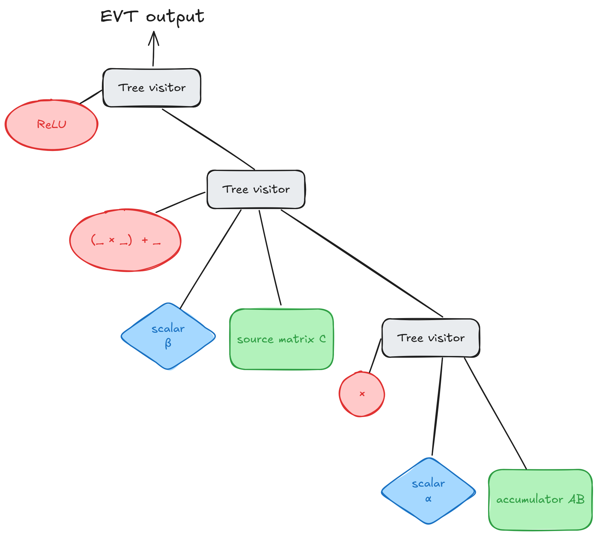
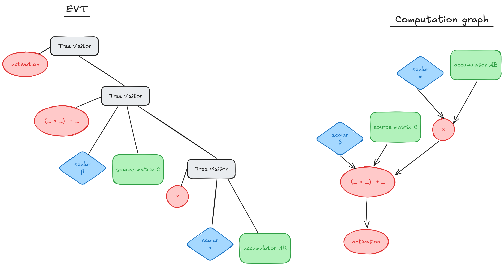
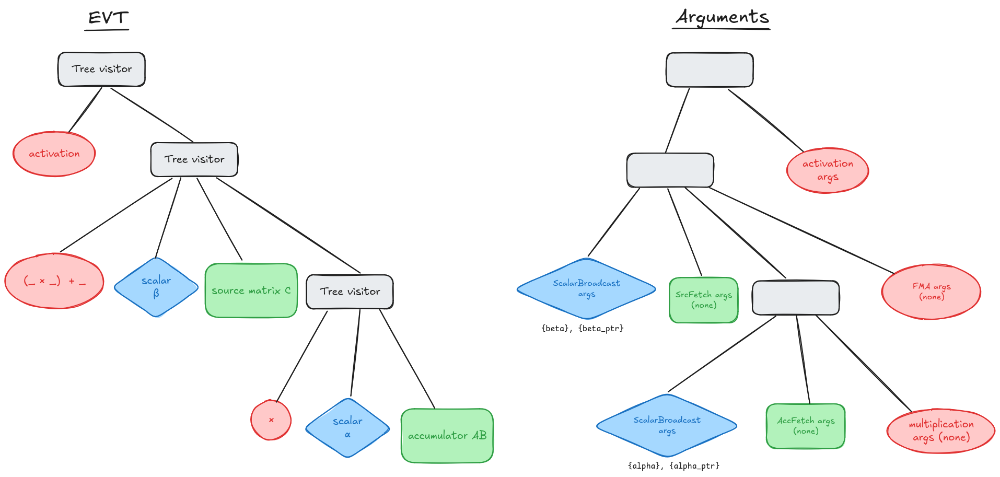
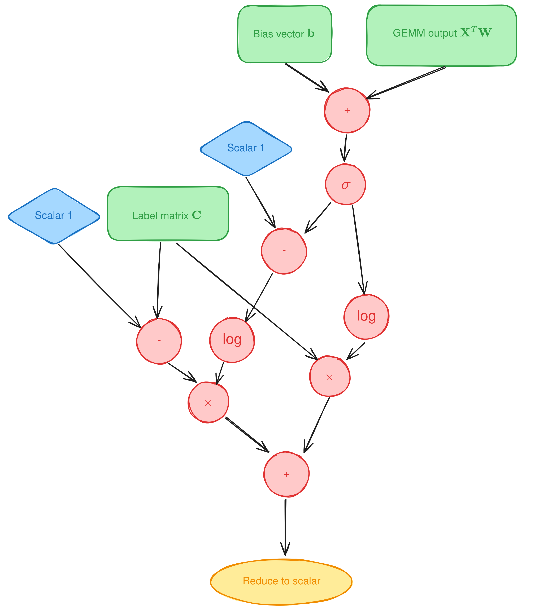
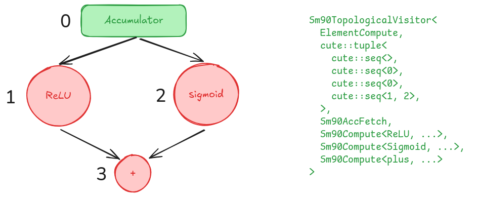
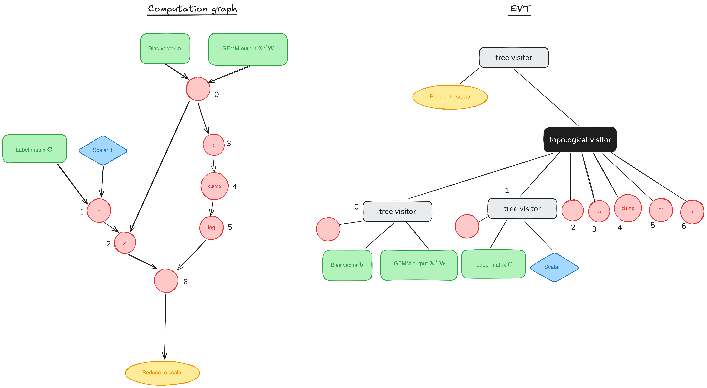

# CUTLASS 中的尾声与尾声访问者树融合

原文标题：Epilogue Fusion in CUTLASS with Epilogue Visitor Trees

英文对照：[articles-en/epilogue_visitor_tree.en.md](../articles-en/epilogue_visitor_tree.en.md)

欢迎阅读我们关于 GEMM（通用矩阵乘法）教程系列的补充文章。主系列中的帖子（[1](https://research.colfax-intl.com/cutlass-tutorial-wgmma-hopper/), [2](https://research.colfax-intl.com/cutlass-tutorial-design-of-a-gemm-kernel/)）通过查看主循环（负责实际 GEMM 计算的部分）讨论了 GEMM 在 NVIDIA GPU 上的高性能实现。但主循环只是 CUTLASS 工作负载的一部分。在这篇文章中，我们将把重点转向**结语**，进行后处理（例如，元素激活、缩放）和数据存储。具体来说，我们将检查 CUTLASS 的尾声融合配方，即**尾声访客树 (EVT)**介绍人[陈等人，2024](https://dl.acm.org/doi/pdf/10.1145/3620666.3651369).

这篇文章的结构越来越复杂。在概述了尾声阶段和 EVT 后，我们将展示如何使用 CUTLASS 定义的 EVT 和手动构建的 EVT 将简单的 EVT 添加到 CUTLASS GEMM 内核。然后，我们给出了一个为新用例开发 EVT 的扩展示例，该示例引入了一些更高级的工具：归约操作和拓扑访问者。代码示例和文档可在[我们的 GitHub](https://github.com/ColfaxResearch/cfx-article-src/tree/master/evt)。最后，在附录中，我们深入研究了 CUTLASS 源代码，以解释 CUTLASS 如何将 EVT 融合到其尾声中。

## 尾声阶段和EVT

在内核中，**结语**阶段跟随主循环阶段并处理输出张量的后处理。在最简单的情况下，此阶段只是将矩阵乘积存储到全局内存（GMEM）。然而，许多 AI 工作负载需要对输出进行额外处理：添加偏置项、计算 GELU 等元素激活函数，或者应用更复杂的归约型函数（如 Layernorm 或 rmsnorm）。这些计算还可能需要加载额外的数据，例如在应用剩余连接或使用一组真实标签计算损失时。合并通常是有益的 - 或*保险丝*——此类操作进入 GEMM 内核的尾声。与让额外的内核处理后处理相比，融合内核有几个优点。

- 共享内存 (SMEM) 中 GEMM 的输出数据可以立即在融合内核中进行后处理，而单独的内核则需要额外的 GMEM-SMEM 传输。
- 在融合内核中，当 GEMM 结果仍在寄存器中时，可能会应用一些后处理操作。
- 额外的内核启动会带来额外的延迟和开销。

在 GEMM 主循环和内核退出之间合并附加处理的过程称为**尾声融合**.

实现尾声融合的一个困难是需要融合的操作类型很多。尾声可以包含基本上任意的计算序列，并且可能需要内核加载或存储附加数据。使用每种不同的尾声模式编写融合内核将很快导致内核数量难以控制的爆炸。此外，程序员可能想要尝试新颖的尾声，为了正确融合尾声，通常需要对内核代码进行大量更改。为了解决这个问题，CUTLASS 使用了一种称为**访客模式。**

在此模式中，各种类型的尾声在专门的尾声访问者对象中实现。 CUTLASS GEMM 内核旨在*接受*用于处理输出数据的任意尾声访问者对象。然后，尾声访问者将*访问*输出数据并对其进行处理。使用此模型，添加新的尾声只需要创建一个新的专门访问者类并将其与当前访问者交换。

由于尾声可能涉及复杂的操作序列，因此尾声访问者可组合非常重要。一个**尾声访客树**(EVT) 是组织在树中的访问者集合，它们共同作为单个访问者进行操作。树中的每个叶节点代表一个基本操作，例如加、乘、加载或存储。非叶子节点一般是**树访客**（我们稍后将讨论例外情况）。当树访问者访问数据时，它会递归地委托给其子级，使用它们的输出作为其自身操作的输入。树根的输出最终存储到GMEM。计算的基本示例显示在**图 1.**



CUTLASS 通过两种方式支持尾声访问者树抽象。首先，常见的尾声已经预先构建了带有用户友好别名的访问者树。其次，开发人员可以为定制的尾声编写自己的访问者树。然后，CUTLASS 将从提供的树中生成融合内核。我们将介绍这两种方法的简单示例，然后讨论如何创建更复杂的树。

## 使用尾声和 EVT

在本文中，我们将重点关注 EVT 的 CUTLASS 3.X 语法，该语法目前仅支持 NVIDIA Hopper™ 架构，并且仅适用于 warp 专用内核。对于老一代，请使用 2.X 语法中的访问者 — 请参阅[`cutlass/epilogue/threadblock/fusion/visitor_2x.hpp`](https://github.com/NVIDIA/cutlass/blob/cc3c29a81a140f7b97045718fb88eb0664c37bd7/include/cutlass/epilogue/threadblock/fusion/visitor_2x.hpp)， 和[实施例35](https://github.com/NVIDIA/cutlass/blob/main/examples/35_gemm_softmax/gemm_with_epilogue_visitor.h)供使用。

在 CUTLASS 3.X API 中构建内核的基本方法是`CollectiveMainloop`和一个`CollectiveEpilogue`.

```

using GemmKernel = cutlass::gemm::kernel::GemmUniversal<
    cute::Shape<int,int,int,int>, // ProblemShape [M,N,K,L]
    CollectiveMainloop,
    CollectiveEpilogue
>;
```

我们当然会重点关注`CollectiveEpilogue`一半，只讨论与尾声相关的其余部分。有关 Mainloop 和 GEMM API 的更多信息，请参阅[3.X API 上的 CUTLASS 文档](https://github.com/NVIDIA/cutlass/blob/main/media/docs/gemm_api_3x.md)。内核定义的完整示例可以在以下位置找到[CUTLASS的例子49](https://github.com/NVIDIA/cutlass/blob/main/examples/49_hopper_gemm_with_collective_builder/49_collective_builder.cu)以及我们的 GitHub 上。

CUTLASS 提供多种不同的方式来创建`CollectiveEpilogue`，我们将按照复杂性增加的顺序进行讨论。

#### 默认尾声

对于许多仅使用元素运算符的常见尾声，尾声融合的最短路径是`DefaultEpilogue`。人们可以定义一个`CollectiveEpilogue`如下。

```

using CollectiveEpilogue = cutlass::epilogue::collective::DefaultEpilogue<
    cutlass::gemm::TagToStrideC_t<LayoutC>,
    cutlass::gemm::TagToStrideC_t<LayoutC>,
    cutlass::epilogue::thread::LinearCombination<ElementC, 1, ElementAccumulator, ElementAccumulator>>;
```

最后一个参数可以替换为其他元素运算符，例如`LinearCombinationReLU`。您可以在以下位置找到更多运营商`include/cutlass/epilogue/thread`.

这里一个有趣的注释是`DefaultEpilogue`不使用访客树。相反，它只是循环输出片段（数据）并应用指定的操作。所以它不是为复杂的尾声而设计的。

#### 内置 EVT

如果您需要更复杂的东西，那么您将需要使用 EVT。 CUTLASS提供了使用EVT构建的各种常见操作，可以在以下位置找到`include/cutlass/epilogue/fusion/operations.hpp`.

要使用内置 EVT 之一，或使用任何 EVT，我们需要转向`CollectiveBuilder`为尾声。

```

using EVTOp = cutlass::epilogue::fusion::LinCombEltAct<
  cutlass::epilogue::thread::ReLU,
  ElementD, ElementCompute, ElementC, ElementScalar>;

using CollectiveEpilogue = typename cutlass::epilogue::collective::CollectiveBuilder<
      cutlass::arch::Sm90, cutlass::arch::OpClassTensorOp,
      Shape<_128,_128,_64>, Shape<_1,_1,_1>, // grid and cluster shapes
      cutlass::epilogue::collective::EpilogueTileAuto, // automatically compute epilogue tile size
      ElementAccumulator, ElementCompute, // dtypes
      ElementC, LayoutC, AlignmentC,
      ElementD, LayoutD, AlignmentD,
      EpilogueScheduleType, // need TMA warp-specialized to use EVT
      EVTOp
    >::CollectiveOp;
```

上面的代码示例实现了`LinearCombination`使用 EVT 进行 ReLU 激活。为了`EVTOp`我们从以下选择了适当的操作`cutlass::epilogue::fusion`。模板参数当然取决于相关操作，因此请参阅`operations.hpp`详细了解具体操作。对于我们的例子`LinCombEltAct`，第一个参数是激活函数（参见`cutlass/epilogue/thread/activation.h`了解更多选项），其余的是输入和输出的数据类型以及用于累加的数据类型。

发现的物体在`operations.hpp`是实际操作的占位符。要查看树本身的结构，我们需要转向`sm90_callbacks_tma_warpspecialized.hpp`，它将这些占位符映射到其特定于架构的 EVT 实现。我们将在下一节中讨论树的实现。

这个尾声需要额外的参数，标量`alpha`和`beta`。对于使用 CollectiveBuilder 构建的 GEMM，可以在初始化内核时将这些参数与内核的其余参数一起指定。内核的参数看起来像

```

typename Gemm::Arguments arguments {
    cutlass::gemm::GemmUniversalMode::kGemm, // GEMM mode (batched, grouped, // etc.)
    problem_size,
    {block_A.get(), stride_A,                // pointers and strides for mainloop
      block_B.get(), stride_B},
    {{},                   // arguments.epilogue.thread, modified below
      block_C.get(), stride_C,                // pointers and strides for epilogue
      block_D.get(), stride_D},
    hw_info                                  // hardware info
};
```

EVT 的参数可以在里面找到`arguments.epilogue.thread`。对于内置的 EVT，这是一个方便命名参数的平面结构，以便我们可以编写；

```

arguments.epilogue.thread.alpha = alpha;
arguments.epilogue.thread.beta = beta;
Gemm gemm;
gemm.initialize(arguments, workspace_ptr);
// workspace_ptr points to additional GMEM workspace, allocated elsewhere
```

其他EVT参数结构可以在内部找到`sm90_callbacks_tma_warpspecialized.hpp`。 Looking at this file, we see a few more options available for`Sm90LinCombEltAct`。首先，而不是指定`alpha`和`beta`通过初始化时的值，我们可以传递指针`alpha_ptr`和`beta_ptr`to their locations in device global memory. Second, some activation functions also require other arguments. For example, suppose that instead of applying ReLU, we wanted to clamp the output to between -1.0 and 1.0.这些是论点`lower_bound`和`upper_bound`到`cutlass::epilogue::thread::Clamp`，并且可以传递给`arguments.epilogue.thread`作为结构`activation`.

#### 拆开 EVT 的结构

如果所有内置操作都不能满足您的需求，那么您需要通过自己构建访问者树来创建自定义 EVT。为了讨论这个过程，我们将看看内置的`LinCombEltAct`之所以被构造，是因为这些内置操作是使用与自定义 EVT 相同的构建块创建的。

这`LinCombEltAct`我们看到`operations.hpp`映射到 Hopper 中定义的具体实现`sm90_callbacks_tma_warpspecialized.hpp`.

```

using Sm90LinearCombination = 
  Sm90EVT&lt;Sm90Compute&lt;homogeneous_multiply_add, ElementOutput, ElementCompute, RoundStyle>, // beta * C + (alpha * acc)
    Sm90ScalarBroadcast&lt;ElementScalar>, // beta
    Sm90SrcFetch&lt;ElementSource>, // C
    Sm90EVT&lt;Sm90Compute&lt;multiplies, ElementCompute, ElementCompute, RoundStyle>, // alpha * acc
      Sm90ScalarBroadcast&lt;ElementScalar>, // alpha
      Sm90AccFetch // acc
    >
  >;

using Sm90LinCombEltAct =
  Sm90EVT&lt;Sm90Compute&lt;ActivationFn, ElementOutput, ElementCompute, RoundStyle>, // activation(beta * C + (alpha * acc))
    Sm90LinearCombination&lt;ElementCompute, ElementCompute, ElementSource, ElementScalar, RoundStyle> // beta * C + (alpha * acc)
  >;
```

CUTLASS访问树的核心是`Sm90EVT`，这是一个别名`Sm90TreeVisitor`。此类表示树中的非叶节点。第一个参数是与该节点关联的操作，而后面的所有参数都是子节点。模板参数允许任意数量的节点 - 例如，中的激活函数`Sm90LinCombEltAct`占用一个节点，而融合乘加运算`Sm90LinearCombination`需要三个节点。

`Sm90Compute`是一个节点 op，它将节点定义为计算节点。第一个模板参数是元素运算（e.g.ReLU、FMA），其他参数确定使用的数据类型和浮点舍入样式。

我们看到该树中使用了其他几个节点。来自 C 和累加器 (AB) 的值通过以下方式获得`Sm90SrcFetch`和`Sm90AccFetch`分别。标量通过使用获得`Sm90ScalarBroadcast`。有关可用节点的完整文档，请参阅我们的 GitHub。



我们倾向于以稍微不同的方式思考尾声操作——**计算图**在右边**图2**。在此图中，计算流程向下移动，非叶节点只是接受来自其他地方的输入的操作。正如我们稍后将讨论的，这样的图根本不需要是树。尾声访客树始终是树；我们将它们的根部放在顶部，以便流*递归*向下移动，非叶节点是树访问者。每个树访问者对其其余子节点执行由其最左边的子节点指定的操作。

（为了避免术语上的潜在混淆，我们强调 EVT 中树访问者的最左子节点始终被区分为树访问者的节点操作，而不是称为*孩子* *节点*关于模板化的 CUTLASS 代码。请注意，在本文中，我们是否在子节点中包含节点操作始终可以从上下文中推断出来；例如，我们在本小节的其余部分中将两者分开。）

与内置的EVT一样，我们需要传入参数`alpha`和`beta`运行 GEMM。但是，我们不能再对自定义 EVT 使用平面命名参数接口，因为可能存在同一类型节点的多个实例。相反，参数形成反映 EVT 结构的树。

`Sm90EVT`节点采用以下形式的参数：

```

{first_child_args, ... last_child_args, node_op_args}
```

其他节点期望有自己的参数结构，这也记录在我们的 GitHub 上。对于这棵树，我们可以这样写：

```

arguments.epilogue.thread =
{    // unary op: activation(beta * C + (alpha * acc))
  {    // ternary op (FMA): beta * C + (alpha * acc)
     {{beta}, {beta_ptr}}, // args to Sm90ScalarBroadcast
     {},                   // no args to Sm90SrcFetch (kernel knows about C)
     {                     // binary op : alpha * acc
       {{alpha}, {alpha_ptr}}, // args to Sm90ScalarBroadcast
       {},                     // no args to Sm90AccFetch
       {}                  // op args: multiplies
     },                    // end binary op
     {} // op args: multiply_add
   },   // end ternary op
   activation_args // op args: activation
 };   // end unary op
```

请注意，`node_op_args`到树访问者节点出现*后*所有子项的参数 - 而在模板参数中`Sm90EVT`，节点操作出现在子节点之前。因此，操作和参数的树不具有相同的结构。两者的关系如图所示**图 3.**



到目前为止，我们使用的大多数操作都不需要参数，因此树大部分是空的。这`activation_args`是激活函数的附加参数，也可能为空。最后，`Sm90ScalarBroadcast`需要一个标量数组或指向标量的指针数组，然后在广播之前减少它们。在本例中，这些数组的长度为 1。有关参数结构的更完整文档，请参阅我们的 GitHub。

## 一个更复杂的例子：二元交叉熵损失

让我们开发一个更复杂的示例，该示例具有现实世界的适用性并且不是由 CUTLASS 预定义的：**二元交叉熵损失**。作为动机，假设我们正在训练机器学习模型来检测图像中的对象。对于提供的每张图像，模型应标记它是否包含人、狗、公共汽车等。给定的图像可以包含任意数量的这些对象，并且需要考虑大量的对象。在这种情况下，称为**极端多标签分类**，评估模型的一种潜在方法是将每个标签视为单独的二元分类问题，独立评估模型在每个问题上的性能，然后汇总结果。这将导致我们得到以下损失函数：

![\mathrm{损失} = -\frac{1}{n}\sum_{i=1}^n \sum_{j = 1}^L \left[ C_{ij} \log\sigma(f_{ij}) + (1 - C_{ij})\log(1 - \sigma(f_{ij}))\right],](https://s0.wp.com/latex.php?latex=%5Cmathrm%7BLoss%7D+%3D+-%5Cfrac%7B1%7D%7Bn%7D%5Csum_%7Bi%3D1%7D%5En+%5Csum_%7Bj+%3D+1%7D%5EL+%5Cleft%5B+C_%7Bij%7D+%5Clog%5Csigma%28f_%7Bij%7D%29+%2B+%281+-+C_%7Bij%7D%29%5Clog%281+-+%5Csigma%28f_%7Bij%7D%29%29%5Cright%5D%2C+&bg=ffffff&fg=000&s=0&c=20201002)

在哪里

- 是训练样本的数量，
- 是可能的标签数量，
- 是真实标签的矩阵，其中如果第 i 个示例实际上具有标签 j，则等于 1，否则等于 0，
- 是模型输出的矩阵，所以每个是一个实数，如果模型更有信心第 i 个示例属于 j 类，则该实数更大，
- 和是 sigmoid 函数，

在像这样的真实分类模型中[XML-CNN](https://dl.acm.org/doi/10.1145/3077136.3080834)，矩阵本身可以作为线性层的输出获得，


在哪里和是模型的参数（最后一层的权重和偏差）和是模型前一层在当前训练示例集上的输出。特别是，损失计算发生在 GEMM 之后不久，这使其成为尾声融合的良好候选者。

陈等人。使用损失梯度计算作为其图形编译器基准之一。采用梯度可以跳过计算损失，从而使计算变得更加简单。在这里，我们将计算损失，而不是其梯度，以提供一个更有趣的示例。

损失公式的直接解释是图中的图表**图4**。 （为简单起见，从现在开始我们将忽略 -1/n 缩放因子。）



这带来了一系列新的并发症：

- 除了标量之外，我们现在还需要广播行向量。我们可以使用 EVT 节点来做到这一点`Sm90RowBroadcast`。 （同样，对于广播列向量，还有 EVT 节点`Sm90ColBroadcast`.)
- 结果必须简化为标量，我们可以使用新的 EVT 节点来完成，`Sm90ScalarReduction`。 （还有用于行和列减少的 EVT 节点。）
- 我们需要加载一个额外的矩阵，即标签矩阵**C**，最好使用 TMA、管道和warp specialization。 CUTLASS 的 GEMM 内核期望执行计算所以需要一个额外的输入矩阵无论如何，我们可以使用`Sm90SrcFetch`。如果我们不想这样做或者需要加载多个附加矩阵，我们可以使用`Sm90AuxLoad`.
- 该图不再是一棵树：两者和在计算中使用了两次。我们可以通过重新加载或重新计算这些矩阵两次来将图转换为树，但这会带来不良的性能成本。这个问题是可以解的，但是它的解法比较复杂，需要题外话来解释一下。

### 拓扑访客

EVT 是表示为树的计算图。在访问过程中，递归地遍历这棵树；每个树访问者节点调用其每个子节点的访问方法，并使用其指定的节点操作组合它们的结果。重要的是，每个节点预计只会被访问一次。但一般来说，计算图不一定是树，而是有向无环图。实际上，这意味着多个其他节点可能需要一个节点的输出。

如果我们仍然将这样的图表示为仅具有树访问者的树，我们将必须有效地复制所需的节点；每个需要输出的父节点都有一个。这种方法效率低下，因为它会导致大量重复工作。相反，我们使用一个名为 a 的节点**拓扑访问者**。树访问者用于表示计算图中的单个操作，而拓扑访问者则表示*任意子图*该图的。

拓扑访问者的子图中的每个节点都有一个子节点。在访问过程中，它会将其委托给其子级[拓扑顺序](https://en.wikipedia.org/wiki/Topological_sorting)，用已经访问过的子项的输出填充每个子项的输入。这里的“拓扑顺序”意味着在计算图中，在其任何前辈节点之前不会访问任何子节点 - 换句话说，当访问后代时，其所有输入都必须准备好。拓扑访问者的返回值是其访问的最后一个节点的返回值。



一个简单的例子如下所示**图 5.**该计算图有两个节点 1 和 2，它们都需要节点 0 的结果，因此我们应该使用拓扑访问者构造关联的 EVT。节点 0 不需要任何输入，因为它只返回累加器值。节点 1 和 2 各有一个输入，即节点 0 的输出。节点 3 有 2 个输入，即节点 1 和 2 的输出。最后，拓扑访问者返回节点 3 的输出。

EVT 是一棵具有根（拓扑访问者）和 4 个叶子（计算图的编号节点）的树。

拓扑访问者的 CUTLASS 语法在图的右侧给出。第一个模板参数是计算的数据类型。第二个是元组序列，我们将很快返回。其余的模板参数是访问的节点（它们本身可以是树或拓扑访问者）。节点按照它们在参数中出现的顺序进行枚举，第一个是节点 0。返回到元组，它们显示了节点依赖性，其中第 N 个元组列出了其输出将用作节点 N 的输入的节点。

元组和节点的顺序至关重要，因为拓扑访问者按照模板参数的顺序访问节点。有效排序对应于所讨论的子图的有效拓扑排序。例如,在模板参数列表中,可以交换节点1 (ReLU) 和节点2 (Sigmoid),但您不能交换节点2 (Sigmoid) 和节点3 (加) 因为节点3需要节点2的结果.

总而言之，拓扑访问者的目的是将非树 DAG 变成树。这意味着，根据经验，拓扑访问者只需要访问计算图的非树部分。如在**图5**,这个部分通常是在分支和合并之间,从多个计算流生成的地方开始,到它们重新合并的地方结束.

### 使用拓扑访问者构建 EVT

使用拓扑访问者，我们可以重用累加器和标签矩阵中的数据，而无需重新加载它。在将树编写为 CUTLASS 类型之前，我们还可以进行一些调整。让我们回到损失公式，

![\sum_{i=1}^n \sum_{j=1}^L \left[ C_{ij} \log\sigma(f_{ij}) + (1 - C_{ij})\log(1 - \sigma(f_{ij}))\right]。](https://s0.wp.com/latex.php?latex=%5Csum_%7Bi%3D1%7D%5En+%5Csum_%7Bj%3D1%7D%5EL+%5Cleft%5B+C_%7Bij%7D+%5Clog%5Csigma%28f_%7Bij%7D%29+%2B+%281+-+C_%7Bij%7D%29%5Clog%281+-+%5Csigma%28f_%7Bij%7D%29%29%5Cright%5D.&bg=ffffff&fg=000&s=0&c=20201002)

由于每个是 0 或 1，对于任何给定 (i, j)，这些项中只有一项实际上是非零，这意味着该项等于或者。而且，


因此公式简化为

![\sum_{i=1}^n \sum_{j=1}^L \left[ (1 - C_{ij})(-f_{ij}) + \log\sigma(f_{ij}) \right]。](https://s0.wp.com/latex.php?latex=%5Csum_%7Bi%3D1%7D%5En+%5Csum_%7Bj%3D1%7D%5EL+%5Cleft%5B+%281+-+C_%7Bij%7D%29%28-f_%7Bij%7D%29+%2B+%5Clog%5Csigma%28f_%7Bij%7D%29+%5Cright%5D.&bg=ffffff&fg=000&s=0&c=20201002)

这种简化通过多种方式改进了计算：

- 它通过消除 C 的重用来简化计算图。
- 从性能角度来看，这每项只需要一个对数而不是两个，从而减少了吞吐量相对较低的特殊功能单元的负载。
- 从数值稳定性的角度来看，如果很大（所以）。这个没有。

其次，如果新公式仍然下溢很大（所以）。有几种方法可以处理这个问题，但最简单的可能是限制输出因此它永远不会太接近 0。进行这些更改将我们引向以下计算图**图 6.**该图仍然不是树，因此我们必须在关联的 EVT 中使用拓扑访问者。



对于像这样的复杂图，用类型别名缩写 EVT 的部分会很有帮助，就像我们在下面所做的那样。

```

using CMinus1 =
  Sm90EVT<
    Sm90Compute<cutlass::minus, ElementCompute, ElementCompute, RoundStyle>,
    Sm90SrcFetch<TC>,
    Sm90ScalarBroadcast<ElementScalar>
  >;
using MatmulPlusBias =
  Sm90EVT<
    Sm90Compute<cutlass::plus, ElementCompute, ElementCompute, RoundStyle>,
    Sm90ColBroadcast<0, CtaTileShapeMNK, ElementBias, Stride<_1, _0, _0>>,
    Sm90AccFetch
  >;
using TopoVisitor =
  Sm90TopologicalVisitor<
    ElementCompute,
    cute::tuple<
      cute::seq<>,
      cute::seq<>,
      cute::seq<0, 1>,
      cute::seq<0>,
      cute::seq<3>,
      cute::seq<4>,
      cute::seq<2, 5>,
    >,
    MatmulPlusBias,
    CMinus1,
    Sm90Compute<cutlass::multiplies, ElementCompute, ElementCompute, RoundStyle>,
    Sm90Compute<cutlass::epilogue::thread::Sigmoid, ElementCompute, ElementCompute, RoundStyle>,
    Sm90Compute<cutlass::epilogue::thread::Clamp, ElementCompute, ElementCompute, RoundStyle>,
    Sm90Compute<FastLog, ElementCompute, ElementCompute, RoundStyle>,
    Sm90Compute<cutlass::plus, ElementCompute, ElementCompute, RoundStyle>
  >;
using BCELossEVT =
  Sm90EVT<
    Sm90ScalarReduction<
      cutlass::plus,       // register reduce function
      cutlass::atomic_add, // GMEM reduce function
        ElementScalar, ElementCompute, RoundStyle,
        Stride<_0, _0, _0>>, // no batching here
    TopoVisitor
  >;
```

对此有几点评论：

- 这`Sm90ColBroadcast`节点与批量 GEMM 一起使用。迈过一大步`Stride<_1, _0, int>`允许在运行时给出批量维度的步幅。
- 拓扑访问者的语法与上面的简单示例类似，但更复杂。
- CUTLASS（从3.5版本开始）没有函子模板计算日志，但自己写一个并不难。这是`FastLog`.
- 这`Sm90ScalarReduction`节点在两个范围内进行缩减：首先，使用“寄存器缩减函数”进行线程级缩减；然后，使用原子“GMEM 归约函数”将全局归约为 GMEM。行和列缩减还将使用warp洗牌操作执行warp范围缩减，并使用 SMEM 执行 CTA 范围缩减。

拓扑访问者的参数是它访问的每个节点的参数列表。整个EVT的参数如下：

```

BCELossEVT::Arguments args_BCE =
{
  { // TopoVisitor [(C - 1) * (bias + AB) + log(clamp(sigmoid(bias + AB)))]
    { // args to MatmulPlusBias = bias + AB (node 0)
      {d_bias_BCE.data().get(), 0, stride_bias_BCE}, // args to ColBroadcast
      {},  // args to AccFetch
      {}   // op args: plus
    },
    { // args to CMinus1 = C - 1 (node 1)
      {}, // args to SrcFetch
      {{ElementScalar(1.0)}}, // args to ScalarBroadcast
      {}  // op args: minus
    },
    {}, // op args: multiplies (node 2)
    {}, // op args: sigmoid (node 3)
    {0.001f, 0.999f},   // op args: clamp (node 4)
    {}, // op args: log (node 5)
    {}, // op args: plus (node 6)
  },
  {d_result, 0, stride_result} // args to ScalarReduction
};
```

为了`Sm90ColBroadcast`，我们需要提供一个指向偏差向量的指针，如果该指针为空则使用默认值，以及步幅（dM，dN，dL），其中在批量计算的情况下dL可以非零。`Sm90ScalarReduction`需要一个指针来存储结果、归约标识和步幅，其中步幅再次允许批处理。

### 图编译和进一步优化

正如本示例所示，构造 EVT 的过程并非完全微不足道。理想情况下，人们希望用 Python 等高级语言以数学方式描述尾声，并让自动化系统将其解析为 EVT，同时沿途应用明显的优化。 EVT 论文的作者将这样的系统称为**深度学习编译器**，并在一个`torch.fx`纸上的表格[GitHub 仓库](https://github.com/apuaaChen/EVT_AE)。 CUTLASS 提供了一个简单的 Python-to-C++ 版本作为其[Python接口](https://github.com/NVIDIA/cutlass/blob/main/examples/python/04_epilogue_visitor.ipynb).

任何手动编写尾声访问者树的人都应该考虑由 EVT 编译器算法执行的一些优化：

- **算子融合：**通过快速实现运算符的组合来替换运算符序列。
- **算子裂变：**将算子分解为序列，以便在其他地方执行算​​子融合。
- **修剪未使用的节点：**也许太明显了，不需提及，但论文指出，在训练 ML 模型时，通常不必计算损失 - 只需计算其梯度！
- **减少消除：**由于归约需要线程间协作，因此这是一个常见的瓶颈。在某些情况下，可以消除归约操作。举一个简单的例子，one-hot 矩阵的行和是一个由 1 组成的常数向量。

处理复杂尾声的开发人员可以通过阅读得到很好的帮助[报纸](https://dl.acm.org/doi/10.1145/3620666.3651369).

## 结论

在本文中，我们详细讨论了尾声融合和尾声访问树。我们介绍了尾声融合及其在高性能 GEMM 工作负载中的重要性。然后我们讨论了 EVT 如何提供一种独立于内核主循环本身开发可融合尾声的方法。

接下来我们解压 CUTLASS 为尾声融合提供的不同接口：`DefaultEpilogue`，预建 EVT 和定制 EVT。最后，我们通过为二元交叉熵创建 EVT 来展示一个复杂的现实示例。该示例以及有关各种 CUTLASS EVT 节点的补充文档可在[我们的 GitHub](https://github.com/ColfaxResearch/cfx-article-src/tree/master/evt).

## 附录：CUTLASS对EVT的实现

编写自己的自定义内核的高级用户可能还希望使用 EVT 来实现尾声或尾声集合，并对内核的其余部分进行最少的修改。为此，值得研究一下 CUTLASS 如何处理 EVT 对象[TMA warp专用尾声](https://github.com/NVIDIA/cutlass/blob/44dae8b90ef232ea663727470dfbbe9daff6972d/include/cutlass/epilogue/collective/sm90_epilogue_tma_warpspecialized.hpp#L770)在其 CollectiveBuilder 构建的内核中使用。了解这种结构可以帮助开发人员与 CUTLASS 的 EVT 对象进行交互，或者编写自己的系统进行尾声融合。请注意，我们的讨论从 CUTLASS 的 3.5 版本开始是准确的；由于这些是 CUTLASS EVT 实现的内部细节，因此它们可能在未来版本中发生变化。

我们将首先描述尾声的高级结构。每个 CTA 负责形状的输出 tile`(CTA_M, CTA_N)`，并循环形状的子tile`(EPI_TILE_M, EPI_TILE_N)`。尾声搭载了主循环的warp specialization；主循环中的生产者warp将通过执行以下命令来加载 C 和尾声所需的任何辅助矩阵`load()`方法，而消费者warp将通过执行来执行计算和存储`store()`方法。这两种类型的warp在一个`Pipeline`被称为`load_pipeline`。 （这`load()`如果在编译时确定尾声不需要加载，则不会使用方法和管道。）由于消费者warp需要在 SMEM 中暂存数据以执行 TMA 存储，因此这些warp通过另一个管道彼此同步，`store_pipeline`.

对应这两种方法，epilogue访问者树支持两种工厂函数：`get_producer_load_callbacks()`和`get_consumer_store_callbacks()`。这些产生对象`pld_callbacks`和`cst_callbacks`将执行 EVT 所需的所有操作`load()`和`store()`分别。每个 EVT 节点都定义这些回调对象中的一个或两个的一些方法，使其能够在内核中的正确位置执行操作。

让我们仔细看看`store()`功能。这是一些显示基本结构的伪代码。

```

cst_callbacks.begin(); // column and row broadcasts copied from GMEM
// outer loops over epilogue tiles
for (int epi_n = 0; epi_n < EPI_N; ++epi_n) {
    for (int epi_m = 0; epi_m < EPI_M; ++epi_m) {
        cst_callbacks.begin_loop(epi_m, epi_n); // row broadcasts copied from SMEM
        if (is_producer_load_needed)
            wait for load_pipeline; // ensure that C and aux tiles are ready in SMEM
        if (is_C_load_needed)
            load tile of C from SMEM;
        // copy aux tensors from SMEM
        cst_callbacks.previsit(epi_m, epi_n, load_wait_state.count(), is_producer_load_needed);
        if (is_producer_load_needed)
            release and advance load_pipeline;
        // Inner loop over values held by thread
        for (int epi_v = 0; epi_v < EPI_V; ++epi_v) {
            // perform thread-local computations
                      tRS_rCompute_frg(epi_v) = cst_callbacks.visit(tRS_rAcc_frg_mn(r2s_v + epi_v), epi_v, epi_m, epi_n);
        }
        // Reduce across CTA using current D subtile as SMEM workspace
        // After this executes, reduction results are held in tRS_rCompute_frg
        cst_callbacks.reduce(sD_epi(_,_,store_pipe_producer_state.index()),
                              synchronize, epi_m, epi_n, is_last_iteration, tRS_rCompute_frg);
        if (D store is needed)
            do RMEM->SMEM copy of D;
        // handle other SMEM stores and any non-TMA GMEM stores
        cst_callbacks.postreduce(epi_m, epi_n, store_pipe_producer_state.count(), issue_smem_store);
        wait for SMEM stores to finish;
        if (D store is needed and this thread is leader)
            TMA store subtile of D;
        // callbacks now handle any *other* TMA stores
        cst_callbacks.tma_store(epi_m, epi_n, store_pipe_producer_state.count(), issue_tma_store);
        commit to and advance store_pipeline;
        acquire store_pipeline;
        cst_callbacks.end_loop(epi_m, epi_n);
    }
}
cst_callbacks.end(); // perform cross-CTA reductions in GMEM
```

突出显示的行调用各种成员函数`cst_callbacks`，执行 EVT 所需的所有行为。删除这些行会得到一个简单的硬编码尾声，从 C 加载数据并将数据存储到 D。

这`load()`方法类似但更简单：

```

acquire load_pipeline;
pld_callbacks.begin(tma_barrier, load_pipe_producer_state.count(), issue_tma_load);
for (int epi_n = 0; epi_n &lt; EPI_N; ++epi_n) {
    for (int epi_m = 0; epi_n &lt; EPI_M; ++epi_m) {
        acquire load_pipeline;
        // aux TMA loads
        pld_callbacks.step(tma_barrier, epi_m, epi_n, load_pipe_producer_state.count(), issue_tma_load);
        if (is_C_load_needed and this thread is leader)
            TMA load subtile of C;
        commit to load_pipeline;
        advance load_pipeline state;
pld_callbacks.end();
```

从 EVT 获取的回调对象`evt.get_consumer_store_callbacks()`和`evt.get_producer_load_callbacks()`本身是与 ZX​​QPH0ZXQ 结构相同的树。他们的成员函数，`cst_callbacks.begin()`等等，都是递归的：当在非叶节点上调用这些函数之一时，它将在其每个子节点上调用相同的函数。此外，每个叶节点都会重载这些函数中的一个或多个以执行其规定的行为。例如，`Sm90AuxLoad`节点过载：

- `pld_callbacks.step()`，启动辅助矩阵子tile的 TMA 加载，
- `cst_callbacks.previsit()`，在计算阶段之前将此子tile复制到寄存器中，并且
- `cst_callbacks.visit()`，返回给定索引处寄存器保存的辅助矩阵片段的值。

这些功能中最重要的一个是`cst_callbacks.visit()`，它被每个节点类型重载并执行所需的线程本地操作。

接下来我们讨论如何向回调对象提供有关内核设置和用户定义参数的信息。该信息有两个来源。有关内核设置的信息（问题形状、CTA 和尾声tile 大小、tile副本和 MMA 等）作为输入传递给`evt.get_consumer_store_callbacks()`和`evt.get_producer_load_callbacks()`以平面结构的形式`ConsumerStoreArgs`和`ProducerLoadArgs`。由于线程索引是这些参数之一，因此必须在内核内部构造回调对象。

运行时数据，例如标量、附加运算符参数和指向辅助矩阵的指针，被包装在嵌套中`Arguments`如上所示的结构体，用于初始化类型为给定 EVT 的对象。在 CollectiveBuilder 构建的 GEMM 内核中，这一切都发生在函数调用中

```

gemm.initialize(arguments, workspace_ptr);
```

这`arguments`这里是整个 GEMM 的参数，这是一个包含 EVT 参数的嵌套结构。一个典型的`arguments`看起来像

```

typename Gemm::Arguments arguments{
    cutlass::gemm::GemmUniversalMode::kGemm, // GEMM mode (batched, grouped, // etc.)
    problem_size,
    {block_A.get(), stride_A,                // pointers and strides for mainloop
      block_B.get(), stride_B},
    {epilogue_fusion_args,                   // arguments to EVT
      block_C.get(), stride_C,                // pointers and strides for epilogue
      block_D.get(), stride_D},
    hw_info                                  // hardware info
};
```

同时，`workspace_ptr`指向用于附加工作空间的 GMEM 分配。目前，该工作空间仅由归约节点使用（因此对于不执行归约的 EVT，可以传递空指针）。所需尺寸可按下式计算

```

size_t workspace_size = Gemm::get_workspace_size(arguments);
```

什么时候`gemm.initialize()`被调用时，会发生两件事：

- 主机端`Arguments`struct 递归转换为设备端`Params`，通过称为的各种函数`.to_underlying_arguments()`。例如，调用者将传入 A、B、C 和 D 的地址和步长，以及 EVT 使用的任何辅助张量。此时，这些在内部转换为 TMA 描述符。这些`Params`稍后将用于初始化内核内的 EVT 对象。
- 任何需要工作空间的 EVT 节点都会被分配一块先前分配的`workspace`.

有了这些知识，我们还可以让自定义内核在 CollectiveBuilder 接口之外与 CUTLASS 的尾声访问者树进行交互。这基本上需要：

- 使用以下命令将主机端参数转换为设备端参数`.to_underlying_arguments()`，并使用它们来初始化 EVT 对象。
- 正在初始化`ConsumerStoreCallbacks`and/or`ProducerStoreCallbacks`来自 EVT 对象和内核设置信息。
- 在尾声中的适当位置添加对回调成员函数的调用。

特别要注意的是，每种类型的节点仅重载*一些*回调方法 - 因此可以引入*部分的*通过合并其中一些调用来支持 EVT 到内核中。作为一个基本示例，我们在为之前的博客文章构建的 sm90 内核中添加了对 EVT 的部分支持。该示例可在[我们的 GitHub 存储库](https://github.com/ColfaxResearch/cfx-article-src/blob/master/evt/evt_gemm_cute.cu)。这个内核只调用`cst_callbacks.begin()`, `cst_callbacks.visit()`， 和`cst_callbacks.end()`。这已经足以支持由标量和列广播、元素运算和标量缩减组成的任何尾声 - 包括早期的二进制交叉熵损失示例！
