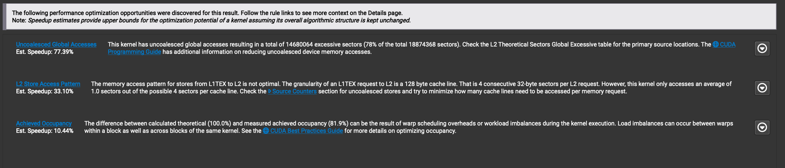
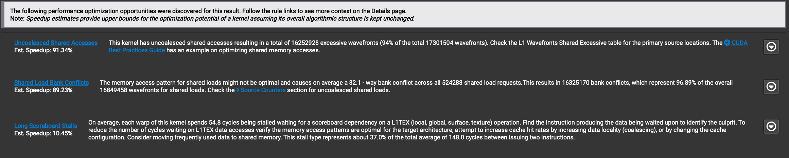
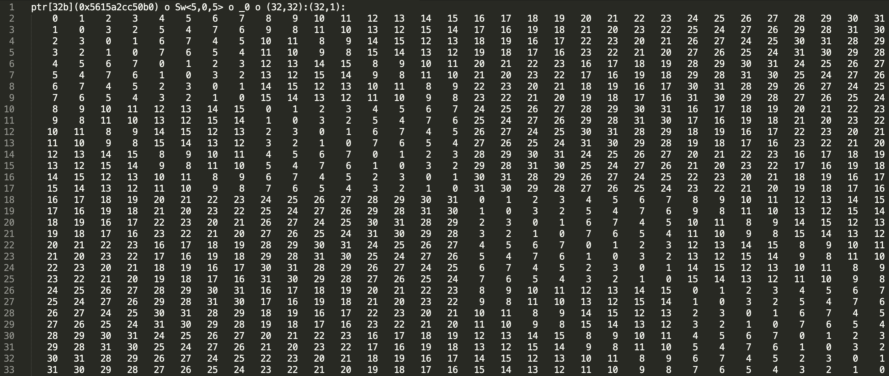
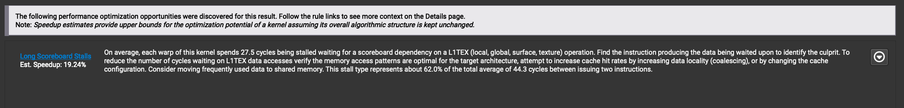

# 教程：CUTLASS 中的矩阵转置

原文标题：Tutorial: Matrix Transpose in CUTLASS

英文对照：[articles-en/tutorial-matrix-transpose-in-cutlass.en.md](../articles-en/tutorial-matrix-transpose-in-cutlass.en.md)

本教程的目标是在使用 NVIDIA® GPU 进行编程时引出涉及内存复制的概念和技术[CUTLASS](https://github.com/NVIDIA/cutlass/)及其核心后端库CuTe。具体来说，我们将研究以下任务：[矩阵转置](https://en.wikipedia.org/wiki/Transpose)作为这些概念的说明性示例。我们选择这个任务是因为它除了将数据从一组地址复制到另一组地址之外不涉及任何操作，这使我们能够独立研究内存复制优化的那些方面，例如合并访问，这些方面可以与也涉及计算的工作负载分开。

我们的写作灵感来自[Mark Harris 的高效矩阵转置教程](https://developer.nvidia.com/blog/efficient-matrix-transpose-cuda-cc/)，我们建议深入讨论矩阵转置问题，该问题不直接涉及我们在这里使用的 CuTe 的抽象。相反，我们的教程也可以作为已经熟悉哈里斯教程的读者对这些抽象的介绍。无论如何，在解释如何使用 CuTe 实现相应的优化解决方案之前，我们将回顾该教程中的关键思想。

## 合并访问的审查：

在许多计算工作负载中，特别是 ML/AI 应用程序中的计算工作负载，我们使用称为*张量。*由于计算机内存本质上是一维的，因此这些张量必须线性化或组织到这个一维空间中。因此，张量某些维度上的相邻元素在内存中可能不相邻。 我们说维度是*连续的*当该维度中相邻的元素在内存中也相邻时。连续维度中的连续元素块也称为*连续的。*

对连续内存块的访问（即，读取或写入）称为*合并的*，而对非连续内存块的访问称为*迈步*。合并访问通常比跨步访问提供更快的性能，因为它们更有效地与 GPU 的内存架构保持一致，从而实现更高效的数据缓存和检索。因此，在为 GPU 编程时，非常需要优化合并内存访问。

然而，某些工作负载需要跨步访问，否则无法实现。矩阵转置——或者更一般地说，张量置换操作——是跨步访问不可避免的主要例子。在这种情况下，最大限度地减少这些效率较低的访问模式对性能的影响至关重要。一种标准技术是仅在较低和较快的级别执行跨步访问。*GPU 内存层次结构*，我们现在回忆起来。

出于我们讨论的目的，GPU 存储器层次结构具有三个可编程级别。从最高到最低级别，我们有全局内存、共享内存和寄存器内存。

这*全局记忆*（GMEM），即*高带宽内存*(HBM) 是三者中最大的，也是读取或写入最慢的。例如，NVIDIA H100 Tensor Core GPU 有 80 个 GB 的 GMEM。此处的跨步访问将对性能产生最严重的影响。

接下来是*共享内存*(SMEM)，它比 GMEM 小得多，但速度快得多。例如，NVIDIA H100 Tensor Core GPU 每个流多处理器 (SM) 最多具有 228KB 的 SMEM。对于更熟悉内存架构的读者，我们注意到 SMEM 是从 L1 缓存中物理划分出来的。SMEM 在同一协作线程数组 (CTA) 内的所有线程之间共享，并且每个 CTA 在其自己的 SMEM 段内运行。这里的跨步访问仍然不是最优的，但比 GMEM 中的跨步访问要好得多。

最后，我们有*登记* *记忆*(RMEM)，专用于单个线程。

在本教程中，内存访问仅包括从一个级别到另一个级别或在同一级别的不同位置之间复制数字（例如，32 位浮点数）。

哈里斯教程中讨论的朴素转置方法从跨步访问开始`GMEM``-transpose->``GMEM`。然后，他通过首先将数据 GMEM 复制到 SMEM 来对此进行改进，这样我们就有`GMEM -> SMEM``-transpose->``SMEM -> GMEM`。 这样，跨步加载发生在 SMEM 中，而两个 GMEM 访问都被合并。

## CuTe方式：

我们现在讨论如何使用 CuTe 库实现这两种方法。我们从朴素的方法开始，主要是为了演示什么*不是*去做。

CuTe框架中的数据被抽象为`cute::Tensor`对象。 CuTe 张量由指向张量第一个元素的指针（在 C 意义上）以及`cute::Layout`object，通过定义描述了张量中每个元素相对于第一个元素的偏移量*形状*和*跨步*整数元组。例如，对于维度为 M × N 的行主矩阵，我们将布局定义为具有形状`(M, N)`并大步迈进`(N, 1)`.

对于一个`cute::Layout`，我们注意到，定义新张量布局时的可用选项之一是根据步幅指定它是行优先还是列优先（`GenRowMajor`或者`GenColMajor`）。在列主矩阵中，列内的相邻元素是连续的，而跨列的相邻元素在内存中是跨步的。默认情况下，CuTe 使用列优先布局。更一般地，我们可以为布局形状的每个维度指定步幅。

实现转置的一种简单方法是简单地将输入定义为列优先，输出定义为行优先，然后让 CuTe 计算出副本。

```

using namespace cute;
int M = 2048, N = 2048;
float *d_S, *d_D;
// Allocate and initialize d_S and d_D on device (omitted).

// Create the row major layouts.
auto tensor_shape = make_shape(M, N);
auto tensor_shape_trans = make_shape(N, M);
auto gmemLayoutS = make_layout(tensor_shape, GenRowMajor{});
auto gmemLayoutD = make_layout(tensor_shape_trans, GenRowMajor{});

// Create the row major tensors.
Tensor tensor_S = make_tensor(make_gmem_ptr(d_S), gmemLayoutS);
Tensor tensor_D = make_tensor(make_gmem_ptr(d_D), gmemLayoutD);

// Create a column major layout. Note that we use (M,N) for shape.
auto gmemLayoutDT = make_layout(tensor_shape, GenColMajor{});

// Create a column major view of the dst tensor.
Tensor tensor_DT = make_tensor(make_gmem_ptr(d_D), gmemLayoutDT);
```

这里需要注意的是，虽然我们有三个张量，但我们只有数据的两个实际副本。这是因为`tensor_D`和`tensor_DT`两者都使用中的数据`d_D`——他们是两个不同的人*意见*在相同的数据上。我们将在转置内核中使用列主视图，但在验证转置结果时使用行主视图。

接下来，我们需要确定如何将输入张量划分为可以分布在 CTA 上的更小的块。我们可以使用`cute::tiled_divide`方法。

```

using namespace cute;
using b = Int<32>;
auto block_shape = make_shape(b{}, b{});       // (b, b)
Tensor tiled_tensor_S  = tiled_divide(tensor_S, block_shape); // ([b,b], m/b, n/b)
Tensor tiled_tensor_DT = tiled_divide(tensor_DT, block_shape); // ([b,b], m/b, n/b)
```

在这里，我们将分块大小指定为 32 x 32。分块大小的值是一个重要的调整参数，应针对每个特定工作负载进行调整。事实上，32 x 32 并不是转置内核的最佳值，我们将在基准测试之前对其进行调整。

`tiled_divide`创建一个具有相同数据但不同布局 即 的张量，即不同的数据视图。 在我们的例子中，对于`tensor_S`我们从一个大小为 2D 的矩阵开始`(M, N)`. `cute::tiled_divide`tile尺寸为`b`生成大小为 3D 的矩阵视图`([b,b], M/b, N/b)`; `b`经过`b`矩阵在一个`M/b`经过`N/b`网格。

此视图使得在内核内部访问正确的tile变得更加容易。

```

Tensor tile_S = tiled_tensor_S(make_coord(_, _), blockIdx.x, blockIdx.y);
Tensor tile_DT = tiled_tensor_DT(make_coord(_, _), blockIdx.x, blockIdx.y);
```

在这里，放置`make_coord(_, _)`因为第一个参数采用整个第一个维度，而指定第二个和第三个维度的整数值，因为块索引采用相应的*片*张量的。 （对于那些熟悉`numpy`: 下划线`(_)`CuTe 中相当于冒号`(:)`那里有符号。）换句话说，`tile_S`代表整个`b`经过`b`矩阵位于网格点`(blockIdx.x, blockIdx.y)`。请注意，我们*不*交换`blockIdx.x`和`blockIdx.y`当切入`tiled_tensor_DT`因为我们已经采用了形状的列主视图`(M, N)`（相比之下，如果我们采用平铺划分`tensor_D`，我们需要交换块索引，然后对源和目标使用不同的线程布局`local_partition`以下）。然后我们可以通过以下方式将部分分配给特定线程：

```

auto thr_layout =
      make_layout(make_shape(Int<8>{}, Int<32>{}), GenRowMajor{});
Tensor thr_tile_S = local_partition(tile_S, thr_layout, threadIdx.x);
Tensor thr_tile_DT = local_partition(tile_DT, thr_layout, threadIdx.x); 
```

在这里，我们启动了每个 CTA 256 个线程的内核，并选择了一种线程布局，以便合并来自 gmem 的加载，而对 gmem 的存储则不合并（正如我们上面强调的，无论选择哪种线程布局，都将存在未合并的访问）。最后我们可以使用`cute::copy`从中复制数据`thr_tile_S`到`thr_tile_DT`.

```

Tensor rmem = make_tensor_like(thr_tile_S);
copy(thr_tile_S, rmem);
copy(rmem, thr_tile_DT);
```

现在我们可以将其与纯复制内核进行基准测试。复制内核的代码基于[CUTLASS的tiled_copy示例](https://github.com/NVIDIA/cutlass/blob/main/examples/cute/tutorial/tiled_copy.cu)，所以我们将把它拆开作为读者的练习。此外，我们根据经验发现，32 x 1024 的切片大小可为我们的工作负载提供最佳性能。

正如我们在 Harris 的帖子中看到的那样，这种简单方法的速度不是很好。这是因为该副本是从 GMEM -> GMEM 的跨步副本。为了确认这一点，让我们使用以下命令来分析这个转置[NVIDIA Nsight™ 计算](https://developer.nvidia.com/nsight-compute)。该分析工具可以检测代码中导致性能下降的问题。对朴素转置进行分析，GUI 的摘要页面向我们展示了：



Nsight Compute 拥有广泛的工具来帮助优化，但对 Nsight 的全面探索超出了本文的范围。对于本文，我们将仅查看摘要页面。在上面的摘要页面中，我们看到未合并访问的问题确实构成了报告的主要问题。

接下来，我们研究改进的算法：先将数据从GMEM复制到SMEM，然后进行转置，然后从SMEM复制回GMEM。

要将跨步访问移至 SMEM，我们需要一个使用 SMEM 的张量。我们将使用 CuTe 来分配`array_aligned`CTA 的 SMEM 中的对象。

```

using namespace cute;
using CuteArray = array_aligned<Element, cosize_v<SmemLayout>>;

extern __shared__ char shared_memory[];
CuteArray &smem = *reinterpret_cast<CuteArray*>(shared_memory);
```

这里，`smemLayout`是单个tile中使用的 SMEM 的布局。我们现在可以创建一个张量，其数据指针是`shared_memory`:

```

Tensor sS = make_tensor(make_smem_ptr(smem.data()), smemLayout);
```

这里需要注意的一个重要事项是，我们必须确保 SMEM 张量足够小以适合单个 SM。换句话说，大小`smemLayout`乘以每个字节数`Element`必须小于单个 SM 上的总 SMEM 容量。除此之外，我们还需要考虑占用情况，具体取决于每个 CTA 使用的 SMEM。

现在我们可以重复我们对 GMEM 中的数据所做的列主视图技巧，只不过这次我们将其应用于 SMEM。我们创建 SMEM 的两个不同视图 - 一个以行优先，另一个以列优先。

```

using namespace cute;
using b = Int&lt;32>;
auto block_shape = make_shape(b{}, b{});       // (b, b)

// Create two Layouts, one col-major and one row-major
auto smemLayout = make_layout(block_shape, GenRowMajor{});
auto smemLayoutT = make_layout(block_shape, GenColMajor{});

// Create two views of smem
Tensor sS  = make_tensor(make_smem_ptr(smem.data()), smemLayout);
Tensor sD = make_tensor(make_smem_ptr(smem.data()), smemLayoutT);
```

最后，我们可以使用`cute::copy`从 GMEM 复制到 SMEM，然后从 SMEM 返回到 GMEM。这里请注意`S`和`D`是`tiled_divide`的`tensor_S`和`tensor_D`和`tS`和`tD`是选择线程布局来确保对 GMEM 的合并访问（事实上，它们都等于`thr_layout`从上面！）。

```

// Slice to get the CTA's view of GMEM.
Tensor gS = S(make_coord(_, _), blockIdx.x, blockIdx.y); // (bM, bN)
Tensor gD = D(make_coord(_, _), blockIdx.y, blockIdx.x); // (bN, bM)

// Create the thread partitions for each Tensor.
Tensor tSgS = local_partition(gS, tS, threadIdx.x);
Tensor tSsS = local_partition(sS, tS, threadIdx.x);
Tensor tDgD = local_partition(gD, tD, threadIdx.x);
Tensor tDsD = local_partition(sD, tD, threadIdx.x);

// Copy GMEM to SMEM.
cute::copy(tSgS, tSsS); 

// Synchronization step. On SM80 and above, cute::copy
// does LDGSTS which necessitates async fence and wait.
cp_async_fence();
cp_async_wait&lt;0>();
__syncthreads();

// Copy transposed SMEM to GMEM.
cute::copy(tDsD, tDgD);
```

现在，当我们进行基准测试时，我们得到了更好的结果。

尽管如此，我们距离复制结果还有一段距离。再次分析代码，我们可以发现下一个问题——内存库冲突。



## 内存库冲突：

strided SMEM 版本比 naive 版本获得了更好的性能，但仍然无法匹配复制性能。这种差异很大一部分是由于内存库冲突造成的。在大多数 NVIDIA GPU 上，共享内存被组织成 32 个内存库。一次只能有一个线程束中的一个线程能够访问内存组；对于读和写访问都是如此。因此，如果多个线程尝试访问同一存储体，则访问会被串行化。这被称为*银行冲突。*有关银行冲突的更深入讨论，我们建议[毛雷的精彩博文](https://leimao.github.io/blog/CUDA-Shared-Memory-Bank/).

更详细地说，元素以循环格式以 32 位分配给存储体。前 32 位分配给 0，接下来的 32 位分配给 1，依此类推，直到第 33 组 32 位再次分配给存储体 0。因此，在 32 x 32（行优先）的tile中`float`，每一列映射到相同的存储体。这是最坏的情况；一个 warp 中有 32 个线程，这会导致 32 路库冲突。

Mark Harris 的教程通过将行填充 1 个数字解决了这个问题。这会抵消元素，导致列中的每个元素落入不同的组中。我们可以通过使用非默认步幅在 CuTe 中复制此解决方法。 CuTe`Layout`包含有关步幅的信息，它定义每个维度中元素之间的偏移量。我们可以通过将列的步长设置为 33 而不是 32 来添加填充。在代码中，可以简单地通过以下方式完成此操作：

```

auto block_shape = make_shape(Int&lt;32>, Int&lt;33>); // (b, b+1)

// Create two Layouts, one col-major and one row-major
auto smemLayout = make_layout(block_shape, GenRowMajor{});
auto smemLayoutT = make_layout(block_shape, GenColMajor{});
```

然而，这会浪费额外的内存`32`SMEM 中的数字。在本文中，我们将实现一个替代解决方案——swizzle。

## Swizzle 和布局组合：

为了讨论 swizzle，我们首先需要扩展 CuTe 布局。布局不仅仅是存储有关张量结构的信息的容器，而且是将一个坐标映射到另一个坐标的函数。例如，采用列主张量`A`和`M`行和`N`列。给定坐标`(4,5)`— 第 4 行，第 5 列 — 此布局为`A`将映射元组`(4,5)`到整数`5M+4`。这是坐标处元素的索引`(4,5)`在指向数据的 1D 指针中。这抽象出了使用高维张量时经常令人困惑的坐标数学。

通常，坐标计算仅使用张量的步幅来完成，它定义了维度中相邻元素之间的一维内存空间中的偏移量。例如使用相同的张量`A`，步幅为`(1,M)`。列中的元素彼此相邻，即，偏移量为`1`，而一行中的元素偏移量为`M`.

CuTe提供了更复杂的坐标映射功能的工具。 Swizzle 就是这样的工具之一。 swizzling 的详细信息超出了本教程的范围，我们建议好奇的读者参考[NVIDIA 的 PTX 文档](https://docs.nvidia.com/cuda/parallel-thread-execution/#tensor-swizzling-modes).

通过定义适当的 swizzling 函数，CuTe 程序员可以像在非 swizzling 情况下一样访问数据，而不必担心库冲突。 CuTe 通过使用 swizzle 作为张量布局的属性进行烘焙，抽象出 swizzling 细节[组合操作](https://github.com/NVIDIA/cutlass/blob/main/media/docs/cute/02_layout_algebra.md#composition).

顾名思义，组合创建了布局参数的函数组合。具体来说，当程序员访问 SMEM 中的混合张量中的数据时 — 例如通过调用`tensor(i)`在 CuTe 中，其中*逻辑索引* `i`就是他们*思考*访问位置是 — 他们实际上访问数据的位置是`swizzle_function(tensor(i))`.

回到转置，我们需要的swizzle函数是`Swizzle<5,0,5>`。这里的数字5指的是掩码中的位数。每[CuTe 文档](https://github.com/NVIDIA/cutlass/blob/main/include/cute/swizzle.hpp#L44)，该函数通过与高 5 位（掩码）进行异或来修改低 5 位。然后，将此模式应用于 32 x 32 的地址集，列中没有两个元素映射到同一存储体，从而避免所有存储体冲突。我们将此 swizzle 模式添加到我们的布局中。

```

auto tileLayoutS = make_layout(block_shape, GenRowMajor{});
auto smemLayoutS_swizzle = composition(Swizzle<5, 0, 5>{}, tileLayoutS);
```



我们还注意到，SMEM 中的其他数据存储模式将需要不同的混合函数。我们鼓励读者尝试通过 CuTe 公开的通用 swizzle 函数，并选择最适合他们的函数。

## 通过布局合成转置：

上面，我们讨论了如何通过定义tile的列主布局来转置 SMEM 中的tile。在这里，我们展示了使用布局组合的替代方法。具体来说，我们制作一个由 swizzled 组成的布局`LayoutS`和`LayoutD`.

```

auto tileLayoutD = make_layout(block_shape_trans, GenRowMajor{});
auto smemLayoutD_swizzle = composition(smemLayoutS_swizzle, tileLayoutD);
```

这里的技巧是，这两种布局都定义为行优先，但 CuTe 默认情况下使用列优先，包括布局代数。我们现在声称`composition`(`tileLayoutS,tileLayoutD)` *等于*

```

auto tileLayoutDT = make_layout(block_shape_trans, GenColMajor{});
```

为了解释一下，让块尺寸为`bM`和`bN`， 所以`tileLayoutS`和`tileLayoutD`有 Shape:Stride 给出`(bM,bN):(bN,1)`和`(bN,bM):(bM,1)`， 分别。然后我们有：

```
tileLayoutS(tileLayoutD(x,y)) = tileLayoutS(bM*x+y).
```

现在计算整数`bM*x+y`映射到下面`tileLayoutS`，可以方便地将其表示为域形状中的坐标对`(bM,bN)`。但由于用于将一维索引映射到形状中的坐标的 CuTe 代数是按列主（或从左到右）完成的，我们看到`bM*x+y`对应坐标`(y,x)`。因此，我们得到：

```
tileLayoutS(bM*x+y) = tileLayoutS((y,x)) = bN*y+x.
```

这表明组合的 Layout 函数等于 Layout 的函数`(bN,bM):(1,bN)`，这验证了该声明。最后，我们注意到，在存在的情况下*后期合成*具有混合功能，*预合成*保留相同的 swizzle 就位，从而避免一些代码重复。

正如 Mark Harris 的文章所做的那样，我们的混合解决方案使我们接近复制内核的性能。

随着性能接近带宽限制，我们也接近硬件限制。在分析 swizzle 版本时，摘要页面显示：



我们看到我们已经解决了内存库冲突问题。由于我们正在分析完全受内存限制的内核，因此可以忽略最后报告的有关长时间记分板停顿的问题。

## TMA：

请注意，GMEM 和 SMEM 之间的数据传输构成了转置内核中花费的大部分时间。这*Tensor Memory Accelerator*(TMA) 是 NVIDIA Hopper™ 架构中引入的一项功能，可用于代替 GMEM 和 SMEM 之间的常规加载和存储指令，从而潜在地提高转置内核的性能。我们研究了本教程中 TMA 的用法，并发现了一组混合结果，我们将在本节中进行描述。

回顾一下，TMA 是一个专用的异步内存复制单元，用于将多维数据从 GMEM 复制到 SMEM，反之亦然。在用于异步复制的 TMA 模型中，不是让 CTA 中的 threads/warps 协作将源张量的一部分复制到目标张量，而是选择 CTA 中的单个线程来发出加载或存储 TMA 指令。当指令在异步代理中执行时，线程可以自由地执行其他独立工作。屏障对象和同步原语（栅栏、到达和等待）用于将数据移动与依赖于数据的计算同步。当与[软件流水线方案](https://github.com/NVIDIA/cutlass/blob/main/test/unit/pipeline/pipeline_tma_async_warp_specialized.cu)，TMA 允许重叠内存复制指令与计算重叠，这有助于隐藏延迟。然而，由于转置内核仅进行内存复制，因此我们没有机会在本教程中展示 TMA 的这一优势。

为了阐明 TMA 单独内存复制的性能，我们首先研究了 TMA 加载和存储复制内核与其他替代方案（例如 CuTe）的性能[平铺复制教程](https://github.com/NVIDIA/cutlass/blob/main/examples/cute/tutorial/tiled_copy.cu)，它仅通过 RMEM 进行 128 位矢量化加载和存储。我们发现，在这种情况下，TMA 的性能与这个更简单的替代方案相当（在对两者进行切片大小调整之后），两者都接近设备的内存带宽规格。这个结果符合我们的预期——事实上，我们没有理由期望 TMA 在按照常规模式进行纯内存复制的情况下表现出色。

相比之下，在转置内核中使用 TMA 进行加载和存储的天真尝试，并选择与上面相同的切片大小，其性能比我们性能最佳的版本更差。这是由于银行冲突的存在！迫在眉睫的问题是 TMA 仅支持一组有限的 swizzle 函数（旨在与 WGMMA 结合使用）；例如，参见[本节](https://github.com/NVIDIA/cutlass/blob/033d9efd2db0bbbcf3b3b0650acde6c472f3948e/include/cute/atom/copy_traits_sm90_tma_swizzle.hpp#L48-L62)CuTe 代码库的。特别是，它不支持`Swizzle<5,0,5>`我们上面使用的函数，这使得完全消除银行冲突变得不那么简单。但请注意，我们没有理由相信这是一个本质问题，但根据我们对复制内核的基准测试，我们选择不进一步进行这一调查。此外，当尝试仅使用 TMA 存储以及将 128 位向量化加载到寄存器中然后写入 SMEM 的版本时，我们发现它的性能仅略低于标准水平，即使探查器仍然报告共享存储库冲突（但避免了从 SMEM 到 GMEM 的 TMA 存储的库冲突）。

由于这些结果好坏参半，我们没有详细描述如何使用 TMA 的机制，而是将其推迟到未来的博客文章中，我们的目标是在更适合其优势的上下文中研究 TMA。

## 结论：

在本教程中，我们向读者介绍了许多基本的 GPU 内存概念，以及如何使用 CuTe 库通过实现高效的矩阵转置内核对其进行编程。

从合并读取和写入开始，我们涉及了 CuTe 布局和张量、存储体冲突、混合函数和 TMA 的概念。除了 TMA 之外，我们已经看到了如何需要很好地理解这些概念来实现高效的转置内核。在后续文章中，我们计划在对优化很重要的环境中研究 TMA。

作为本教程的总结，我们介绍了我们讨论的各种内核的运行时。我们包括了`JustCopy`内核作为可以实现的空间，以及一个简单的 PyTorch 实现（通过调用`contiguous()`在`torch.transpose`）和一个使用`torch.compile`，以证明通过编写这些低级内核可获得的效率增益的大小。

所有这些内核的源代码以及基准测试脚本都可以在[科尔法克斯研究 GitHub 存储库](https://github.com/ColfaxResearch/cfx-article-src/tree/master/transpose-cute).

*编辑*(05/07/24): 添加了 JIT 编译版本的 PyTorch 转置以供参考 (h/t[@CHHillee](https://twitter.com/cHHillee/status/1787993571808932197)).
